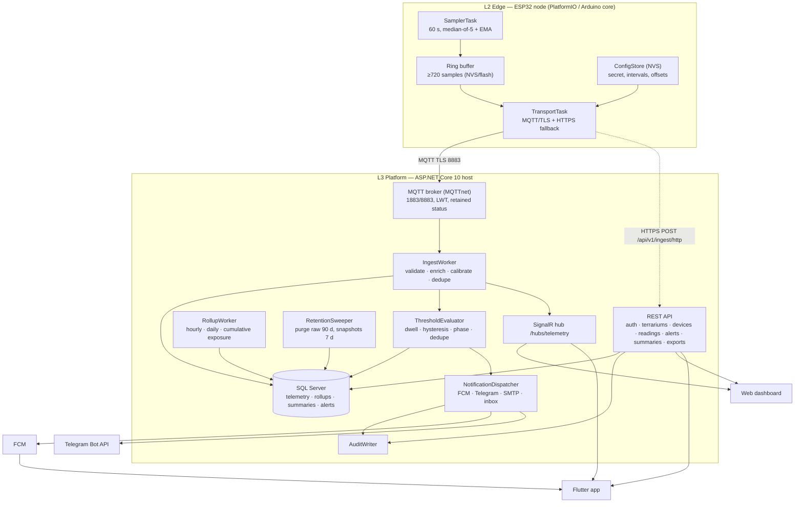
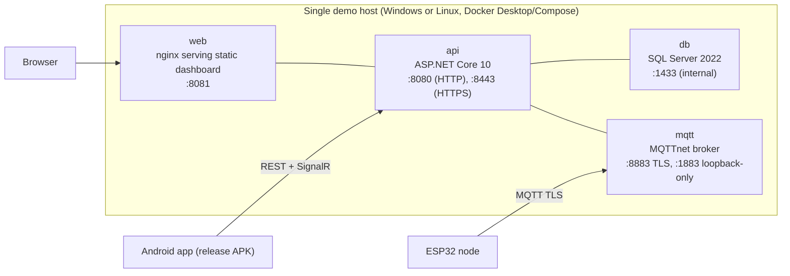

# 02 — Architecture

## 1. Architectural drivers

| Driver | Source | Consequence |
|---|---|---|
| Monitoring-first, no actuation in v1 | brief §5, ADR-008 | No safety-critical control loop; the system can fail without endangering the animal |
| Data must survive network loss | O7, NFR-03 | Buffer at the edge; idempotent ingest; server is the single source of truth for evaluation |
| Thresholds must be defensible | brief §6, FR-10 | Thresholds are first-class data with **source references**, not constants in code |
| The dataset is the asset for v2 | brief §7–8, FR-14/15 | Retention + rollup + summary pipeline is part of v1, not an afterthought |
| Cheap, reproducible, demoable | NFR-08, NFR-09 | Single-host Docker Compose; no cloud dependencies required at demo time |
| Course rubric | PRM393 | State management, DB, release build, tests, commented code all visible in the design |

## 2. Four layers (from the brief, made concrete)

The brief names four layers — sensors, collection/storage, alerting, interface. The
implementation adds an explicit **edge** layer (buffering + health) because reliability was
made a first-class concern.

| Layer | Responsibility | Components | Fails how? |
|---|---|---|---|
| **L1 Sensing** | Produce trustworthy measurements | SHT31 (temp/RH), BH1750 (lux), LTR390 (UVI), DS18B20 (surface temp), optional ESP32-CAM | Reports a fault flag; the system marks the metric unavailable instead of guessing |
| **L2 Edge** | Sample, filter, buffer, transport, health | ESP32 firmware (`sr-node`): sampler task, filter, ring buffer, transport task, provisioning portal | Degrades to buffering; eventually drops oldest and reports the count |
| **L3 Platform** | Ingest, store, evaluate, alert, aggregate | MQTT broker, ASP.NET Core API + workers, SQL Server | Ingest never blocks on evaluation; evaluation never blocks on notification |
| **L4 Experience** | Show and explain | Flutter app (Android), web dashboard (HTML/CSS/JS + Chart.js), SignalR | Read-only degraded mode with last known values + clear staleness |

## 3. Component view

## 4. Dependency rules (enforced in review and by project references)

1. **`Api` may depend on `Application` and `Infrastructure`; `Application` may depend on `Domain`;
   `Domain` depends on nothing.** No EF Core type may appear in `Domain`.
2. **Workers do not call the REST API.** They share `Application` services. This keeps the ingest
   path in-process and testable without HTTP.
3. **The evaluator never writes telemetry.** It reads samples and writes alerts — one writer per table.
4. **The device never decides about alerts.** It reports values + faults only (ADR-005). This keeps
   thresholds editable without reflashing firmware.
5. **The client never computes bands.** Threshold bands come from the API as `effectiveThresholds`,
   so a change requires no app update.
6. **Time:** the device produces `RecordedAt`; the server produces `ReceivedAt`; only the server
   rolls up by local day. Clients render, never bucketing-critical logic.

## 5. Runtime view — one sample, end to end

| Step | Component | Action | Budget |
|---|---|---|---|
| 1 | SamplerTask | reads 5× sensors over 250 ms, median filter + EMA, attaches seq + ts | 300 ms |
| 2 | TransportTask | batch → JSON → MQTT publish QoS 1 to `sr/v1/d/{id}/telemetry` | 50 ms |
| 3 | Broker | delivers to the API's subscription; device LWT set to `offline` | < 100 ms |
| 4 | IngestWorker | schema check → plausibility → calibration → `(deviceId, seq)` dedupe → insert sample + readings → update `LastSeenAt`/status → SignalR `readingAdded` | < 400 ms |
| 5 | ThresholdEvaluator | load effective thresholds (cached per terrarium, invalidated on change) → pick phase → update dwell counters → raise/escalate/resolve alert | < 50 ms |
| 6 | NotificationDispatcher | preference + quiet hours + rate limit → channel calls (async, retried) | < 5 s |
| 7 | RollupWorker | per-minute accumulate; hourly row upsert; daily summary at local midnight | batched |

Total device-timestamp → dashboard-paint is designed for ≤ 5 s p95 (NFR-02), dominated by the
60 s sampling interval in practice — a sample that *exists* is on screen within seconds.

## 6. Deployment view

- **Volumes:** `db-data` (SQL Server), `uploads` (snapshots, exports), `broker-data` (retained status/queues).
- **Secrets:** `.env` (not committed) for SQL password, Telegram token, FCM service account path; certificate
  mounted read-only. `appsettings.Development.json` contains no secrets (NFR-04).
- **TLS:** self-signed/internal CA certificate is acceptable for the demo **only if** the ESP32 is flashed with
  the matching CA and the app/browser trust it; otherwise use a Let's Encrypt certificate on a hostname.
  This is recorded as demo risk R-04.
- **Why one host:** the assignment needs a *working, reproducible* system, not elasticity. The ingest path is
  stateless, so horizontal scale is possible later without redesign.

## 7. State ownership (who may change what)

| State | Owner | Readers |
|---|---|---|
| Sensor values | Device (authoritative) → IngestWorker (persisted) | Evaluator, API, hub |
| Device status / last seen | IngestWorker (from traffic + LWT) | API, hub, fleet view |
| Effective thresholds | ThresholdService via API (Owner-authored) | Evaluator (cached), dashboard |
| Alert lifecycle | Evaluator (open/escalate/auto-resolve) + API (ack/manual resolve) | All clients |
| Notification preferences | API (user-authored) | Dispatcher |
| Rollups + daily summaries | RollupWorker (derived, recomputable) | API, reports, v2 dataset |
| Terrarium/device binding | API (Owner-authored) | Everything |

Rule of thumb visible throughout the design: **derived data is recomputable; authored data is audited.**

## 8. Cross-cutting concerns

| Concern | Approach | Doc |
|---|---|---|
| Time | UTC everywhere in storage; device NTP; server `ReceivedAt`; local-day bucketing only in the rollup worker | `03-implementation/06` |
| Idempotency | `(deviceId, seq)` for ingest; `Idempotency-Key` header for client mutations; upsert-based rollups | `02-design/03` |
| Validation | Payload schema + plausibility ranges at ingest; domain validation in `Application`; UI validation mirrored (never trusted) | `02-design/03` §3 |
| Error taxonomy | RFC 7807 problems with a stable `code` field; the app maps codes to Vietnamese/English strings | `07-appendices/03` §5 |
| Security | TLS everywhere, hashed credentials, owner-scoped queries, RBAC, audit log, OWASP IoT Top 10 review | `02-design/06` |
| Observability | Structured logs + correlation id, counters, `/health`, `/ready`, `/metrics` | `05-release/02` |
| Localisation | UI strings `vi` (default) + `en`; units metric only (°C, %RH, lx, UVI) | `02-design/04` §7 |

## 9. Rejected alternatives (summary; full text in the ADR log)

| Alternative | Why rejected |
|---|---|
| Device-side threshold evaluation + alert publishing | Threshold edits would need firmware changes and a reflash; two sources of truth for bands (ADR-005) |
| Cloud IoT platform (Blynk/ThingSpeak/Firebase as the whole backend) | Less coursework engineering to show, vendor lock-in, and no place for the species/threshold domain logic (ADR-002) |
| Wide `SensorLog` table (one row per sample, one column per metric) | Adding a metric (v2 behaviour/camera events) becomes a migration; kept as a documented alternative (ADR-004) |
| REST-only ingest (no MQTT) | The brief explicitly suggests MQTT-style messaging is fair game and it is the industry norm for device telemetry; MQTT + HTTPS fallback also demonstrates transport thinking (ADR-001) |
| Control/actuation in v1 (heat lamp, mister) | Safety-critical; a bug endangers the animal; also expands the hardware BOM and failure modes (ADR-008) |
| Full mobile app in v1 *instead of* web dashboard, or vice versa | The brief says "web hoặc ứng dụng" (web **or** app). Both are built because the course requires a mobile app with state management, and the web dashboard is cheap to add on top of the same API |
| Event sourcing for telemetry | Over-engineering for a course project; append-only telemetry already gives most of the benefit |
