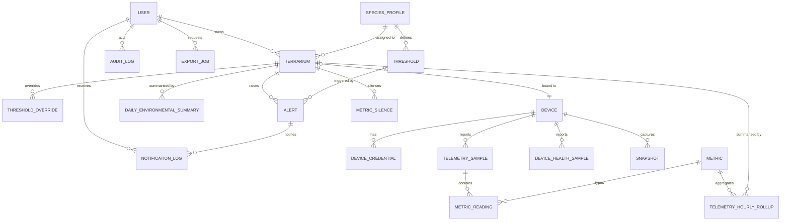
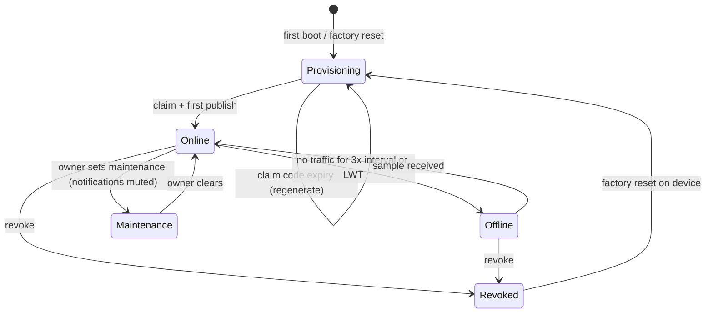
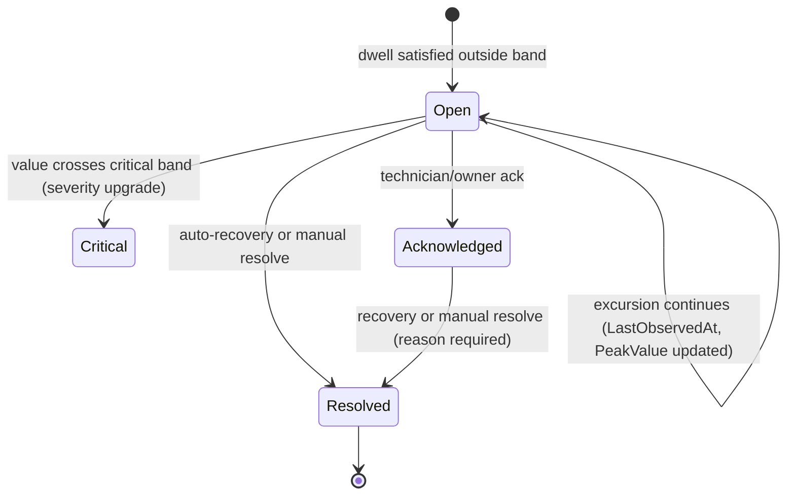

# 02 — Domain and Data Model

## 1. Ubiquitous language → entities

| Term (glossary) | Entity | Notes |
|---|---|---|
| User | `User` | Account + role; owns terrariums |
| Terrarium | `Terrarium` | The monitored enclosure; 1 device max in v1 |
| Species profile | `SpeciesProfile` | Bands + photoperiod + literature references |
| Threshold | `Threshold` | One band for one metric in one phase |
| Terrarium override | `ThresholdOverride` | Per-terrarium band that wins over the profile |
| Device | `Device` | ESP32 node + claim/lifecycle state |
| Device credential | `DeviceCredential` | Hashed secret, rotation history |
| Sample | `TelemetrySample` | One device report (all metrics, one instant) |
| Reading | `MetricReading` | One metric value belonging to a sample |
| Metric | `Metric` | Dictionary of metric codes/units |
| Device health | `DeviceHealthSample` | RSSI, uptime, heap, battery, firmware |
| Rollup | `TelemetryHourlyRollup` | min/max/avg/count per metric per hour |
| Daily summary | `DailyEnvironmentalSummary` | Per local day: stats, out-of-range minutes, exposure index |
| Alert | `Alert` | Lifecycle + peak value + duration |
| Silence | `MetricSilence` | Time-boxed notification suppression |
| Notification | `NotificationLog` | One dispatch attempt record |
| Snapshot | `Snapshot` | Optional camera image metadata |
| Audit entry | `AuditLog` | Who changed what, when |
| Export job | `ExportJob` | Async CSV/JSON generation + download token |

## 2. Entity-relationship diagram

Delivery/ordering nuance: `Device : Terrarium` is `0..1 — 1` in v1 (`Terrarium.DeviceId` is nullable
until claimed). A device can be *unbound* and re-claimed to another terrarium; history stays attached to
the samples' `TerrariumId`, which is copied at ingest time so rebinding never rewrites history.

## 3. Entity definitions

Types are SQL Server. `TBC` = to be confirmed. Full column list with indexes and DDL excerpts is in
`07-appendices/02-sql-schema-reference.md`.

### 3.1 `User`
| Column | Type | Notes |
|---|---|---|
| `Id` | uniqueidentifier PK | |
| `Username` | nvarchar(32) | unique (CI collation) |
| `Email` | nvarchar(256) | unique |
| `PasswordHash` | varbinary(64) | PBKDF2-SHA256 output |
| `PasswordSalt` | varbinary(16) | |
| `PasswordIterations` | int | 210 000 default; enables rehash-on-login upgrades |
| `Role` | tinyint | 0 Owner, 1 Technician, 2 Viewer |
| `PreferredLanguage` | varchar(2) | `vi` default |
| `TimeZoneId` | varchar(64) | default `Asia/Ho_Chi_Minh` |
| `QuietHoursStart/End` | time | nullable |
| `MinNotifySeverity` | tinyint | 0 Info, 1 Warning, 2 Critical |
| `ChannelsFcm/Telegram/Email` | bit | per-channel opt-in |
| `TelegramChatId`, `PhoneToken` | nvarchar | nullable, FCM token |
| `CreatedAt`, `LastLoginAt`, `DisabledAt` | datetime2(3) | |

### 3.2 `SpeciesProfile`
| Column | Type | Notes |
|---|---|---|
| `Id` | uniqueidentifier PK | |
| `Name` | nvarchar(80) | e.g. "Leopard gecko (semi-desert)" |
| `ScientificName` | nvarchar(120) | `Eublepharis macularius` |
| `ClimateZone` | tinyint | 0 Tropical, 1 SemiArid, 2 Arid, 3 Temperate |
| `IsBuiltIn` | bit | built-ins are read-only (FR-10 A2) |
| `PhotoperiodHours` | decimal(4,2) | e.g. 12.00 |
| `LightsOnLocalTime` | time | e.g. 07:00 |
| `Notes` | nvarchar(1000) | husbandry summary |
| `CreatedByUserId` | uniqueidentifier NULL | null for seeded |
| `RowVersion` | rowversion | optimistic concurrency (UC-03 A3) |
| `CreatedAt`/`UpdatedAt` | datetime2(3) | |

### 3.3 `Threshold`
| Column | Type | Notes |
|---|---|---|
| `Id` | uniqueidentifier PK | |
| `SpeciesProfileId` | FK | |
| `MetricId` | FK → `Metric` | |
| `Phase` | tinyint | 0 Any, 1 Day, 2 Night |
| `TargetMin`, `TargetMax` | decimal(9,3) | must satisfy ordering rule |
| `CriticalMin`, `CriticalMax` | decimal(9,3) | nullable → falls back to target ± default margin |
| `DwellWarnMinutes` | smallint | default 5 |
| `DwellCritMinutes` | smallint | default 2 |
| `RecoveryMargin` | decimal(9,3) | default per metric |
| `SourceRef`, `SourceUrl` | nvarchar | **required for built-ins** (brief §6) |
| `Enabled` | bit | |
| Unique index | `(SpeciesProfileId, MetricId, Phase)` | |

### 3.4 `ThresholdOverride`
Same shape as `Threshold` minus `SpeciesProfileId`, plus `TerrariumId`. A present row replaces the
profile row for that `(MetricId, Phase)`; resolution order is override → profile → system default
(BR-10.3).

### 3.5 `Terrarium`
| Column | Type | Notes |
|---|---|---|
| `Id` | uniqueidentifier PK | |
| `UserId` | FK | owner |
| `Name` | nvarchar(60) | |
| `SpeciesProfileId` | FK | required |
| `Location`, `Description` | nvarchar | optional |
| `TimeZoneId` | varchar(64) | drives local-day bucketing |
| `DeviceId` | uniqueidentifier NULL | 0..1 |
| `CreatedAt`, `UpdatedAt`, `DeletedAt` | datetime2(3) | soft delete |

### 3.6 `Device`
| Column | Type | Notes |
|---|---|---|
| `Id` | uniqueidentifier PK | |
| `DeviceId` | varchar(24) | human/device-facing short id `sr-xxxxxx`, unique |
| `DeviceName` | nvarchar(60) | renameable |
| `ChipId` | varchar(32) | ESP32 MAC/chip id, unique |
| `MacAddress` | varchar(17) | |
| `FirmwareVersion` | varchar(16) | reported by device |
| `Status` | tinyint | 0 Provisioning, 1 Online, 2 Offline, 3 Revoked, 4 Maintenance |
| `Protocol` | tinyint | 0 Mqtt, 1 HttpFallback |
| `TerrariumId` | FK NULL | |
| `UserId` | FK NULL | registered owner at claim |
| `ClaimCode` | varchar(8) NULL | single-use, hashed? → stored plain but short-lived; see §5 |
| `ClaimCodeExpiresAt` | datetime2(3) NULL | |
| `ProvisionedAt`, `RevokedAt` | datetime2(3) NULL | |
| `LastSeenAt` | datetime2(3) NULL | |
| `SamplingIntervalSec`, `PublishIntervalSec` | smallint | desired config pushed downlink |
| `CalibrationJson` | nvarchar(512) NULL | `{"tempOffsetC":-0.4,"rhOffsetPct":2.1,"luxGain":1.03}` |
| `SignalStrengthDbm`, `BatteryPct`, `UptimeSeconds`, `FreeHeapKb` | int/smallint | last health values (denormalised for the fleet list) |

### 3.7 `DeviceCredential`
| Column | Type | Notes |
|---|---|---|
| `Id`, `DeviceId` FK | | |
| `SecretHash` | varbinary(32) | SHA-256(secret ‖ salt) |
| `Salt` | varbinary(16) | |
| `IssuedAt`, `ExpiresAt`(nullable), `RevokedAt`(nullable), `GraceUntil`(nullable) | datetime2(3) | grace supports rotation (BR-05.5) |
| `IssuedByUserId` | FK NULL | null = self-registration during claim |

### 3.8 `Metric` (dictionary, seeded)
| Id | Code | Unit | ValueType | Precision | Core? |
|---|---|---|---|---|---|
| 1 | `TempC` | °C | decimal | 2 | yes |
| 2 | `HumidityPct` | %RH | decimal | 2 | yes |
| 3 | `LightLux` | lx | decimal | 1 | yes |
| 4 | `UvIndex` | UVI | decimal | 2 | yes |
| 5 | `SurfaceTempC` | °C | decimal | 2 | optional |
| 6 | `BatteryPct` | % | decimal | 1 | no (health) |
| 7 | `RssiDbm` | dBm | int | 0 | no (health) |

The dictionary exists so a v2 metric (e.g. `MotionIndex`, `ActivityScore`) is a **row**, not a schema
migration (ADR-004).

### 3.9 `TelemetrySample`
| Column | Type | Notes |
|---|---|---|
| `Id` | bigint identity PK | |
| `TerrariumId` | FK | copied at ingest so rebinding never rewrites history |
| `DeviceId` | FK | |
| `RecordedAt` | datetime2(3) | device clock (UTC) |
| `ReceivedAt` | datetime2(3) | server clock (UTC); default `SYSUTCDATETIME()` |
| `Sequence` | bigint | device monotonic counter |
| `QualityFlags` | smallint | bitmask per glossary |
| `ClockSkewSeconds` | int | `ReceivedAt − RecordedAt` at ingest (null if NTP-unsynced) |
| `FirmwareVersion` | varchar(16) | |
| Unique index | `(DeviceId, Sequence)` | **the idempotency guarantee** |
| Secondary index | `(TerrariumId, RecordedAt DESC) INCLUDE (Id)` | latest + range queries |

### 3.10 `MetricReading`
| Column | Type | Notes |
|---|---|---|
| `Id` | bigint identity PK | |
| `SampleId` | FK → `TelemetrySample` (cascade delete) | |
| `MetricId` | FK | |
| `Value` | decimal(9,3) | post-calibration value used for evaluation |
| `RawValue` | decimal(9,3) NULL | sensor output, diagnostics only |
| Unique index | `(SampleId, MetricId)` | |
| Index | `(MetricId, SampleId)` | for metric-scoped joins |

### 3.11 `TelemetryHourlyRollup`
`(Id, TerrariumId, MetricId, HourStartUtc, MinValue, MaxValue, AvgValue, SampleCount, OutOfRangeMinutes, ExposureValue, ComputedAt)`
with unique index `(TerrariumId, MetricId, HourStartUtc)`. Upsert-based, recomputable for the last 48 h
(BR-15.3). `OutOfRangeMinutes` and `ExposureValue` are computed against the thresholds **in force at
that hour**, which is why the rollup stores `ThresholdVersionId` — a nullable FK to a
`ThresholdSnapshot` row (below) so a later threshold edit does not silently rewrite history.

### 3.12 `DailyEnvironmentalSummary`
`(Id, TerrariumId, LocalDate, TimeZoneId, CoveragePct, TempMin/Max/Avg, HumidityMin/Max/Avg,
LuxAvg, LightHours, UvMax, OutOfRangeMinutesJson, TempExposureDegCHours, HumidityExposurePctHours,
LightDeficitHours, AlertCount, CriticalAlertCount, ComputedAt, IsLowConfidence)` with unique index
`(TerrariumId, LocalDate)`. This is the row the report screen and the v2 dataset both read.

### 3.13 `ThresholdSnapshot`
`(Id, TerrariumId, CapturedAtUtc, EffectiveThresholdsJson, ThresholdVersionHash)` — written whenever the
effective thresholds for a terrarium change (UC-03 A4). Alerts and rollups reference the snapshot in
force, so history is explainable: *"this alert used the summer bands"*.

### 3.14 `Alert`
| Column | Type | Notes |
|---|---|---|
| `Id` | bigint identity PK | |
| `TerrariumId`, `DeviceId` | FK | |
| `MetricId` | FK NULL | null for `DeviceSilent` / `SensorFault` |
| `Severity` | tinyint | 1 Warning, 2 Critical (0 Info reserved) |
| `Phase` | tinyint | as evaluated |
| `DedupeKey` | varchar(80) | `{terrariumId}:{metric}:{severity}:{phase}` |
| `State` | tinyint | 0 Open, 1 Acknowledged, 2 Resolved |
| `TriggeringValue` | decimal(9,3) NULL | value at first violation |
| `PeakValue` | decimal(9,3) | extremum during the episode (max for hot, min for cold) |
| `BandMin`, `BandMax` | decimal(9,3) | band in force (denormalised for the alert card) |
| `Source` | tinyint | 0 Threshold, 1 DeviceSilent, 2 SensorFault, 3 DeviceClockSkew |
| `TriggeredAt`, `LastObservedAt`, `AcknowledgedAt`, `ResolvedAt` | datetime2(3) | |
| `AcknowledgedByUserId`, `ResolvedByUserId` | FK NULL | |
| `ResolvedReason` | tinyint NULL | 0 Recovered, 1 FalsePositive, 2 SensorFault, 3 Accepted |
| `Message` | nvarchar(300) | localised at render time from fields, not stored per language |
| `ThresholdSnapshotId` | FK NULL | |
| Index | `(TerrariumId, State, TriggeredAt DESC)`, unique filtered open index on `(DedupeKey) WHERE State <> 2` | guarantees one open alert per key |

### 3.15 `MetricSilence`
`(Id, TerrariumId, MetricId, UntilUtc, Reason, CreatedByUserId, CreatedAt, CancelledAt)`.

### 3.16 `NotificationLog`
`(Id, UserId, AlertId NULL, TerrariumId NULL, Channel tinyint, Title, Body, DeepLink, Status tinyint
(0 Queued, 1 Sent, 2 Failed, 3 Suppressed), Attempts, LastError, IsRead, CreatedAt, SentAt, ReadAt,
SuppressedReason varchar(40))`. Suppression reasons are explicit: `quiet_hours`, `rate_limited`,
`below_min_severity`, `silenced_metric`, `digest_coalesced`.

### 3.17 `Snapshot` (optional camera)
`(Id, DeviceId FK, TerrariumId, CapturedAtUtc, ContentType, ByteSize, Sha256, StoragePath, ExpiresAt,
Status tinyint (0 Available, 1 Expired, 2 Deleted))`.

### 3.18 `AuditLog`
`(Id, UserId NULL, DeviceId NULL, EntityName varchar(40), EntityId nvarchar(64), Action varchar(40),
BeforeJson nvarchar(max) NULL, AfterJson nvarchar(max) NULL, IpAddress, UserAgent, CorrelationId,
OccurredAt)`. Actions are a closed vocabulary: `user.login`, `user.login_failed`, `user.role_changed`,
`device.claimed`, `device.bound`, `device.unbound`, `device.secret_rotated`, `device.revoked`,
`device.calibrated`, `threshold.created`, `threshold.updated`, `threshold.deleted`, `alert.acknowledged`,
`alert.resolved`, `alert.silenced`, `data.purged`, `export.generated`.

### 3.19 `ExportJob`
`(Id, UserId, TerrariumId, Format tinyint (Csv/Json), RangeStartUtc, RangeEndUtc, MetricIdsJson,
Status tinyint, RowCount, FilePath, DownloadToken, ExpiresAt, ErrorMessage, CreatedAt, CompletedAt)`.

## 4. Lifecycle state machines

### 4.1 Device

`Maintenance` exists so routine servicing (lamp replacement, cleaning) does not create false alerts —
an alternative to silencing every metric individually.

### 4.2 Alert

`Resolved` is terminal. Recurrence creates a new row (BR-12.1) — history is immutable.

### 4.3 Export job
`Queued → Running → Completed | Failed | Expired` (Expired after the 24 h download window, file removed by the sweeper).

## 5. Data-integrity rules

| Id | Rule | Enforced by |
|---|---|---|
| DI-01 | Exactly one open alert per `(terrarium, metric, severity, phase)` | Filtered unique index on `Alert.DedupeKey WHERE State <> 2` |
| DI-02 | No duplicate sample for `(deviceId, sequence)` | Unique index + upsert-on-conflict in ingest |
| DI-03 | One reading per `(sampleId, metricId)` | Unique index |
| DI-04 | A terrarium has at most one device | Filtered unique index on `Device.TerrariumId WHERE TerrariumId IS NOT NULL AND Status <> 4` |
| DI-05 | `TargetMin < TargetMax` and `CriticalMin ≤ TargetMin ≤ TargetMax ≤ CriticalMax` | CHECK constraints + domain validation |
| DI-06 | `MetricReading.Value` must be within the plausibility range for its metric unless `QualityFlags & 2` | IngestValidator (not a DB constraint, so diagnostics stay storable) |
| DI-07 | Rollups for a range must be recomputable from raw data for the last 48 h | Upsert logic + `TC-I-06` |
| DI-08 | A summary with `CoveragePct < 80` is flagged `IsLowConfidence = 1` | RollupWorker |
| DI-09 | Claim codes are single-use and expire; reuse returns the same error as unknown | ClaimService + `TC-I-13` |
| DI-10 | Deleting a terrarium is soft, and its device is unbound first | DeleteTerrariumCommand |

**Note on claim codes.** Codes are 8 chars from a 32-symbol unambiguous alphabet (≈ 10¹² space,
birthday-safe for a demo fleet) and are stored **plaintext but with a hard 15-minute TTL and single-use
flag**, because the device prints them on an OLED and a user may need to read them out. They are never
usable as a credential and are audited. Secrets (the real credential) are only ever stored hashed.
This trade-off is deliberate and recorded in ADR-006.

## 6. Retention and growth model

| Data | Retention | Purge mechanism | Estimated size (1 device, 60 s sampling) |
|---|---|---|---|
| `TelemetrySample` + `MetricReading` | 90 days | nightly sweeper, batched deletes ≤ 10 000 rows/tx | sample ≈ 120 B + 4 readings × ~60 B ≈ **360 B/sample** → 1 440/day → **≈ 47 MB/90 days** |
| `TelemetryHourlyRollup` | 24 months | yearly sweep | negligible (~0.5 MB) |
| `DailyEnvironmentalSummary` | indefinite | — | ~1.5 KB/day → ≈ 0.5 MB/year |
| `Alert` + `NotificationLog` | indefinite (small) | — | demo scale |
| `Snapshot` | 7 days | nightly sweeper | 512 KB × up to 2 880/day = cap enforced by 1/30 s limit; disabled by default |
| `AuditLog` | 24 months | yearly | small |
| `ExportJob` files | 24 h | sweeper | transient |

Budget sanity check against NFR-11 (`< 60 MB/90 days`): 47 MB estimated + indexes ≈ 55–58 MB — the
target is met but **tight**, so the retention sweeper and the 90-day window are load-bearing, not
optional. (Test `TC-I-14` measures the real number and the report quotes it.)

## 7. Migration strategy

1. All schema changes go through EF Core migrations; `database update` runs automatically on API start
   in Development and as an explicit step in the release runbook (never in Production startup).
2. Seed data (`Metric`, three built-in `SpeciesProfile` + their `Threshold` rows) is applied by
   idempotent seeders keyed on `Code`/`Name`, so re-running never duplicates.
3. Backwards compatibility rule for telemetry: **new metrics may be added at any time; existing metric
   semantics never change silently.** If a metric's meaning or unit must change, a new `Metric.Code` is
   introduced and the old one is deprecated (`IsDeprecated = 1`) rather than reinterpreted — this keeps
   the v2 training set honest.
4. Destructive migrations (dropping a telemetry column) require a threshold-snapshot note in the
   migration file explaining the historical consequence.
