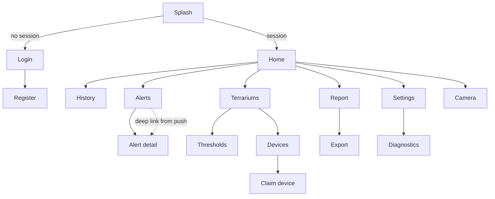

# 04 — UI, UX and Navigation

Two clients share one API: a **Flutter mobile app** (Android, release APK required by the rubric) and a
**web dashboard** (browser, for the demo wall display and for report screenshots). Layout logic, colour
semantics and status vocabulary are shared; the component implementations are not.

## 1. Screen inventory

### 1.1 Flutter app

| # | Screen | Route | Purpose | FRs |
|---|---|---|---|---|
| S1 | Splash / bootstrap | `/` | Restore session, decide login vs home, warm up API | FR-01 |
| S2 | Login | `/login` | Credentials, "stay signed in" | FR-01 |
| S3 | Register | `/register` | Create account | FR-01 |
| S4 | Home / Dashboard | `/home` | Live cards for the selected terrarium, device status, open alerts banner | FR-08, FR-11 |
| S5 | History | `/history` | Range picker + chart + alert overlays + daily summaries | FR-09, FR-14 |
| S6 | Alerts | `/alerts` | Filterable alert inbox with ack/resolve actions | FR-12 |
| S7 | Alert detail | `/alerts/:id` | Full episode: value timeline, band, actions, reason picker | FR-12 |
| S8 | Terrariums | `/terrariums` | List, add, edit, delete, switch active | FR-03 |
| S9 | Thresholds | `/terrariums/:id/thresholds` | Effective bands per metric, overrides, day/night, dwell | FR-10 |
| S10 | Devices | `/devices` | Fleet list, claim flow entry, rename, rebind, rotate, revoke, calibrate | FR-04, FR-16 |
| S11 | Add device (claim) | `/devices/claim` | Code entry + terrarium picker | FR-04 |
| S12 | Summaries / Report | `/report` | Daily/weekly table: coverage, out-of-range minutes, light hours, exposure index | FR-14 |
| S13 | Export | `/report/export` | Range + format, job status, download | FR-15 |
| S14 | Profile / Settings | `/settings` | Language, theme, notification channels, quiet hours, min severity | FR-13 |
| S15 | Camera (optional) | `/camera` | Latest snapshot + refresh | FR-17 |
| S16 | Diagnostics | `/settings/diagnostics` | Coverage %, last sample, rates (read-only, honest numbers) | FR-18 |

### 1.2 Web dashboard

| # | Page | Purpose |
|---|---|---|
| W1 | Wallboard | One terrarium, big live cards + 24 h sparkline, no chrome; designed to be left on a screen |
| W2 | Live | Same as S4 with a multi-terrarium selector |
| W3 | History | Same as S5 with a larger chart and CSV copy button |
| W4 | Alerts | Table view with bulk acknowledge |
| W5 | Thresholds | Editor with a live preview table of `effectiveThresholds` |
| W6 | Devices | Fleet table with last-seen age in seconds |
| W7 | Report | Daily summary table + export button (report screenshots come from here) |
| W8 | Admin | Audit log viewer, retention status, `/metrics` snapshot |

## 2. Navigation graph (app)



Bottom navigation (4 items): **Home · History · Alerts (badge with open count) · More**
(More = Terrariums, Devices, Report, Settings). Deep links from notifications open
`/alerts/:id` or `/home?terrariumId=…` directly, bypassing the tab shell.

**Navigation rule.** Every destructive or expensive action is at most one level deeper than the screen
it belongs to; nothing lives behind a modal that also contains a form (mobile keyboards + modals are a
bad pair). Confirmation dialogs are used only for delete/revoke/purge.

## 3. Design tokens

| Token | Value | Use |
|---|---|---|
| `color.inRange` | `#2E7D32` green | Metric within target band |
| `color.warning` | `#ED6C02` orange | Outside target band (Open Warning) |
| `color.critical` | `#C62828` red | Outside critical band (or Critical alert) |
| `color.unknown` | `#616161` grey | No data / sensor unavailable / offline |
| `color.surface` / `color.surfaceDim` | theme-based | Stale data uses `surfaceDim` + reduced opacity |
| `spacing` | 4 / 8 / 12 / 16 / 24 | 8 pt grid |
| `radius` | 8 (cards) / 4 (chips) | |
| `typography` | metric value: 32 sp semibold; unit: 16 sp; label: 12 sp uppercase | Readable at arm's length (wallboard) |
| `elevation` | 0 for metric cards, 2 for the alert banner | Flat, glanceable |
| `motion` | 200 ms ease-out on value change; no motion beyond that | Values must not distract |
| `statusIcon` | in-range `check_circle`, warning `warning_amber`, critical `error`, unknown `help_outline` | **Colour is never the only signal** (NFR-06) |

## 4. Wireframes (ASCII)

### 4.1 Home / Dashboard (S4)

```
┌───────────────────────────────────────────────────────┐
│ ▾ Linh's gecko box            🟢 online · 12 s ago    │
│ Leopard gecko (semi-desert) · Asia/Ho_Chi_Minh        │
├───────────────────────────────────────────────────────┤
│ ⚠ 1 open alert: Temperature above 32.0 °C for 9 min   │  ← tap → S7
├───────────────┬───────────────┬───────────────────────┤
│ 🌡 Temperature│ 💧 Humidity   │ 💡 Light              │
│ 28.6 °C       │ 41 %RH        │ 1820 lx               │
│ ✅ in range   │ ⚠ low         │ ✅ in range           │
│ band 26–32 °C │ band 40–60 %  │ day phase · ≥ 500 lx  │
│ 12 s ago      │ 12 s ago      │ 12 s ago              │
├───────────────┴───────────────┴───────────────────────┤
│ UV index 0.3 (✅)   ·   Surface 31.2 °C (✅)          │
├───────────────────────────────────────────────────────┤
│ [ 1 h ] [ 24 h ] [ 7 d ] [ 30 d ]                     │
│ ╱╲___╱╲____╱╲_____ 24 h sparkline (tap → S5)          │
├───────────────────────────────────────────────────────┤
│ Today: 0 min out of range · 6.4 light h · coverage 99%│
└───────────────────────────────────────────────────────┘
[ Home ] [ History ] [ Alerts ① ] [ More ]
```

### 4.2 Thresholds (S9)

```
┌───────────────────────────────────────────────────────┐
│ ← Thresholds · Linh's gecko box        [ Reset ]      │
│ Source: profile "Leopard gecko (semi-desert)"         │
├───────────────────────────────────────────────────────┤
│ Temperature              Any phase        [ edit ]    │
│  target 26.0 – 32.0 °C                                │
│  critical 22.0 – 34.5 °C                              │
│  dwell 5 / 2 min · recovery 0.5 °C                    │
│  source: profile ▸ Baines et al. (2016)               │
├───────────────────────────────────────────────────────┤
│ Temperature (Night)      Night phase      [ edit ]    │
│  target 22.0 – 27.0 °C   ← night drop expected        │
├───────────────────────────────────────────────────────┤
│ Humidity                 Any phase        [ edit ]    │
│  target 30 – 40 %RH · critical 20 – 60 %RH            │
├───────────────────────────────────────────────────────┤
│ [ + Override for this terrarium ]                     │
│ ⚠ Sanity: light band is 0–20000 lx; desert profiles   │
│   normally require ≥ 10 h above 1000 lx.              │
└───────────────────────────────────────────────────────┘
```

### 4.3 Claim device (S11)

```
┌───────────────────────────────────────────────────────┐
│ ← Add device                                          │
│ 1. Power the node and wait for the OLED to show a code│
│ 2. Enter the 8 characters below                       │
│                                                       │
│      [ K 7 M 2 - Q P 4 T ]     code expires in 11:42   │
│                                                       │
│ Terrarium:  ▾ Linh's gecko box                        │
│ [ Bind device ]                                       │
│                                                       │
│ Having trouble? ▸ The code expires every 15 minutes;   │
│ the OLED shows the current one.                        │
└───────────────────────────────────────────────────────┘
```

### 4.4 Alert detail (S7)

```
┌───────────────────────────────────────────────────────┐
│ ← ⛔ Critical · Temperature                 Open       │
│ Linh's gecko box                                      │
├───────────────────────────────────────────────────────┤
│ Triggered  14:05 (peak 34.2 °C at 14:22)              │
│ Recovered  14:40  ·  duration 35 min                  │
│ Band in force  26.0 – 32.0 °C  (critical ≤ 34.5)      │
│ Threshold source  profile · Baines et al. (2016)      │
├───────────────────────────────────────────────────────┤
│ 34 ┤      ╭─╮                                         │
│ 32 ┼──────╯ ╰───────  target max                      │
│ 28 ┤                                               │
│    14:00      14:20      14:40                        │
├───────────────────────────────────────────────────────┤
│ [ Acknowledge ]                                       │
│ Resolve as:  ( ) Recovered  ( ) False positive        │
│              ( ) Sensor fault  ( ) Accepted risk      │
│ Note: ______________________________  [ Resolve ]     │
└───────────────────────────────────────────────────────┘
```

## 5. State vocabulary in the UI (must match the API exactly)

| UI label (vi / en) | API value | Colour | Meaning |
|---|---|---|---|
| Trong ngưỡng / In range | `InRange` | green | Inside target band |
| Ngoài ngưỡng / Out of range | `OutOfRange` | orange | Outside target band, inside critical |
| Nguy hiểm / Critical | `Critical` | red | Outside critical band |
| Không có dữ liệu / No data | `NoData` | grey | Never received or device silent |
| Cảm biến lỗi / Sensor unavailable | `Unavailable` | grey | Fault flag or implausible value |
| Đang bảo trì / Maintenance | `Maintenance` | blue-grey | Suppressed by design |

`Unavailable` and `NoData` are deliberately separate: "we do not know" and "the sensor is broken" lead to
different user actions (wait vs replace a part).

## 6. UX rules that the design enforces

| Rule | Rationale |
|---|---|
| **Never show a stale value as a current value.** Every metric card carries its own timestamp; cards older than `3 × samplingInterval` are dimmed and labelled. | The single most dangerous UX failure in monitoring apps. |
| **Always show the band next to the value.** Users should not have to remember numbers. | BR-08.1 |
| **Show coverage alongside any summary.** A 100%-compliant day with 40% data is not compliance. | BR-14.6 |
| **Explain pauses.** When the device is offline, the dashboard states that evaluation is paused — otherwise a quiet screen implies safety. | UC-06 |
| **Never report an unbuilt feature as an outage.** A 404 with no problem body means the route is not built ("not built yet"); a 404 *with* a code is a refusal, which is how ownership is hidden (BR-02.2); only a genuine connection failure says "cannot reach the server". | A wrong diagnosis sends the keeper hunting for a network fault that does not exist — and the reverse hides a real outage |
| **Confirmation only for irreversible actions**, with typed confirmation for purge. | Prevents dialog fatigue, protects real data |
| **Empty states name the next action** ("Claim a device to start collecting"). | Onboarding without documentation |
| **Metric cards never animate numbers continuously** (only on value change, 200 ms). | A wallboard should be calm |
| **Push notification text contains value, band, duration** — not "Check the app". | Users act from the lock screen |
| **Language: vi default, en available**; units always metric; dates `dd/MM HH:mm` for vi, `dd MMM HH:mm` for en. | NFR-06, target users |
| **Accessibility:** ≥ 4.5:1 contrast, 48 dp touch targets, semantic labels on every card (`Semantics(label: 'Temperature 28.6 degrees Celsius, in range')`), no colour-only status. | NFR-06, and it makes the widget tests assert something real |

## 7. Localisation and formatting

- Flutter: `flutter_localizations` + ARB files (`lib/l10n/app_vi.arb`, `app_en.arb`). No hard-coded
  user-facing strings in widgets — enforced by review and by a test that greps for string literals in
  `lib/screens` (see `TC-W-18`).
- Numbers: temperature 1–2 decimals depending on magnitude (`28.6`, `28.75` in tables), humidity integer
  in cards and 1 decimal in tables, lux with thousands separators, UVI 1 decimal.
- Web dashboard: a tiny `i18n.js` with the same keys as the ARB files, so a translation cannot drift
  silently — the key lists are compared in `TC-I-15`.

## 8. Accessibility and responsiveness checks

| Check | Target | How verified |
|---|---|---|
| Text scaling | App usable at 130% system font scale without clipping metric cards | `04-quality/03` checklist, screenshot |
| Portrait phone | 320–480 dp wide; cards stack in one column < 420 dp, two columns 480–900 dp, four above | `TC-W-06` |
| Tablet / web | Wallboard layout above 1 200 px | `04-quality/03` §4.7, screenshot at 1080p+ |
| Contrast | ≥ 4.5:1 body, ≥ 3:1 large text | Manual check with a contrast tool, recorded in QA log |
| Screen reader | Every metric card announced with name + value + unit + status | `TC-W-04` (Semantics assertions) |
| Landscape phone | Chart usable; no clipping of the alert banner | `04-quality/03` |
