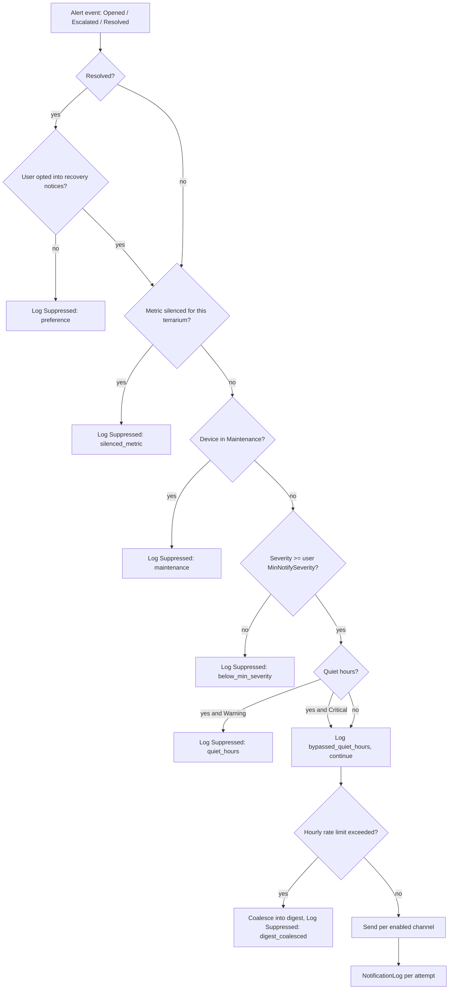

# 05 — Alerts and Notifications

## 1. Severity model

| Severity | Produced when | UX expectation | Notification policy |
|---|---|---|---|
| **Info** (reserved) | Device back online, buffer drained, calibration applied, export ready | Timeline entry only | In-app, never pushed |
| **Warning** | Value outside the target band for `dwellWarnMinutes` (default 5) | Card turns orange; banner on dashboard | Push if user's `MinNotifySeverity ≤ Warning` and quiet hours allow |
| **Critical** | Value outside the critical band for `dwellCritMinutes` (default 2), or `DeviceSilent` > 30 min | Card red; alert pinned; banner has action button | Push always; **bypasses quiet hours**; escalates if unacknowledged |

Rationale for only two operable severities: a third tier tempts the team into inventing distinctions the
biology does not support. `Info` exists only for system events.

## 2. Alert source matrix

| Source | Trigger | Metric | Typical false-positive cause | Mitigation built in |
|---|---|---|---|---|
| `Threshold` | Per-metric band violation (FR-11) | any measured | Lamp repositioned, lid opened during cleaning, sensor in direct sun | Dwell + hysteresis + `Maintenance` device state + silence |
| `DeviceSilent` | No sample for `3 × interval` (Warning) / 30 min (Critical) | none | Wi-Fi drop, power cut, someone unplugged the node | Buffer + auto-resolve on reconnect |
| `SensorFault` | Device reports ≥ 3 consecutive read failures | affected metric | Wiring, condensation, dead sensor | Metric marked `Unavailable`, evaluation skipped — *not* alerted as a habitat problem |
| `DeviceClockSkew` | `\|ReceivedAt − RecordedAt\| > 120 s` | none | NTP blocked, long power-off | Flag samples; fall back to server time for phase/day logic |
| `GradientWarning` *(SHOULD)* | `SurfaceTempC − TempC > 12 °C` | surface | Probe on the basking rock reads the lamp, not the rock | Documented placement rule (`07-appendices/04` §4) |
| `LightDeficit` *(SHOULD)* | Light-hours below profile minimum by 21:00 local | light | Lamp/timer failure, cloudy season | Uses accumulated lux-hours, not instantaneous lux |

## 3. Notification channels

| Channel | Implementation | Auth/config | Failure handling | Notes |
|---|---|---|---|---|
| **In-app inbox** | `NotificationLog` rows rendered in S6 | user session | none needed | Always on; the audit trail of "what was sent" |
| **FCM push** | Firebase Admin SDK from `NotificationDispatcher` | service account JSON mounted read-only | 3 retries (5 s / 30 s / 2 min), token invalidation on `UNREGISTERED` | Android only in v1 |
| **Telegram** | Bot API `sendMessage` to a chat id the user links via a one-time code | bot token in `.env` | 3 retries, 429 `retry_after` respected | **Primary demo channel** — fastest to show live in a demo |
| **SMTP email** | `System.Net.Mail` (optional) | SMTP credentials in `.env` | 3 retries, failures logged | Off by default; useful for a "daily digest" |

Duplicate-channel control: if the same alert would be sent to both Telegram and FCM within 30 s, both are
sent (different devices, different urgency), but the *digest* path collapses them.

## 4. Notification decision flow



`SuppressedReason` values (`quiet_hours`, `silenced_metric`, `maintenance`, `below_min_severity`,
`rate_limited`/`digest_coalesced`, `preference`, `no_channel`) exist so the report can show a real
suppression table instead of hand-waving about alert fatigue.

## 5. Rate limiting, digests and flapping

| Control | Value | Effect |
|---|---|---|
| Per-alert repeat | `cooldownMinutes` (default 60) for a still-open alert | An open alert re-notifies at most hourly, not every sample |
| Per-terrarium hourly cap | 10 notifications | The 11th+ becomes a digest entry; alerts are still created and visible in the inbox |
| Digest | Sent at the top of the next hour if anything was coalesced | One message: "7 warnings, 1 critical, worst 34.2 °C" |
| Flap suppression | Hysteresis 3 consecutive minutes inside by the recovery margin | Prevents open/resolve oscillation near the band |
| Silence window | ≤ 24 h, per metric, reason required, visible on the dashboard | Deliberate, accountable suppression |
| Maintenance mode | Device-level; notifies nobody but records everything | Cleaning/lamp changes without lying about data |

## 6. Escalation

For **Critical** alerts only:

| Elapsed since open | Action |
|---|---|
| 0 min | Push to all users who enabled Critical |
| 30 min, unacknowledged | Repeat push; if a `Technician` exists and was not notified, notify them |
| 60 min, unacknowledged | Notify the `Owner` with an explicit "unacknowledged for 60 min" body |
| 120 min, unacknowledged | Telegram message (out-of-band channel, likely read on a different device) + a permanent banner in the app |

Escalation stops at the first acknowledgement. Escalation events are logged as `NotificationLog` rows
with the same `AlertId`, so the report can show the full response timeline of one incident.

## 7. Notification content contract

Fields available to every channel (FR-13, BR-13.6):

```
title:  "{terrariumName} · {metricName} {direction}"     e.g. "Linh's gecko box · Temperature high"
body:   "{value}{unit} (band {targetMin}–{targetMax}{unit}), out of range {durationMin} min"
        "Critical band exceeded: > {criticalMax}{unit}"  (when critical)
deep:   smartreptile://alerts/{alertId}
```

Rules: no jargon ("dwell", "hysteresis" never appear in user-facing text), always include the band,
always include the duration, never include another user's data, and localise from the user's
`PreferredLanguage` — not stored per-language in the database (ADR-013).

## 8. Testability of the notification layer

Because channels are behind `INotificationChannel`, they are unit-testable with a fake:

```
TC-U-*: policy matrix tests — (severity, quietHours, minSeverity, silenced, maintenance, rateLimit)
        → expected SuppressedReason or Send. One test per cell of the matrix (12 cells).
TC-I-*: dispatcher integration with a fake FCM/Telegram client, asserting retry counts and logs.
TC-E2E-03: real Telegram message received within 90 s of an induced excursion.
```

The *only* non-deterministic part of the system (a third-party push service) is therefore isolated to
one seam — which is also why the demo can fall back to Telegram if FCM delivery is flaky on the day.
