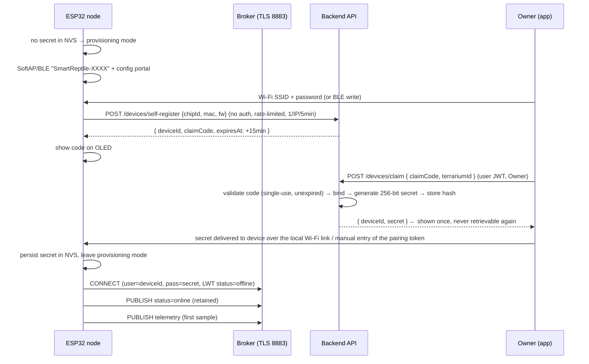

# 06 — Security, Device Auth and Provisioning

Scope: user authentication, device authentication, provisioning, authorisation, transport security,
secrets handling, and an honest threat model. Not in scope: physical tamper resistance, secure boot,
mTLS (both recorded as accepted limitations / v1.1 candidates).

## 1. Assets and the threats that matter for this project

| Asset | Why it matters | Primary threats | Control |
|---|---|---|---|
| Sensor readings | The product's value and the v2 dataset | Tampering, forged telemetry, deletion | Device auth, idempotency, append-only telemetry, audit log |
| Device secret | Grants write access to telemetry | Theft via flash read-out, replay, brute force | 256-bit random, hashed at rest, TLS-only, rotate/revoke |
| User credentials | Account takeover → all terrarium data | Credential stuffing, weak passwords, token theft | PBKDF2 (210 k) / Argon2id, throttling, short-lived JWT + rotating refresh |
| Terrarium & alert data | Privacy (who has an animal, home address implied) | Cross-tenant access, IDOR, enumeration | Owner-scoped queries, `404` on foreign ids, no enumerable endpoints |
| Threshold configurations | Correct alerts; false confidence if wrong | Silent tampering | Audit log with before/after; `ThresholdSnapshot` history |
| Notification channels | Spam/abuse vector, token leakage | Leaked Telegram bot token, FCM service account | Secrets only in `.env`/mounted files, never in repo or client, CI secret scan |
| Availability of the pipeline | Missed alerts | DoS on ingest, broker flood | Rate limits per device, bounded queues, `1883` disabled externally |

## 2. User authentication

| Aspect | Decision |
|---|---|
| Password storage | PBKDF2-HMAC-SHA256, ≥ 210 000 iterations, 16-byte random salt per user (or Argon2id m=64 MiB/t=3/p=1 if time allows). `PasswordIterations` is stored per user so the cost can be raised and rehashed on next login without a mass reset. |
| Password policy | ≥ 10 chars, ≥ 1 letter and ≥ 1 digit, ≤ 128 chars (no composition theatre beyond that); reject the top-1 000 common passwords (embedded list, no API call). |
| Access token | JWT (HS256 in v1, RS256 if the API is split later), 15-minute lifetime, claims: `sub`, `role`, `iat`, `exp`, `jti`, `ver`. |
| Refresh token | Opaque 256-bit random, stored as SHA-256 hash, 30-day lifetime, **single-use with rotation**; reuse of a consumed token revokes the whole family (token-theft detection) and writes an audit entry. |
| Transport of tokens | App stores tokens in `flutter_secure_storage` (Android Keystore-backed), never in `shared_preferences`. |
| Throttling | 5 failed logins per username per 15 min → 15-min lock with an audit entry; 20 failures per IP per 15 min → 15-min block. Response time is constant-ish to avoid user enumeration by timing. |
| Error messages | Login failure is always the same generic message; registration on an existing email returns a neutral "if this address is free you will receive a confirmation" style response. |
| Session invalidation | Logout revokes the refresh token; password change revokes all refresh tokens for that user. |
| Password reset | **Not implemented in v1** (no email infrastructure). Owner can change the password while logged in; a forgotten password means recreating the account in the demo environment. Recorded as limitation L-02 in `05-release/03`. |

## 3. Roles and permissions

| Action | Owner | Technician | Viewer |
|---|---|---|---|
| View dashboard, history, summaries, exports | ✅ | ✅ | ✅ |
| Acknowledge / resolve alerts | ✅ | ✅ | ❌ |
| Silence a metric (≤ 24 h) | ✅ | ✅ | ❌ |
| Create/edit/delete terrarium | ✅ | ❌ | ❌ |
| Claim / rebind / revoke device, rotate secret | ✅ | ❌ | ❌ |
| Edit thresholds and overrides | ✅ | ❌ | ❌ |
| Set calibration offsets | ✅ | ❌ | ❌ |
| Change roles, invite users | ✅ | ❌ | ❌ |
| Purge data, delete account | ✅ | ❌ | ❌ |
| View audit log for own terrariums | ✅ | ⚠ read-only | ❌ |

Implementation: a single `TerrariumAccessRequirement` authorisation handler resolves
`(userId, terrariumId) → role` from the membership table, so an endpoint never has to remember the rule
itself. Foreign resources return **`404`** rather than `403` to prevent id existence probing (BR-02.2).

## 4. Device authentication

### 4.1 Credential model

| Property | Value |
|---|---|
| Secret | 256-bit CSPRNG, base32-encoded (52 chars), issued once at claim time |
| Storage server-side | `SHA-256(secret ‖ 16-byte salt)`, constant-time comparison (`CryptographicOperations.FixedTimeEquals`) |
| Storage device-side | ESP32 NVS (encrypted NVS is enabled where the partition layout allows; not claimed as tamper-proof) |
| MQTT use | `username = deviceId`, `password = secret` |
| HTTPS fallback use | `Authorization: Device {deviceId}.{secret}` |
| Rotation | New secret issued; old one valid for a 10-minute grace window (`GraceUntil`) so the device can reconnect and persist it |
| Revocation | `RevokedAt` set → subscriber kicks the MQTT session, API rejects the credential, audit entry written |

### 4.2 Why not certificates in v1

mTLS with per-device certificates would be stronger, but it requires a CA, per-device provisioning of
keys/certs on an ESP32 without a secure element, and certificate lifecycle tooling — cost that does not
buy meaningful protection for a hobby device whose flash can be read out anyway. Recorded as ADR-006
with the **v1.1 path**: ESP32 `esp_secure_cert`/`esp-tls` with a per-device client certificate, or a
secure element (ATECC608A) for key storage.

## 5. Provisioning flow (UC-01 in detail)

**Decided `[TBC-4]` → `ADR-016`:** how the secret reaches the device in step 10. Option A is the design; option B
survives only as the demo-day fallback. Two options were considered:

| Option | Mechanism | Trade-off |
|---|---|---|
| A (default) | The app sends the secret to the device over the local network with an **8-digit pairing token** that the device displays (the same channel used for Wi-Fi config), one-time use, 5-min TTL, HTTPS with the device's self-signed cert pinned by fingerprint | Good UX, small attack surface, extra firmware endpoint |
| B (fallback) | The user types the secret into the captive portal (long base32 string) | No extra endpoint, terrible UX |

Option A is decided (`ADR-016`); option B remains the demo-day fallback if the pairing endpoint is not finished in
time. Either way the secret is returned exactly once and stored hashed (ADR-006, BR-05.3).

**Anti-abuse on `self-register`:** unauthenticated by necessity, so it is rate-limited (1 request per IP
per 5 min, 20 per hour globally for the demo), payload-validated, and creates devices in
`Provisioning` state with zero capability. Unclaimed devices older than 24 h are swept. A flood can
create junk rows but can never read or write other tenants' data.

**Claim-code properties:** 8 chars from a 32-symbol alphabet excluding `0/O/1/I/L` (see
`07-appendices/03` §2.1), 15-minute TTL, regenerated while in provisioning mode, single-use, and —
crucially — **the same error is returned for unknown, expired and consumed codes** (BR-04.3).

## 6. Transport and platform security

| Item | v1 decision |
|---|---|
| MQTT | TLS 1.2+ on `8883` only; `1883` bound to loopback for local debugging and *disabled* in the release runbook; broker requires credentials (`allow_anonymous false`) |
| HTTPS | TLS 1.2+; HSTS on the dashboard host; HTTP redirects to HTTPS |
| Certificates | Let's Encrypt hostname in the runbook; self-signed/internal CA acceptable only for the local demo, and the ESP32 is flashed with the matching CA bundle |
| Firmware | WiFi credentials stored in NVS; OTA disabled (no attack surface for unsigned updates); debug serial logs must not print the secret |
| API input handling | Model validation + explicit allow-lists; no raw SQL (EF Core parameterised only); file uploads (snapshots) limited to 512 KB, content-type checked, `sha256` recorded, filename never used for the storage path |
| Rate limits | auth 10/min/IP · ingest HTTP 6/min/device · snapshot 1/30 s/device · exports 5/hour/user · self-register 1/5min/IP |
| Headers | Dashboard served with `X-Content-Type-Options: nosniff`, `X-Frame-Options: DENY`, `Referrer-Policy: no-referrer`, CSP without `unsafe-inline` |
| Dependencies | `dotnet list package --vulnerable` in CI; `flutter pub outdated` review each milestone (NFR-08) |
| Secrets | `.env` (git-ignored) + mounted files; CI runs a secret scan; `appsettings.*.json` contain no secrets |
| Backups | SQL Server backup file created before the demo, stored off the host (protects against a demo-day DB accident, not against a determined attacker) |

## 7. OWASP IoT Top 10 review (2018 list, checked item by item)

| # | Risk | Status in v1 | Note |
|---|---|---|---|
| I1 | Weak, guessable, or hardcoded passwords | ✅ Mitigated | 256-bit per-device random secrets; no default password; no secret in firmware source |
| I2 | Insecure network services | ✅ Mitigated | Only MQTT/TLS + HTTPS exposed; no telnet/HTTP debug service in release firmware; `1883` loopback-only |
| I3 | Insecure ecosystem interfaces | ⚠ Partly | API + app reviewed; the **captive portal** during provisioning is the weak spot — mitigated by a 5-minute window and no persistent credential issuance without the claim step |
| I4 | Lack of secure update mechanism | ⚠ Accepted | No OTA in v1 → no update attack surface, but also no way to patch a deployed device. Accepted for a monitoring-only prototype (limit L-03) |
| I5 | Use of insecure or outdated components | ✅ Managed | Pinned versions, vulnerability scan in CI, no abandoned libraries (no `DHT` sensor libraries; SHT31/BH1750/LTR390 all active) |
| I6 | Insufficient privacy protection | ✅ Mitigated | Owner-scoped data, no third-party analytics, camera off by default with a 7-day retention and a consent note |
| I7 | Insecure data transfer and storage | ✅ Mitigated | TLS everywhere; passwords and secrets hashed; DB reachable only inside the Compose network |
| I8 | Lack of device management | ✅ Mitigated | Fleet view, revoke, rotate, last-seen, firmware version, audit log |
| I9 | Insecure default settings | ✅ Mitigated | Anonymous MQTT off, no default admin account, `Development`-only auto-migrations, CORS allow-list |
| I10 | Lack of physical hardening | ❌ Not addressed | Flash read-out gives the device secret; no secure element. Declared as limitation L-01, and the design limits the blast radius (a stolen device can only publish to *its own* terrarium, and can be revoked) |

Being explicit about I3, I4 and I10 is deliberate: a report that claims ten green ticks invites a
question the team cannot answer.

## 8. Privacy notes

- The system stores no personal data beyond username/email and an optional terrarium location string.
  Users are advised in the settings screen not to enter an address, only a room label.
- Camera snapshots could show a home interior; the feature is off by default, has a 7-day retention, and
  is excluded from the v2 dataset by default (BR-17.3).
- Account deletion removes user rows, their terrariums, raw telemetry, rollups, summaries, snapshots and
  export files; alerts and audit rows are anonymised (`UserId` set to null) rather than deleted, so the
  dataset remains coherent for research use without identifying anyone. This behaviour is stated in the
  settings screen before deletion.

## 9. Security verification checklist (evidence for the report)

| Check | Method | Expected result |
|---|---|---|
| Anonymous MQTT publish rejected | `mosquitto_pub` without credentials | Connection refused |
| Wrong device secret rejected + audited | publish with a bad password | Refused, `auth_failed` audit row, `ingest_rejected_total` increments |
| Cross-tenant read blocked | request another user's terrarium with a valid token | `404` |
| Viewer cannot mutate | `POST /alerts/{id}/ack` with a Viewer token | `403 insufficient_role` |
| Expired/consumed claim code rejected identically | submit each case | Same body and status (`404 claim_code_invalid`) |
| Revoked device blocked within 60 s | revoke, then publish | Not persisted; status `revoked` |
| Secret rotation grace window works | rotate, reconnect with old secret within 10 min | Connects, audit warning written |
| Refreshed-token reuse detected | use a consumed refresh token | Family revoked, audit entry |
| Password throttle | 6 failed logins | Lock + audit; no user enumeration in the response |
| No secrets in the repo | `git grep` for token/secret patterns + CI scan | No matches |
| TLS enforced | connect to `1883` from another host | Refused |
| Rate limits | burst beyond limits | `429` with `Retry-After` |
