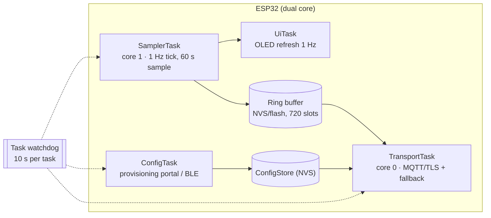
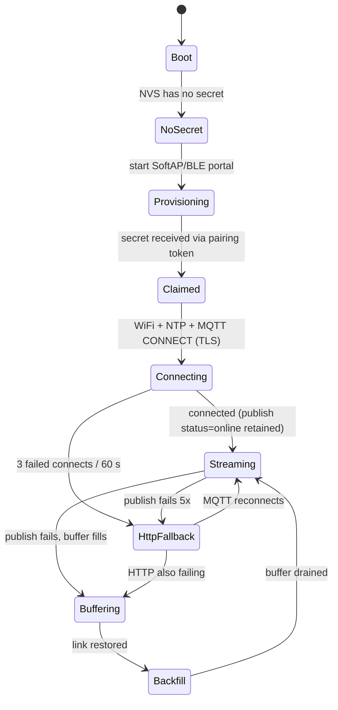

# 04 — Firmware: Sensor Sampling and Transport

Target: **ESP32 DevKitC v4** (ESP32-WROOM-32E), Arduino core via PlatformIO. One firmware, one job: read
sensors honestly, keep samples safe, publish them, and tell the truth about its own health.

## 1. Task architecture (FreeRTOS)



| Task | Core | Period | Stack | Watchdog | Responsibility |
|---|---|---|---|---|---|
| `SamplerTask` | 1 | 1 Hz tick, emit every `samplingIntervalSec` | 6 KB | fed each tick | Read all sensors 5× at 50 ms spacing, median filter, EMA smooth, stamp `RecordedAt` + `seq`, write to the ring buffer |
| `TransportTask` | 0 | 1 s poll | 8 KB | fed each loop | Publish due batches, handle ACKs, send health every 5 min, receive `cmd`, fall back to HTTPS, back-fill after reconnect |
| `ConfigTask` | 0 | event-driven | 8 KB | fed | Provisioning portal (SoftAP + captive page) or BLE config; then exits and frees ~40 KB heap |
| `UiTask` | 1 | 1 Hz | 4 KB | fed | OLED: live values, device id, claim code / status icon |
| `loop()` | 1 | continuous | — | feeds | Feeds the watchdog, housekeeping (heap log every 5 min), no blocking work |

Estimated RAM: ~90 KB static+heap out of ~320 KB DRAM; ~35% flash. Verified with
`pio run -t size` and logged in `05-release/02` §5.

## 2. Sensor drivers and filter chain

| Sensor | Bus | Address/pin | Measured | Datasheet accuracy | Vote |
|---|---|---|---|---|---|
| SHT31-D | I²C | `0x44` | Air temperature, relative humidity | ±0.3 °C, ±2 %RH | Primary (ADR-014) |
| BH1750 | I²C | `0x23` | Illuminance, 1–65 535 lx | ±20% typ. | Primary light sensor |
| LTR390 | I²C | `0x53` | UV index + ambient light | indicative (calibrated to UVI) | UV, optional but recommended |
| DS18B20 | 1-Wire | GPIO 4 (4.7 kΩ pull-up) | Surface/basking-spot temperature | ±0.5 °C | Optional |
| (rejected) DHT22 | 1-Wire-ish | GPIO | Temp + RH | ±0.5 °C, ±2–5 %RH, 2 s min interval | Rejected: slower, less accurate, self-heating |
| (optional) ESP32-CAM | UART/Wi-Fi | second board | JPEG still | — | FR-17, separate node |

**Filter chain (per metric):**

```
raw₁…raw₅ (50 ms spacing)  →  median of 5  →  EMA(α = 0.3)  →  value published
                                     │
                                     └── disagreement > 2× datasheet noise → flag quality bit 2
```

Why median-of-5 then EMA: the median rejects a single I²C glitch (which would otherwise become an alert),
and the EMA damps slow oscillation without hiding a real trend. Rejected alternatives are documented in
ADR-014: a plain mean is glitch-sensitive; a Kalman filter is unjustified complexity for a 60 s cadence.

**Plausibility at the edge** duplicates the server rule deliberately (`sr_config.h`), so obviously bad values
are flagged before they consume bandwidth:

```c
// include/sr_config.h
#define SR_TEMP_MIN_C        (-10.0f)
#define SR_TEMP_MAX_C        ( 60.0f)
#define SR_RH_MIN_PCT        (  0.0f)
#define SR_RH_MAX_PCT        (100.0f)
#define SR_LUX_MAX           (200000.0f)
#define SR_UVI_MAX           ( 15.0f)
#define SR_PLAUSIBLE(v, lo, hi) ((v) >= (lo) && (v) <= (hi))
```

## 3. Ring buffer (the reliability core)

```
struct SampleRecord {              // 32 bytes, packed
  uint32_t epoch;                  // seconds, UTC from NTP
  int64_t  seq;                    // monotonic device counter (also the dedupe key)
  int16_t  tempC_x100;             // 28.75 °C → 2875
  uint16_t rh_x100;                // 41.20 % → 4120
  uint32_t lux;                    
  uint16_t uvi_x100;               // 0.30 → 30
  int16_t  surfaceC_x100;
  uint8_t  qualityFlags;
  uint8_t  reserved;
};                                 // 32 B × 720 slots = 23 KB → fits NVS blob comfortably
```

| Property | Value | Note |
|---|---|---|
| Capacity | 720 samples | 12 h at 60 s — the NFR-03 floor |
| Storage | NVS blob (or a dedicated SPIFFS/LittleFS file if wear becomes visible) | Documented decision; NVS write amplification is acceptable at 1 write/min |
| Eviction | Ring: oldest overwritten when full | `droppedCount` is reported in the next health payload, so data loss is **visible**, never silent |
| Ordering | Append-only; `seq` strictly increasing | Back-fill preserves the original `RecordedAt` |
| Durability | Survives reset and power loss (write completes before publish) | Written *before* any network attempt |

**Design rule:** the buffer is written before publishing, and the publish watermark advances only after a
broker ACK. A crash therefore re-sends at worst one batch, which the server dedupes by `(deviceId, seq)`.

## 4. Transport state machine



| Parameter | Value | Rationale |
|---|---|---|
| MQTT keep-alive | 30 s | Detects a dead link within ~1.5× |
| LWT | `sr/v1/d/{id}/status` = `offline`, QoS 1, retained | Server-side fast offline detection; the watchdog still catches LWT loss |
| Reconnect backoff | 2 s → 4 → 8 → … → 60 s cap, ±20% jitter | Avoids thundering herd if many nodes boot together |
| Back-fill batch | ≤ 20 samples per publish, 1 publish/s | Keeps payload < 4 KB and avoids burst-flooding the broker |
| HTTPS fallback | Only after 60 s of MQTT failure, ≤ 6 requests/min (server limit), same payload | Second path over the same network; also proves the API contract independently |
| NTP | `pool.ntp.org` + VN pool, sync before first publish; re-sync daily | Timestamps are the backbone of day/night logic (NFR-10) |
| Clock fallback | If NTP fails: publish with `q \|= clockUnsynced`, server stamps `ReceivedAt` | Never publish a wrong local time as if it were right |
| Wi-Fi modem sleep | `WIFI_PS_MIN_MODEM` | ~40% lower average current, latency impact irrelevant at 60 s |
| Command handling | Subscribe `cmd`, execute, publish to `ack` with `cmdId` within 5 s | `set_config` (intervals), `take_snapshot` (if camera node), `ping` |

## 5. Payload construction

```cpp
// src/net/mqtt_transport.cpp (excerpt)
void TransportTask::publishBatch(const SampleRecord* batch, size_t n) {
  JsonDocument doc;                                 // ArduinoJson 7
  doc["deviceId"] = cfg.deviceId;
  doc["seq"]      = batch[0].seq;
  doc["fw"]       = FW_VERSION;
  doc["ts"]       = iso8601Utc(batch[0].epoch);
  JsonArray samples = doc["samples"].to<JsonArray>();
  for (size_t i = 0; i < n; ++i) {
    JsonObject s = samples.add<JsonObject>();
    s["t"]   = (int32_t)(batch[i].epoch - batch[0].epoch);   // seconds offset from ts
    s["tf"]  = batch[i].tempC_x100 / 100.0f;
    s["rh"]  = batch[i].rh_x100 / 100.0f;
    s["lux"] = batch[i].lux;
    s["uvi"] = batch[i].uvi_x100 / 100.0f;
    if (hasSurface) s["st"] = batch[i].surfaceC_x100 / 100.0f;
    if (batch[i].qualityFlags) s["q"] = batch[i].qualityFlags;
  }
  doc["health"].to<JsonObject>();                   // rssi/up_s/heap_kb/bat/src
  char out[4096];
  size_t len = serializeJson(doc, out, sizeof(out));
  mqtt.publish(topicTelemetry(cfg.deviceId), /*qos*/ 1, /*retain*/ false, (uint8_t*)out, len);
}
```

The short keys (`tf`, `rh`, `lux`, `uvi`, `st`, `q`) exist purely to keep the payload small on a 12 h
back-fill; the mapping is documented in `07-appendices/03` §3 and mirrored in the server validator.
ArduinoJson 7's elastic `JsonDocument` avoids the fixed-pool sizing bugs that plague this kind of code.

## 6. Self-diagnostics the firmware reports

| Signal | Trigger | Field | Why the dashboard cares |
|---|---|---|---|
| `sensor_fault` | ≥ 3 consecutive read failures on a metric | `events` topic | Turns a metric into `Unavailable` instead of a false alert |
| `buffer_overflow` | Ring buffer overwrote unread samples | `events` + `dropped` count in health | Makes data loss visible; feeds coverage honesty |
| `clock_unsynced` | NTP not obtained before publishing | quality bit 16 | Phase/day attribution is flagged as approximate |
| `low_heap` | free heap < 20 KB | health | Early warning of a leak before it resets the device |
| `boot` | every start | `events` | Distinguishes a power cut from a Wi-Fi drop in the incident timeline |
| `calibrated` | calibration offsets loaded from NVS | `events` | Documents that corrections were active for the period |

## 7. Provisioning UX on the device (firmware side of UC-01)

1. No secret in NVS → start SoftAP `SmartReptile-XXXX` (last 4 of the chip id) + captive portal, or BLE
   config if the app is used over BLE.
2. Portal form: Wi-Fi SSID/password, optional device name, optional Wi-Fi "advanced" (static IP).
3. On save: connect, sync NTP, `POST /api/v1/devices/self-register` with `chipId`, `mac`, `fw`.
4. Show the returned 8-character claim code on the OLED (large font) with a countdown; refresh every
   15 minutes until claimed.
5. Wait for the pairing secret (`POST` from the app to the device with the 8-digit pairing token shown on
   the OLED — `ADR-016`, option A, in `02-design/06` §5). On receipt: store in NVS, clear the code, reboot
   into streaming mode.
6. If the pairing endpoint is not implemented (fallback option B), the user types the secret into the
   portal's advanced field.

Failure handling: if `self-register` fails, show `No server` + the portal URL again; never store a
half-configured state (all-or-nothing config commit to NVS at the end).

## 8. Build configurations

```ini
; platformio.ini
[env:esp32dev]
platform = espressif32@6.9.0
board = esp32dev
framework = arduino
monitor_speed = 115200
build_flags =
  -DSR_FW_VERSION=\"1.2.0\"
  -DSR_LOG_LEVEL=2          ; 0 off, 1 err, 2 info, 3 debug
  -DCORE_DEBUG_LEVEL=1
lib_deps =
  knolleary/PubSubClient@^2.8
  bblanchon/ArduinoJson@^7.2.0
  adafruit/Adafruit SHT31 Library@^2.2.2
  claws/BH1750@^1.3.0
  adafruit/Adafruit LTR390 Library@^1.0.4
  milesburton/DallasTemperature@^3.11.0
  paulstoffregen/OneWire@^2.3.8
  adafruit/Adafruit SSD1306@^2.5.13
  wifi-manager/WiFiManager@^2.0.17

[env:native]                ; host tests for the pure logic (filters, ring buffer, payload builder)
platform = native
test_framework = unity
```

`native` is the reason `lib/filters` and `lib/ringbuffer` are plain C++ with no Arduino includes: the
reliability-critical logic is unit-tested on the developer machine in `TC-U-FW-*`, not only on hardware.

## 9. Firmware definition of done (per milestone)

1. `pio run -e esp32dev` and `pio run -e native` succeed; `pio test -e native` green.
2. 24 h soak: no watchdog reset, no heap decline beyond 2 KB, ≥ 99% of intervals delivered or buffered.
3. Serial log contains no secret and no credentials (checked by eye and by a grep in CI).
4. Power-cycle test: resumes streaming with correct timestamps within 30 s (NFR-12).
5. Ring-buffer test: with the broker stopped for 30 min, every sample is delivered after restart and the
   server reports zero duplicates.
