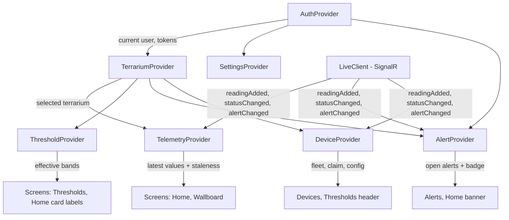

# 05 — App State Management and Real-Time

Flutter (Android) with `provider`. The discipline that makes this work: **screens render state, providers
own state, `data/` talks to the network.** No screen ever imports `api_client.dart`.

## 1. Provider graph



| Provider | Owns | Key API | Notifies on |
|---|---|---|---|
| `AuthProvider` | Session, access/refresh tokens (secure storage), current user, role | `login`, `register`, `logout`, `refreshIfNeeded` | Login/logout, token refresh, role change |
| `TerrariumProvider` | Terrarium list, selected id (persisted), CRUD | `load`, `select`, `create`, `update`, `delete` | List/selection change |
| `TelemetryProvider` | Latest value per metric per terrarium, freshness, live subscription lifecycle | `loadLatest`, `subscribe`, `applyPush` | New sample, status change, staleness tick |
| `AlertProvider` | Inbox (paged), filters, open count, ack/resolve/silence | `load`, `ack`, `resolve`, `silence`, `applyPush` | Any alert state change |
| `ThresholdProvider` | Effective bands + overrides, edit drafts, validation | `load`, `saveOverride`, `resetToProfile` | Threshold change |
| `DeviceProvider` | Fleet list, claim flow state, pending commands, calibration | `load`, `claim`, `rotate`, `revoke`, `sendConfig` | Device status/command result |
| `SettingsProvider` | Language, theme, notification preferences, quiet hours | `load`, `set*` | Any preference change |

**Wiring rule:** providers that need the session subscribe to `AuthProvider` themselves
(`auth.addListener(...)`) instead of being rebuilt from the widget tree — so a token refresh does not
recreate every screen and lose scroll position.

## 2. `TelemetryProvider` — the interesting one

```dart
class TelemetryProvider extends ChangeNotifier {
  TelemetryProvider(this._readings, this._live, this._clock);

  final Map<String, Map<MetricCode, MetricValue>> _latest = {};   // terrariumId → metric → value
  final Map<String, DeviceStatusSnapshot> _status = {};
  Timer? _stalenessTimer;

  void applyPush(ReadingAddedEvent e) {
    _latest[e.terrariumId] = {...?_latest[e.terrariumId], for (final m in e.metrics) m.code: m};
    _status[e.terrariumId] = _status[e.terrariumId]!.copyWith(lastSampleAt: e.recordedAt);
    notifyListeners();                     // single notify per event
  }

  /// Staleness is computed, never stored: the UI asks "how old is this?" at render time.
  MetricFreshness freshness(String terrariumId, MetricCode code) {
    final v = _latest[terrariumId]?[code];
    if (v == null) return MetricFreshness.noData;
    final age = _clock.now().difference(v.recordedAt);
    final threshold = Duration(seconds: 3 * _status[terrariumId]!.samplingIntervalSec);
    return age > threshold ? MetricFreshness.stale(age) : MetricFreshness.fresh(age);
  }
}
```

Three decisions worth defending in the report:

1. **Freshness is derived, not stored.** A stored `isStale` flag requires a timer to flip it, and timers
   that flip flags are where "the app says online for 20 minutes after the device died" bugs live. The UI
   ticks every 5 s (a cheap `Timer.periodic` that only calls `notifyListeners`) and re-derives.
2. **One map, one notify.** Pushes arrive as batches; merging into a single map and notifying once per
   event keeps the frame budget trivial even during a 12 h back-fill burst.
3. **`IClock` is injected** (`Clock.system()` in production, `Clock.fake()` in tests), so staleness, phase
   and duration formatting are tested without `Future.delayed` — which also avoids the fake-async
   deadlock that plagues `testWidgets` when real delays are awaited.

## 3. Live connection (`LiveClient`)

```dart
class LiveClient {
  HubConnection? _conn;
  Future<void> connect(String accessToken) async {
    _conn = HubConnectionBuilder()
        .withUrl('$apiBase/hubs/telemetry', options: HttpConnectionOptions(
            accessTokenFactory: () async => accessToken))
        .withAutomaticReconnect([0s, 2s, 5s, 10s, 30s])
        .build();
    _conn!.on('readingAdded',  (e) => _bus.add(ReadingAdded.fromMap(e)));
    _conn!.on('statusChanged', (e) => _bus.add(StatusChanged.fromMap(e)));
    _conn!.on('alertChanged',  (e) => _bus.add(AlertChanged.fromMap(e)));
    await _conn!.start();
    for (final id in _subscribed) await _conn!.invoke('JoinTerrarium', args: [id]);
  }
}
```

Rules:
- Subscriptions are re-issued after every reconnect (SignalR does not restore groups for a new connection).
- On reconnect, the client **re-fetches** `readings/latest` before resuming the stream — a reconnected
  socket must never leave the UI showing pre-disconnect values as current.
- If the hub cannot connect at all, the app degrades to 30 s polling and shows a visible "live updates
  paused" chip (UC-02 A1). Silent degradation is not allowed.
- The token is refreshed before `connect()`; a 401 on the hub triggers one refresh-and-reconnect, then
  surfaces an error rather than looping.

## 4. Offline and error behaviour (client side)

| Situation | Behaviour |
|---|---|
| No network on launch, cached values exist | Show cached values with explicit timestamps and an `offline` chip; do not pretend they are live |
| Mutations while offline (claim, ack, threshold save) | Queued in `local_cache` with an `Idempotency-Key`, replayed on reconnect, with a visible "1 pending action" indicator; conflict → server wins + a message |
| `401 unauthorized` on a data call | One silent refresh; if refresh fails → session expired → login screen with a preserved deep link |
| `403 insufficient_role` | Action hidden or disabled for that role in the first place; if it still happens, show a plain explanation |
| `404` on a terrarium (deleted elsewhere) | Remove it from the list, show "this terrarium was removed", return to Home |
| `409 version_conflict` on threshold save | Show the server's current values side by side and let the user re-apply |
| `429` | Respect `Retry-After`; disable the action with a countdown |
| `5xx` | One retry with jitter, then an actionable error (`problem.code` mapped to a localised message) |

Problem codes are mapped in one place (`core/result.dart`) with a **fallback message per HTTP status** so
an unknown code never renders as "Error 500" with no explanation.

## 5. Rendering rules the widgets enforce

| Widget | Enforced rule |
|---|---|
| `MetricCard` | Requires `capturedAt` (non-null) → a value can never be rendered without its timestamp |
| `StatusBadge` | Status → (colour, icon, localised label) from `core/status.dart` only; colour alone is never the signal |
| `BandLabel` | Always shows the band, plus the source (`profile`/`override`) so numbers are never unexplained |
| `StalenessChip` | Shows `12 s ago` / `12 min ago`; switches to a warning style past the staleness threshold |
| `CoverageBadge` | Any summary must be rendered with its coverage; a summary without coverage is a compile-time missing argument |
| `AlertTile` | Shows severity, metric, duration, and state; ack/resolve actions are role-gated at render time *and* on the server |
| `ChartPanel` | Gap-aware (nulls preserved), max 720 points appended, disposes the chart controller, shows bucket size (`5-min averages`) |

## 6. Web dashboard structure

```
web/js/
├── api.js        # fetch wrapper: base URL, token, problem+json → typed errors, 401 refresh
├── live.js       # SignalR client (same events as the app), re-subscribe on reconnect
├── store.js      # tiny observable store: {terrariums, latest, alerts}; pages subscribe
├── charts.js     # Chart.js helpers: band overlay, gap-aware series, 720-point cap
├── i18n.js       # vi/en strings mirroring the ARB keys
└── pages/{wallboard,live,history,alerts,thresholds,devices,report,admin}.js
```

- The store mirrors the Flutter `TelemetryProvider` semantics (derived freshness, one notify per batch) so
  the two clients cannot disagree about what "stale" means.
- `wallboard.html` renders one terrarium with no navigation, larger type, and a 24 h sparkline: this is the
  screen shown during the demo and in report screenshots.
- The dashboard has no build step on purpose (NFR-08): a `git clone` + `docker compose up` must be enough.

## 7. Widget and provider test hooks (mirrors `04-quality/02`)

| Test target | Technique |
|---|---|
| `TelemetryProvider` | Inject fake API + fake `LiveClient` + `Clock.fake()`; assert merge semantics, one notify per batch, freshness transitions |
| `AlertProvider` | Fake API; assert optimistic ack rollback on failure and badge count |
| `MetricCard` | `pumpWidget` with a fixed value/status/time; assert text, icon and Semantics label; assert dimming when stale |
| `ChartPanel` | Feed a series with a gap; assert the rendered series contains a null (no interpolation) |
| Claim flow (S11) | Widget test: invalid code → error state; valid code → success state + terrarium shown |
| Threshold editor (S9) | Widget test: `min >= max` shows a field error and disables Save |
| Role gating | Widget test with a `Viewer` session: ack button absent on `AlertTile` |
| Navigation | Widget test: bottom nav switches tabs, deep link `/alerts/:id` lands on the detail screen |
