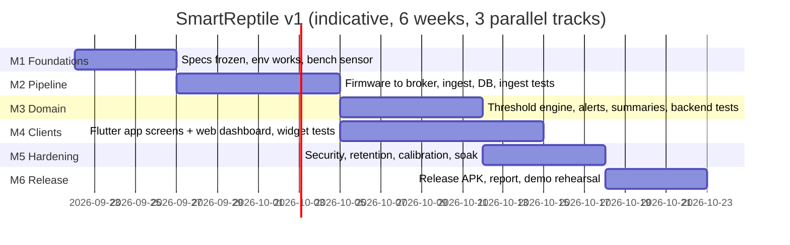

# 07 — Implementation Roadmap

Six milestones. Each ends with a **demo-able increment** and an explicit definition of done, so the team
always has something to show and always knows what "finished" means. Parallel tracks are marked.

---

## M1 — Foundations (5 days)

**Goal:** every member can run the whole stack locally and one real sensor produces a number.

| # | Task | Owner track | Acceptance | Status (2026-09-23, measured) |
|---|---|---|---|---|
| 1.1 | Close the open decisions `[TBC-1…4]` with the mentor (species, box size meaning, channels, pairing method) | all | Values written into this doc set; `01-product/01` §6 updated | **Partial** — the decisions are now in one canonical list (`05-release/03` §6, TBC-1…TBC-6), the product-facing four are repeated in `01-product/01` §6, TBC-4 is closed as **`ADR-016`**, and `02-design/06` §5 no longer describes it as open. What is still missing is *evidence of sign-off*: an agreement reached verbally is not in the repository, so `05-release/03` §6.1 carries a dated line to fill in. Partial until that line is real |
| 1.2 | Freeze FR/NFR list and ids | all | No id changes after this point without a note in `05-release/03` | **Complete** — the id scheme is in use across all 34 documents |
| 1.3 | Create the monorepo skeleton + CI job running `dotnet build`, `flutter analyze`, `pio run`, `pio test -e native` | backend | CI green on an empty scaffold | **Complete, exceeded** — five green jobs on every push (`backend`, `integration`, `app`, `firmware`, `secret-scan`); the firmware job executes the 22 host tests |
| 1.4 | Docker Compose: SQL Server + API skeleton + broker with `/health` | backend | `/health` green, `/health/ready` reports `database` + `mqtt-broker` | **Complete** — stack up and healthy; `/health/ready` reports both checks Healthy; the DB-outage drill returns `503` in 3.0 s and recovers in 7 ms with zero API restarts |
| 1.5 | Bench bring-up: SHT31 + BH1750 (+ DS18B20) on a breadboard, serial print at 1 Hz | firmware | Serial shows plausible values; `04-quality/03` §2 checklist partially signed | **Not started** — no hardware has been connected; `main.cpp` reports placeholder values and the QA checklist is unsigned |
| 1.6 | Sensor accuracy spot check (fridge/room/lamp, hygrometer comparison) | firmware | Numbers within datasheet tolerance, recorded in the QA log | **Not started** — depends on 1.5 |
| 1.7 | Flutter app scaffold: routing, theme, providers wired to a stub API, `flutter test` green | app | App runs, empty screens, tests green | **Complete** — `flutter analyze` clean, 19 tests pass, provider wiring and en/vi localisation in place |
| 1.8 | `07-appendices/05` literature pass 1 (collect sources, mark verified rows) | doc/report | ≥ 60% of threshold rows have a citation | **Partial** — every seeded band carries `SourceRef` + `SourceUrl`, but all are stamped `PENDING VERIFICATION` and the §5 checklist is 0 of 13 rows signed |

**DoD:** `README` quick start reproduces the environment on a teammate's machine in ≤ 30 min; sensor data on
serial; CI green. **Risk burn-down:** toolchain/JDK/Wi-Fi-band issues surface here, not in week 5.

**DoD status, measured 2026-09-21:** two of the three lines hold — the quick start has been run repeatedly on this
machine, and CI is green — but *"sensor data on serial"* does not, because 1.5 and 1.6 are unstarted. **M1 is
therefore not closed**, and the milestone's own goal statement ("one real sensor produces a number") is the single
line keeping it open. Everything the milestone asked for that does not need a breadboard is done, and the Status
column above records how each was verified rather than that it was attempted.

**Re-measured 2026-09-23:** the milestone gained its first real evidence set on 2026-09-22 —
`06-report/snapshots/` holds the live `/health/ready`, `/version` and `/metrics` responses plus three captured
dashboard pages, produced from the running stack rather than drawn. `06-dashboard-health.png` is the one that shows
a complete path today: browser → nginx → API → SQL Server + MQTT broker. That pass also found a genuine defect,
now fixed: the dashboard reported *any* non-2xx as an unreachable server, so the `404` from the not-yet-built
`/api/v1/...` routes read as "cannot reach the server" and implied the animal was unmonitored when in fact nothing
was wrong. Failure messaging is now classified once (`web/js/api.js` → `failureKind`), with the distinction
recorded as a UX rule (`02-design/04` §6) and a drill that would catch its return (`04-quality/03` §5.11); the
four cases were exercised in a browser on 2026-09-23. **The DoD verdict is unchanged** — two of three lines hold,
and *"sensor data on serial"* is still the only missing line. What moved: 1.1 went from "decision recorded" to
"decision recorded and consistent across the doc set" (`ADR-016`), and M1 now has report-grade screenshots of
what it actually delivers instead of prose claims about it.

Beyond M1: task **2.1** (domain entities, EF Core model, `InitialSchema` migration, seeders for the metric
dictionary, three profiles and their bands) is also complete and enforced by the `integration` CI job, and 2.3 is
partly in place (the broker is hosted in-process and refuses anonymous connections, but credential verification
against `DeviceCredential` is not written). The M2 table below is not starting from zero.

---

## M2 — Data pipeline (8 days)

**Goal:** a real sample walks from the terrarium into SQL Server and back out through the API.

| # | Task | Track | Acceptance |
|---|---|---|---|
| 2.1 | Domain entities + EF Core model + `InitialSchema` migration + seeders (metrics, 3 profiles, thresholds) | backend | `TC-I-01/02`; DB has seeded profiles with sources |
| 2.2 | Device self-register + claim + credentials (hash, rotate, revoke) | backend | `TC-I-05/13`; UC-01 walkthrough on paper |
| 2.3 | MQTT broker hosted in API; subscriber; auth against credentials; TLS on 8883 | backend | Bad credentials refused + audited; `1883` loopback-only |
| 2.4 | `IngestWorker` + `IngestPipeline` stages + counters | backend | `TC-U-01…09`, `TC-I-03/04` green |
| 2.5 | Firmware: sampler task, filters, ring buffer, MQTT publish, LWT, health | firmware | 60 s samples visible in DB; `TC-U-FW-*` (native tests) green |
| 2.6 | Firmware: HTTPS fallback + back-fill after outage | firmware | `TC-I-08` passes with a 30-minute broker stop |
| 2.7 | Provisioning: SoftAP portal + self-register + claim code on OLED | firmware | Code appears within 60 s of boot; `TC-I-05` |
| 2.8 | REST: readings/latest, readings (range, bucketing), coverage, terrariums CRUD | backend | `TC-I-10/11`; p95 within NFR-01 on the seeded dataset |
| 2.9 | SignalR hub + broadcast on ingest | backend | A browser console client receives a push < 1 s after ingest |
| 2.10 | First end-to-end: real node → broker → DB → `readings/latest` | all | `TC-E2E-01` recorded with a screenshot for the report |

**DoD:** the chain works with the real device, and the pipeline survives a broker restart without losing a
sample. This is the milestone where the design either holds or is corrected — expect ADR updates.

---

## M3 — Domain logic (7 days)

**Goal:** the system can tell a keeper something they did not already know, correctly.

| # | Task | Track | Acceptance |
|---|---|---|---|
| 3.1 | `ThresholdService` + resolution order + `effectiveThresholds` endpoint + `ThresholdSnapshot` | backend | `TC-U-21…26`; UC-03 flows verified |
| 3.2 | `ThresholdDecision.Decide` (pure) + `EvaluatorWorker` + ordered queue + `EvaluationState` | backend | `TC-U-10…20` (dwell/hysteresis/escalation matrix) green |
| 3.3 | Derived signals: `DeviceSilent`, `SensorFault`, `DeviceClockSkew` | backend | `TC-U-27…31`, `TC-I-09` |
| 3.4 | Alert lifecycle: open/ack/resolve/silence + audit + role gating | backend | `TC-I-07`, `TC-U-36` |
| 3.5 | `NotificationDispatcher` + policy matrix + FCM + Telegram + inbox + retries | backend | `TC-U-37…45` (policy matrix), live Telegram message demoed |
| 3.6 | Rollup worker + daily summary worker + exposure index maths | backend | `TC-U-46…50`, recomputation after back-fill (`TC-I-06`) |
| 3.7 | Ops: `/metrics`, structured logs, audit endpoints | backend | `TC-I-15` |
| 3.8 | `07-appendices/05` literature pass 2 — every shipped row cited | doc/report | 100% citation gate met |

**DoD:** inducing a real excursion (lamp on / ice pack) produces exactly one alert and one notification,
and a 4-minute disturbance produces nothing. **This is the milestone to demo to the mentor.**

---

## M4 — Clients (10 days, overlaps M2/M3)

**Goal:** everything the backend knows is visible in a way a keeper would accept using.

| # | Task | Track | Acceptance |
|---|---|---|---|
| 4.1 | Auth flow in app (login/register/refresh/logout, secure storage) | app | `TC-W-01…03` |
| 4.2 | Home dashboard: metric cards, band labels, staleness, status badge, device header | app | `TC-W-04…07`; UX rules from `02-design/04` §6 enforced by widgets |
| 4.3 | Live subscription + reconnect re-fetch + polling fallback | app | `TC-W-08`; values update < 5 s |
| 4.4 | History: range selector, gap-aware chart, alert overlays, bucket labels | app | `TC-W-09/10` |
| 4.5 | Alerts: inbox, filters, detail, ack/resolve with reason, badge | app | `TC-W-11/12`; role gating verified |
| 4.6 | Threshold editor with inline validation + source display | app | `TC-W-13` |
| 4.7 | Devices: fleet list, claim flow, rename/rebind/rotate/revoke, calibration | app | `TC-W-14`; UC-01 through the UI |
| 4.8 | Report/summary screen + export request/download | app | `TC-W-15` |
| 4.9 | Settings: language, theme, notification prefs, quiet hours; Diagnostics screen | app | `TC-W-16/17` |
| 4.10 | Web dashboard: wallboard + live + history + alerts + thresholds + devices + report | web | Manual checklist `04-quality/03` §5 |
| 4.11 | Localisation pass (vi default, en), formatting, accessibility labels | app | `TC-W-18`; contrast check recorded |

**DoD:** the demo can be given entirely from the phone, with the wallboard on a second screen; every screen
shows real data; no screen renders a value without a timestamp.

---

## M5 — Hardening (6 days)

**Goal:** it survives an awkward demo and a skeptical question.

| # | Task | Track | Acceptance |
|---|---|---|---|
| 5.1 | Security checklist from `02-design/06` §9 executed and recorded | backend | Every row has evidence or an explicit limitation |
| 5.2 | Rate limits, CORS, headers, secret scan, `--vulnerable` package scan | backend | No findings above low; results screenshotted |
| 5.3 | Retention sweeper + purge + export jobs | backend | `TC-I-14`; measured storage for the report |
| 5.4 | 24 h soak with the real device; incident log; alert precision check | all | ≥ 99% coverage, ≤ 1 false positive, no reset |
| 5.5 | Chaos drills: kill broker, kill DB, unplug node, change Wi-Fi, wrong clock | all | Behaviours match `02-design/03` §8; results recorded |
| 5.6 | Calibration offsets applied and documented | firmware | Offset evidence in the QA log; `TC-E2E-04` |
| 5.7 | Performance runs (k6 50 RPS, 30-day dataset) + execution plans captured | backend | NFR-01/02 met or the doc is corrected honestly |
| 5.8 | Bug bash: 1 hour, everyone plays adversary, findings triaged | all | Findings either fixed or listed in `05-release/03` |

**DoD:** every NFR has either a measurement or a documented, explicit shortfall. Nothing is claimed without
evidence.

---

## M6 — Release and report (5 days)

| # | Task | Track | Acceptance |
|---|---|---|---|
| 6.1 | Firmware release build, tagged, version in health payload | firmware | `v1.0.0` flashed and reporting |
| 6.2 | Backend images built and `docker compose up` on the demo host from a clean clone | backend | NFR-08 drill passes with a timer |
| 6.3 | Android release APK + App Bundle signed, installed on a real phone | app | Screenshot of the release-mode app (rubric requires proof) |
| 6.4 | Test suite final run: counts and coverage captured for the report | all | `dotnet test`, `flutter test`, `pio test` outputs saved |
| 6.5 | Source archive `.zip` prepared (excludes `bin/`, `obj/`, `.dart_tool/`, `.env`, secrets) | all | Clean-clone build verified from the archive |
| 6.6 | Report written per `06-report/01-report-outline.md`, with screenshots and the traceability matrix | doc | Rubric checklist 100% covered |
| 6.7 | Demo rehearsal ×2, timed, with a fallback plan (recorded video + seeded data reset script) | all | 15-minute demo runs twice without touching a shell |
| 6.8 | Contribution table completed and agreed by all members | all | Signed off before submission |

**DoD:** submission package complete; the demo works from a cold start; every claim in the report points at
a file, a test, or a screenshot.

---

## FR coverage order (what can be demoed when)

| Milestone | FRs demonstrable |
|---|---|
| M1 | — (environment only) |
| M2 | FR-01 (partial), FR-03, FR-04, FR-05, FR-06, FR-07, FR-09 (partial), FR-16 (partial), FR-18 (partial) |
| M3 | FR-10, FR-11, FR-12, FR-13, FR-14, FR-15, FR-02 (enforced) |
| M4 | FR-08, FR-09 (complete), FR-16 (complete), FR-17 (optional), FR-02 (visible) |
| M5 | NFR evidence for all |
| M6 | Release artefacts + report |

---

## Team allocation (3 people, indicative)

| Track | Primary | Backup |
|---|---|---|
| Firmware + hardware + bench tests | member A | member C |
| Backend + DB + engine + ops | member B | member A |
| Flutter app + web dashboard + UX | member C | member B |
| Report + doc set + demo script | rotating, one owner per milestone | — |

Every milestone has exactly **one accountable owner**. Parallel work is safe because the three interfaces
(MQTT payload, REST contract, UI states) are frozen in `07-appendices/03` and `02-design/04` §5 at M1.

## Standing rules

1. **No id renumbering.** Requirements, tests and ADRs keep their ids forever; superseded items are marked
   superseded, not renumbered.
2. **Doc-first for interface changes.** A changed payload field or endpoint is written into
   `07-appendices/03` in the same PR as the code.
3. **Never fake a number.** If a chart has a gap, the gap is shown; if a sensor is dead, the metric is
   `Unavailable`; if coverage is 40%, it is printed. This rule exists because the entire product value is
   "you can trust the screen".
4. **Demo path stays green.** From M3 onward, `main` must always be demo-able; experiments live on branches.
