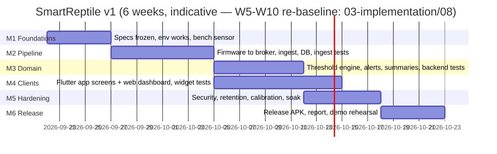

# 07 — Implementation Roadmap

Six milestones. Each ends with a **demo-able increment** and an explicit definition of done, so the team
always has something to show and always knows what "finished" means. Parallel tracks are marked.

A web prototype was delivered **outside** this milestone plan on 2026-10-02; it is absorbed by the M4 table below
and recorded in "Prototype baseline" before M2.

```mermaid
gantt
  dateFormat  YYYY-MM-DD
  title SmartReptile v1 (6 weeks, indicative — W5-W10 re-baseline: 03-implementation/08)
  section M1 Foundations
  Specs frozen, env works, bench sensor  :a1, 2026-09-22, 5d
  section M2 Pipeline
  Firmware to broker, ingest, DB, ingest tests :a2, after a1, 8d
  section M3 Domain
  Threshold engine, alerts, summaries, backend tests :a3, after a2, 7d
  section M4 Clients
  Flutter app screens + web dashboard, widget tests :a4, after a2, 10d
  section M5 Hardening
  Security, retention, calibration, soak :a5, after a3, 6d
  section M6 Release
  Release APK, report, demo rehearsal :a6, after a5, 5d
```

---

## M1 — Foundations (5 days)

**Goal:** every member can run the whole stack locally and one real sensor produces a number.

| # | Task | Owner track | Acceptance | Status (2026-09-23, measured) |
|---|---|---|---|---|
| 1.1 | Close the open decisions `[TBC-1…4]` with the mentor (species, box size meaning, channels, pairing method) | all | Values written into this doc set; `01-product/01` §6 updated | **Partial** — the decisions are now in one canonical list (`05-release/03` §6, TBC-1…TBC-6), the product-facing four are repeated in `01-product/01` §6, TBC-4 is closed as **`ADR-016`**, and `02-design/06` §5 no longer describes it as open. What is still missing is *evidence of sign-off*: an agreement reached verbally is not in the repository, so `05-release/03` §6.1 carries a dated line to fill in. Partial until that line is real |
| 1.2 | Freeze FR/NFR list and ids | all | No id changes after this point without a note in `05-release/03` | **Complete** — the id scheme is in use across all 34 documents |
| 1.3 | Create the monorepo skeleton + CI job running `dotnet build`, `flutter analyze`, `pio run`, `pio test -e native` | backend | CI green on an empty scaffold | **Complete, exceeded** — five green jobs on every push (`backend`, `integration`, `app`, `firmware`, `secret-scan`); the firmware job executes the 22 host tests |
| 1.4 | Docker Compose: SQL Server + API skeleton + broker with `/health` | backend | `/health` green, `/health/ready` reports `database` + `mqtt-broker` | **Complete** — stack up and healthy; `/health/ready` reports both checks Healthy; the DB-outage drill returns `503` in 3.0 s and recovers in 7 ms with zero API restarts |
| 1.5 | Bench bring-up: SHT31 + BH1750 (+ DS18B20) on a breadboard, serial print at 1 Hz | firmware | Serial shows plausible values; `04-quality/03` §2 checklist partially signed | **Not started** — no hardware has been connected; `main.cpp` reports placeholder values and the QA checklist is unsigned |
| 1.6 | Sensor accuracy spot check (fridge/room/lamp, hygrometer comparison) | firmware | Numbers within datasheet tolerance, recorded in the QA log | **Not started** — depends on 1.5 |
| 1.7 | Flutter app scaffold: routing, theme, providers wired to a stub API, `flutter test` green | app | App runs, empty screens, tests green | **Complete** — `flutter analyze` clean, 19 tests pass, provider wiring and en/vi localisation in place |
| 1.8 | `07-appendices/05` literature pass 1 (collect sources, mark verified rows) | doc/report | ≥ 60% of threshold rows have a citation | **Partial** — every seeded band carries a `SourceRef`, but **0 of 14 rows are signed**, so 16 of the 19 bands still read `PENDING VERIFICATION` (the three light bands are inert by design and cite §5 row 12 instead). The two sides are now held together mechanically: `SourceUrl` is `null` while a range is unverified rather than a dead placeholder link, and `ReferenceDataSeeder.BandsAwaitingVerification` + `SchemaAndSeedingTests` fail CI if the checklist and the database disagree. What is missing is still a person with a book open: the page/table column, the signature and rows 12–13's two statements |

**DoD:** `README` quick start reproduces the environment on a teammate's machine in ≤ 30 min; sensor data on
serial; CI green. **Risk burn-down:** toolchain/JDK/Wi-Fi-band issues surface here, not in week 5.

**DoD status, measured 2026-09-21:** two of the three lines hold — the quick start has been run repeatedly on this
machine, and CI is green — but *"sensor data on serial"* does not, because 1.5 and 1.6 are unstarted. **M1 is
therefore not closed**, and the milestone's own goal statement ("one real sensor produces a number") is the single
line keeping it open. Everything the milestone asked for that does not need a breadboard is done, and the Status
column above records how each was verified rather than that it was attempted.

**Re-measured 2026-09-23:** the milestone gained its first real evidence set on 2026-09-22 —
`06-report/snapshots/` holds the live `/health/ready`, `/version` and `/metrics` responses plus three captured
dashboard pages, produced from the running stack rather than drawn. `06-dashboard-health.png` is the one that shows
a complete path today: browser → nginx → API → SQL Server + MQTT broker. That pass also found a genuine defect,
now fixed: the dashboard reported *any* non-2xx as an unreachable server, so the `404` from the not-yet-built
`/api/v1/...` routes read as "cannot reach the server" and implied the animal was unmonitored when in fact nothing
was wrong. Failure messaging is now classified once (`web/legacy/js/api.js` → `failureKind`), with the distinction
recorded as a UX rule (`02-design/04` §6) and a drill that would catch its return (`04-quality/03` §5.11); the
four cases were exercised in a browser on 2026-09-23. **The DoD verdict is unchanged** — two of three lines hold,
and *"sensor data on serial"* is still the only missing line. What moved: 1.1 went from "decision recorded" to
"decision recorded and consistent across the doc set" (`ADR-016`), and M1 now has report-grade screenshots of
what it actually delivers instead of prose claims about it.

**Re-measured 2026-09-29:** no new gate was run, because 1.8 moved on the documentation side only. The checklist
gained its 14th row: the seeded `Arid` **surface** band (38–45 °C) is now in §3 and in §5, closing the coverage gap
where the database shipped a band no document described (the rule is still "pick an answer and make §3, §5 and the
seeder agree"). The **other** gap was left open on purpose at the time — row 7 verifies an `Arid-cool` ambient band the seeder
never created, and closing it meant either seeding a fourth profile or deleting a row, both of which move band
counts quoted in `README`, here and `05-release/01`. **Seeded 2026-10-07** (see the re-measure below): the
variant is now one of four profiles, so the gap is closed and the counts above read 19 bands. So of the three M1 tasks still short of complete, two (1.5,
1.6) are short of hardware and one (1.1) is short of a mentor's dated confirmation; **1.8 is short only of a
person with the books open**. The DoD verdict stays 2 of 3.

**Re-measured 2026-10-07:** 1.8 moved on the bibliographic side only, and no row was signed. A metadata pre-pass
against the open indexes (OpenAlex, Crossref) resolved source 3 in full (*J. Comp. Physiol. B* 175(8): 533–541,
2005), corrected source 1's title (*"How much UVB does my reptile need?"*, DOI `10.19227/jzar.v4i1.150`, *JZAR*
4(1), 2016), and found that sources 2, 4 and 5–8 name no edition or year. It recorded **no page number**, because
the copies it would have to read were unreachable from the build machine (`jzar.org` unresolved, `aza.org` `403`,
RSPCA care URLs `404`, the search engines blocked) and a guessed page is the one thing §6 forbids. The count is
unchanged — **0 of 14 signed**, `BandsAwaitingVerification` still 14 — so what is missing is unchanged too: a
person with the books open, plus rows 12 and 13, which now have drafted wording and need only a signature. The
pass did make the remaining sitting cheaper: eight of the fourteen rows lean on sources 4, 6 and 7, which are the
three copies worth borrowing first.

**Arid-cool was seeded the same day**, which closes M1's last documentation gap and the oldest "we describe it,
we do not ship it" note in the doc set. `ReferenceDataSeeder` now ships a fourth profile, `Arid-cool (bearded
dragon, ambient)`, carrying the two ambient bands §3 describes (day temperature 28–33 °C against critical
24–36 °C, and humidity 30–40 %RH) and deliberately neither the `SurfaceTempC` nor the `UvIndex` band, because both
belong to the basking zone a cool-side profile does not describe. The seeded set is therefore **19 bands over four
profiles** (Tropical 5, SemiArid 6, Arid 6, Arid-cool 2), and `BandsAwaitingVerification` rose 14 → 16 because the
two new bands are pending exactly like the others. `SchemaAndSeedingTests` pins all of it: four names, 19 bands,
the variant's shape, and the pending count against the constant. Every count quoted elsewhere moved with it —
`README`, `05-release/01`, `01-product/03` (`BR-10.1`) and the Flutter prototype's own band-count tests.

Beyond M1: task **2.1** (domain entities, EF Core model, `InitialSchema` migration, seeders for the metric
dictionary, four profiles and their bands) is also complete and enforced by the `integration` CI job. The M2
table below is not starting from zero, and as of 2026-10-04 its backend half — FR-01, 2.2, 2.3 and 2.4 — is done,
with the per-task evidence in the progress blocks that follow the table.

---

## Prototype baseline — the TERRAGUARD web prototype (landed 2026-10-02, recorded 2026-10-03)

Not a milestone: a deliverable that arrived **outside** the plan, recorded here so the M4 tables below are read
against reality rather than against the plan as it was written in September. The decision is `ADR-017`.

| What exists | Where | State |
|---|---|---|
| **TERRAGUARD** prototype — 8 screens (login, dashboard, terrariums, detail, devices, alerts, history, settings) | `web/` — React 19 + Vite + TypeScript + Tailwind v4 | Built; **mock data only**, Vietnamese only, outside CI, covered by no test case |
| M1 static dashboard — Live / Wallboard / Health | `web/legacy/` | Unchanged, and still the only web surface with a real API behind it |
| Committed Vite build (3 files) | `web/dist/` | Deliberate (`ADR-017`): keeps npm out of the demo path |

**What it is not.** It is not task 4.10, and no number on it is a measurement: its alerts are `value > max` over
mock bands, and it contains no dwell, hysteresis, phase or dedupe (`ADR-005`). M4's DoD — every screen showing real
data with a timestamp — is therefore still entirely ahead of it, and a rehearsal must not be run from it.

**What it changed.** The dashboard pages moved path (`web/` → `web/legacy/`), the compose `web` mount broke
(**BUG-03**), and `web/dist/` entered the repository against the standing "no build output" rule. The three tasks
4.12–4.14 are the cost of absorbing it. They were added to M4 rather than given a milestone of their own because
**4.13 decides what M4's web surface actually is — answered on 2026-10-03 as `ADR-018`: `web/legacy/`. Revoked on
2026-10-06 by `ADR-019`**, which promotes TERRAGUARD instead and adds 4.15–4.20 to carry it out; read the M4 section
below for the live plan, and `ADR-018`'s status line for the record of what was decided and why.

**Ownership.** `DOC` — the same track that owns 4.10 — because the alternative is a prototype nobody owns and a
dashboard nobody reconciles it with, which is how one repository ends up documenting two contradictory UIs.

---

## M2 — Data pipeline (8 days)

**Goal:** a real sample walks from the terrarium into SQL Server and back out through the API.

| # | Task | Track | Acceptance |
|---|---|---|---|
| 2.1 | Domain entities + EF Core model + `InitialSchema` migration + seeders (metrics, 4 profiles, thresholds) | backend | `TC-I-01/02`; DB has seeded profiles with sources |
| 2.2 | Device self-register + claim + credentials (hash, rotate, revoke) | backend | `TC-I-05/13`; UC-01 walkthrough on paper |
| 2.3 | MQTT broker hosted in API; subscriber; auth against credentials; TLS on 8883 | backend | Bad credentials refused + audited; `1883` loopback-only |
| 2.4 | `IngestWorker` + `IngestPipeline` stages + counters | backend | `TC-U-01…09`, `TC-I-01/02/03` green (TC-I-04's health half green; its `sensor_fault` half is 3.3, see the 2.4 block below) |
| 2.5 | Firmware: sampler task, filters, ring buffer, MQTT publish, LWT, health | firmware | 60 s samples visible in DB; `TC-U-FW-*` (native tests) green |
| 2.6 | Firmware: HTTPS fallback + back-fill after outage | firmware | `TC-I-08` passes with a 30-minute broker stop |
| 2.7 | Provisioning: SoftAP portal + self-register + claim code on OLED | firmware | Code appears within 60 s of boot; `TC-I-05` |
| 2.8 | REST: readings/latest, readings (range, bucketing), coverage, terrariums CRUD | backend | `TC-I-10/11`; p95 within NFR-01 on the seeded dataset |
| 2.9 | SignalR hub + broadcast on ingest | backend | A browser console client receives a push < 1 s after ingest |
| 2.10 | First end-to-end: real node → broker → DB → `readings/latest` | all | `TC-E2E-01` recorded with a screenshot for the report |

**DoD:** the chain works with the real device, and the pipeline survives a broker restart without losing a
sample. This is the milestone where the design either holds or is corrected — expect ADR updates.

**Progress so far (measured 2026-10-03, extended 2026-10-04 and 2026-10-06).** M1 is closed except its hardware line and 2.1 is complete, so M2 starts
from a schema-current database rather than from scratch. **Task 2.2 needed a prerequisite: user authentication
(FR-01) is implemented**, because `POST /devices/claim` is `Owner`-gated and there was nothing to be `Owner` with.
What exists in `src/`:

| Piece | Where | Verified by |
|---|---|---|
| Registrations, sessions, profile, change-password | `Application/Identity/AuthService.cs`, `Api/Endpoints/AuthEndpoints.cs` | 67 new unit tests; live HTTP run below |
| PBKDF2-HMAC-SHA256, 210 000 iterations, **stored per user** so a stale hash is upgraded on the next login | `Infrastructure/Security/Pbkdf2PasswordHasher.cs` | `TC-U-32` |
| HS256 access tokens, 15 min, `sub`/`role`/`iat`/`exp`/`jti`/`ver` | `Infrastructure/Security/JwtAccessTokenService.cs` | `TC-U-33` |
| Single-use refresh rotation; reuse of a consumed token revokes the whole family | `AuthService.RefreshAsync` | `TC-U-34` |
| Failed-login throttling, 5 per identifier / 20 per address per 15 min | `Domain/Identity/LoginThrottlePolicy.cs`, `Infrastructure/Security/InMemoryLoginThrottleStore.cs` | `TC-U-35` |
| 10 requests per minute per address on the whole `/api/v1/auth` group | `Program.cs` rate-limit policy | live 429 below |

Run end to end against a real SQL Server and a real HTTP surface: register `202`, login `200` (role `Owner`),
`/me` `200`, refresh `200`, reuse of the consumed token `401 token_reused`, the rotated token afterwards
`401 refresh_token_invalid`, wrong password `401 invalid_credentials`, no token `401 unauthenticated`, and the
11th auth call inside a minute `429 rate_limited` — all as RFC 7807 with a stable `code`. **121 backend unit tests
pass** (was 54).

**What is deliberately still open in FR-01.** There is no email-confirmation flow at all (limitation L-02 — there is
no email infrastructure), and registration reports an identifier that is already in use rather than confirming an
address (`ADR-020`, 2026-10-07 — which also made `forgot-password` answer `404 identifier_unknown`). The other
half of L-02 is closed by the password-recovery block below: resetting a forgotten password no longer means
recreating the account, and what remains of the limitation is the transport, not the flow.
The common-password deny-list carries the highest-frequency subset of the documented top 1 000, to be completed in
M5's hardening pass. The password policy itself is the brief's composition rule (`BR-01.2`, changed 2026-10-07):
≥ 8 characters containing an upper-case letter and a special character, on top of the ≤ 128 cap and the deny-list.
The floor was **10** characters with deliberately no composition rule before it, so this loosens the length
requirement while adding the two character rules — a trade the brief asked for and one worth re-deciding if it did
not mean to move the floor. The `Technician`/`Viewer` half of `TC-U-36` is no longer waiting on anything: 2.2's endpoints
carry the policies, and both refusals were seen in the live run below.

**Task 2.2 — self-register, claim, credentials, rotate, revoke.** Complete on the HTTP surface. The rules are
`02-design/06` §5 and the contract is `07-appendices/03` §2:

| Piece | Where | Verified by |
|---|---|---|
| Claim code: 31-symbol alphabet, 8 characters, 15-minute TTL, single use, normalised so `k7m2-qp4t` = `K7M2QP4T` | `Domain/Devices/{ClaimCode,DeviceProvisioningRules}.cs` | 27 new unit tests |
| Anonymous self-register throttled 1 per address per 5 min, 20 per hour globally | `Domain/Devices/OnboardingThrottlePolicy.cs`, `Infrastructure/Security/InMemoryOnboardingThrottleStore.cs` | unit tests + live `429` |
| Secret: 256-bit CSPRNG, base32 (52 chars), stored as `SHA-256(secret ‖ 16-byte salt)`, compared with `FixedTimeEquals` | `Infrastructure/Security/{Base32,DeviceCredentials,ClaimCodeGenerator}.cs` | unit tests + the stored row shape |
| Use cases: self-register, claim, rotate (10-minute grace), revoke, `VerifyCredentialAsync` for the telemetry path | `Application/Devices/DeviceProvisioningService.cs` | unit tests + live run below |
| Routes, `Owner`-gated except self-register, policies from the role matrix | `Api/Endpoints/DeviceEndpoints.cs`, `Api/Security/AuthorizationPolicies.cs` | live `403 insufficient_role` |

Run end to end against a real SQL Server and the real HTTP surface — 50 assertions, all green: `self-register`
`201` with an 8-character code from the documented alphabet and a ~15-minute expiry, a second attempt from the same
address `429 rate_limited`, a malformed body `400 registration_invalid`; `claim` anonymous `401 unauthenticated`,
unknown / malformed / consumed / superseded codes all `404 claim_code_invalid`, a **foreign** terrarium
`404 not_found` (not `403`, so ids cannot be probed), the right code `200` with a 52-character base32 secret, and a
claim into a terrarium whose live device is bound `409 terrarium_already_bound`; `rotate-secret` `200` with a fresh
secret and a 10-minute `previousUsableUntilUtc`; `revoke` `204` and idempotent, after which `rotate-secret` is `404`
and both credential rows read `32/16/revoked`; re-registering a **claimed** chip `409 device_already_registered`
with the `deviceId` and no code, re-registering an **unclaimed** chip `409` with the same `deviceId` and a **fresh**
code; `Technician` `403 insufficient_role` on claim and rotate. **186 backend unit tests pass** (was 121).

**What is deliberately still open in 2.2.** Four caveats were recorded here; two have since been closed by later
work and two stand:

- **Revoking does not disconnect a live MQTT session — closed by task 2.3.** A revoked board used to be refused on
  its next connect or publish rather than mid-session, because the kick needed the broker that 2.3 owns; the block
  below records the kick closing a live session in 0.0 s.
- **No audit rows were written for claim, rotate or revoke — closed 2026-10-06.** `BR-18.4` asks for them and
  `02-design/02` §3.18 specifies an `AuditLog` table, but `InitialSchema` never created one, so the acceptance line
  "audit rows written" in `TC-I-13` could not pass. The follow-up added the table (`Domain/Auditing/AuditLog.cs`,
  `IProvisioningStore.AddAuditEntry`, migration `20261006170132_AddAuditLog`) and the three writes in
  `DeviceProvisioningService`; each row is staged on the same save as the change it describes, so the change cannot
  commit without it. The login and token-reuse verbs of the vocabulary are still unwritten — they belong to the
  FR-01 path, not to this one.
- **The last write is not guarded against a race — closed 2026-10-09.** Two simultaneous claims of one terrarium
  can both pass the pre-check, and the filtered unique index `IX_Device_TerrariumId` then refuses the second insert.
  That refusal is now translated into the documented `409 terrarium_already_bound` instead of escaping as a `500`:
  `IProvisioningStore.TrySaveClaimAsync` returns false when the index named `IX_Device_TerrariumId` rejects the
  write, which mirrors how `EfTelemetryStore` already reports a lost dedupe race. The index name is checked rather
  than the SQL error number alone, because 2601/2627 also cover the public-id and chip-id indexes.
- **One address buys one registration per five minutes**, so every board behind one NAT shares the budget — on a
  home network a second board waits out the window. That is what `07-appendices/03` §2.2 specifies (a demo
  setting), but it is worth knowing before a demo with two boards.

**Task 2.3 — broker authentication, TLS, topic ACL, session kick.** Complete. The broker now does everything
`02-design/06` §4 and `07-appendices/03` §3.1 require of it:

| Piece | Where | Verified by |
|---|---|---|
| A connection needs `username = deviceId` and a password matching a usable `DeviceCredential`; everything else gets the identical refusal (BR-05.1/BR-05.3) | `Infrastructure/Mqtt/MqttBrokerHostedService.OnValidatingConnectionAsync` | 3 live refusals + `mqtt_rejected_connections_total` |
| Two listeners: TLS on `8883` for devices, plaintext on `1883` bound to **loopback only** and switchable off entirely (`Mqtt:DisablePlaintextEndpoint`) | `MqttBrokerHostedService.BuildOptions` | `netstat` in both shapes, live `1883`/`8883` runs |
| Own-prefix-only ACL: publish on `telemetry`/`health`/`status`/`events`/`ack`, subscribe on `cmd`, nothing else, no wildcards, no other device's id | `Domain/Devices/MqttTopicScheme.cs`, used by both interceptors | 20 new unit tests + live refusals |
| Revoke closes the live session (BR-05.4) | `Application/Abstractions/IDeviceSessionRegistry.cs`, `Infrastructure/Mqtt/DeviceSessionRegistry.cs`, called from `DeviceProvisioningService.RevokeAsync` | live: closed in **0.0 s**, and the device cannot reconnect |
| Refused publications are refused *and* drop the client, so a session held by a since-revoked device dies on its next publish | `OnInterceptingPublishAsync` | live |

Run against a real TLS listener with a self-signed certificate, and checked with `paho-mqtt` (30 assertions, all
green): anonymous, wrong-secret and unknown-device connects all answered `Bad user name or password`; a claimed
device connected over TLS and over plaintext; wildcard and cross-device subscriptions refused; a publish under
another device's prefix refused and the session dropped while a fresh connection still worked; `POST
/devices/{id}/revoke` closed the live session immediately and the same credential could not reconnect; and in the
release shape (`DisablePlaintextEndpoint=true`) `1883` was not listening at all while TLS kept working.
**226 backend unit tests pass** (was 186).

**What is deliberately still open in 2.3.** One thing was, and it is now half closed:

- **No audit rows — closed for the device actions on 2026-10-06.** `BR-18.4` wants `device.secret_rotated` and
  `device.revoked` in an `AuditLog`; that table now exists (see 2.2 above) and `DeviceProvisioningService` writes
  both, verified live. The **rejected-connection** cases the acceptance line also names are still only counted and
  logged: the closed vocabulary of `02-design/02` §3.18 has no verb for a refused connection, so that half needs a
  vocabulary decision — and a row that names neither a user nor an existing device — before it can be written.

The other half of that acceptance — "nothing consumes the accepted publish" — is closed by the block below.

**Task 2.4 — `IngestWorker` and the ingest pipeline.** Complete, with two placeholders declared at the fan-out
boundary rather than left implicit. Each stage is a separate type so each rule has one implementation and one
test, and the pure ones have no database in front of them at all:

| Stage | Where | Verified by |
|---|---|---|
| Bytes → document | `Infrastructure/Ingest/JsonTelemetryPayloadParser.cs` | adapter tests: tolerance, unknown keys kept for the validator to judge, the 32 KB limit |
| Schema, shape, timing (V-01…V-03, V-07…V-09, V-10) | `Application/Ingest/TelemetryPayloadValidator.cs`, `Domain/Readings/TelemetryIngestRules.cs` | `TC-U-01…04` plus the timing rules |
| Device: match, lifecycle, credential (V-04/V-05) | `Application/Ingest/DeviceAuthenticator.cs` | `TC-U-05` |
| Plausibility, never a refusal (V-06) | `Application/Ingest/PlausibilityGuard.cs` | `TC-U-06…08` |
| Calibration on `Value`, never on `RawValue` (BR-07.4) | `Application/Ingest/{DeviceCalibration,CalibrationApplier}.cs` | `TC-U-09` |
| Dedupe + stage the rows (DI-02/DI-03) | `Application/Ingest/TelemetryWriter.cs` + `Infrastructure/Ingest/EfTelemetryStore.cs` | `TC-I-01…03` |
| Device state: `LastSeenAt`, status, firmware, health denorms | `Application/Ingest/DeviceStateUpdater.cs` | `TC-I-01`, and `TC-I-04`'s health half |
| Transport, back-pressure, counters | `Infrastructure/Ingest/{InProcessTelemetryBus,IngestWorker,IngestOutcomeRecorder}.cs`, broker `OnInterceptingPublishAsync` | the live run below |
| Fan-out after the commit | `Infrastructure/Ingest/PendingFanOut.cs` (**placeholder**) | the recorder tests assert a failed push cannot fail a stored batch |

Two decisions worth reading back. **The transport hop carries raw envelopes, not batches**: the design's sketch
deserialises in the reader and queues the batch, but a payload that is not JSON has to be *counted* under
`schema_invalid`, and the writer loop is the one place that can count anything — so the queue holds bytes and the
parse is the writer's first stage. **Back-pressure is the write itself**: the broker is in-process (ADR-012), so
MQTTnet sends the QoS 1 PUBACK only after `InterceptingPublishAsync` returns. Awaiting the bounded channel write is
therefore the "stop acking so the broker holds the messages" rule of §02-design/03 §1, with no timeout on purpose —
a timeout would have to choose between losing the batch and failing the broker, and "the device retries" is already
the right answer.

Run against a real SQL Server and a real MQTT listener (`paho-mqtt` over loopback, 2026-10-04): a batch of two
samples published twice produced **2** `TelemetrySample` rows with contiguous sequences `1, 2`, **8**
`MetricReading` rows with `Value = 28.750` / `RawValue = 28.900` intact, the device's `LastSeenAt`,
`FirmwareVersion = 1.2.0`, `SignalStrengthDbm = -63` and `FreeHeapKb = 142` from the batch's health block, and a
`DeviceHealthSample` row; `/metrics` read `ingest_samples_total=2`, `ingest_duplicates_total=2`,
`ingest_rejected_total=0`. A sample of `tf = 85` was **stored** with `QualityFlags = 2` (the row exists, the flag
is what will exclude it), and a 121-sample batch and a malformed body were refused as `payload_too_large` and
`schema_invalid`, taking `ingest_rejected_total` to **2**. **325 backend unit tests pass** (was 226) and the
integration project passes **15 of 15** against a fresh database, `TC-I-01…03` among them.

**What is deliberately still open in 2.4.**

- **The fan-out has no consumer — closed 2026-10-09.** `PendingTelemetryBroadcaster` was replaced by
  `SignalRTelemetryBroadcaster` in 2.9 and `PendingEvaluationQueue` by a real bounded channel plus `EvaluatorWorker`
  (the M3 scaffolding block below). A stored sample is now handed to something: the evaluator reads its quality
  flags and advances an `EvaluationState` watermark. That is why `TC-I-03`'s "zero alerts created" now holds for a
  stated reason — the evaluator saw the flagged row and declined to judge it — rather than trivially, because nothing
  consumed the queue at all.
- **`TC-I-04`'s `sensor_fault` half moved to 3.3.** The task's acceptance named it, but a `sensor_fault` arrives on
  `sr/v1/d/{id}/events`, and "humidity is `Unavailable`" needs the `SensorFault` derived signal — which is 3.3. What
  was missing underneath it is no longer: `DeviceEvent` storage now exists (2026-10-09) and the broker forwards the
  `events` channel, so the raw fault a 3.3 signal reads is stored rather than dropped. The health half of the test is
  green; the fault half stays recorded against 3.3 where the signal lives.
- **Only the `telemetry` channel is forwarded — closed 2026-10-09.** All four device → server channels reach the
  ingest worker now; only `ack` does not, because command results are FR-14's and accepting one would acknowledge a
  command this build cannot issue. The channels were left unforwarded until the consumers existed rather than
  half-handled, and each consumer is now real: `status` sets the lifecycle state and is the source of the
  `statusChanged` push, `health` denormalises the fleet figures and stages a health row, `events` is stored as a
  `DeviceEvent` (`Application/Ingest/DeviceChannelPipeline.cs`, `Infrastructure/Ingest/JsonDeviceChannelParser.cs`).
  A malformed or out-of-vocabulary payload on any of the three increments `ingest_rejected_total` under
  `schema_invalid`, so a firmware typo is visible instead of silently becoming a new category.
- **The HTTPS fallback endpoint shipped 2026-10-06** (`POST /api/v1/ingest/http`,
  `Api/Endpoints/IngestEndpoints.cs`); what is still open is the *firmware* half of 2.6 — the device-side switch to
  HTTPS and its back-fill loop. `ITelemetryPayloadParser`, `DeviceAuthenticator` (presented secret) and the
  `IngestSource` column were already in place for it, so the endpoint is composition: the same `IngestPipeline` as
  MQTT, summoned synchronously so the `202` can carry real counts, which is what lets a device clear its ring buffer
  after an outage. The credential header's parse lives in `Application/Ingest/DeviceCredentialHeader.cs` as a pure
  function, because a value that parsed to an empty secret would be refused exactly like a wrong one and the bug
  would look like an authentication problem forever.
- **`ClockSkewSeconds` is the observed skew, not the stored difference.** Rule V-07 clamps a future timestamp to
  `ReceivedAt`, and storing the clamped difference would read as zero and hide the fault the column exists to
  surface. A sample from the future is therefore stored with a clamped timestamp *and* its real skew, flagged
  `ClockUnsynced` (16). `QualityFlags` has no `clock_ahead` bit, so that is where the condition lands.

**Task 2.8 — the terrarium surface: reads, create, and since 2026-10-09 update and delete.** The six routes both
clients call are implemented, and FR-03's update and delete halves have landed on top of them. What remains of the
rest of the table — thresholds, silences, summaries, exports — belongs to 3.1, 3.4 and 3.6 and is recorded as open
rather than implied by a green row. Contract: `07-appendices/03` §4.2.

| Piece | Where | Verified by |
|---|---|---|
| List, create, detail | `Api/Endpoints/TerrariumEndpoints.cs`, `Application/Terrariums/TerrariumService.cs` | service tests + the live run below |
| `PATCH` with `If-Match`, and the `ETag` on `GET`/`POST`/`PATCH` responses | `TerrariumService.UpdateAsync`, `Terrarium.RowVersion`, `EfTerrariumStore.TrySaveChangesAsync`, `TerrariumEndpoints.{SetETag,ParseIfMatch}` | service tests + a live `200`/`412`/`428`/`400` run below |
| `DELETE` as a soft delete, refused while a live device is bound unless `?allowUnboundDevice=true` | `TerrariumService.DeleteAsync` | service tests + a live `409`/`204` run below |
| Ownership is a query parameter: foreign, missing and soft-deleted are one `404 not_found` | `Infrastructure/Persistence/EfTerrariumStore.cs` | service tests + live `404` |
| `readings/latest`: newest value per metric, the effective band, the device state | `TerrariumService.LatestReadingsAsync` | service tests + live run |
| Band resolution: an override beats the profile, an exact phase beats `Any` (BR-10.3); the phase comes from the photoperiod (BR-11.2) | `TerrariumService.EffectiveBand`, `Domain/Thresholds/ThresholdPhaseResolver.cs` | `ThresholdPhaseResolverTests` + service tests |
| Status vocabulary, `Unavailable` for a faulted or implausible value, `Maintenance` for a device in maintenance | `Application/Terrariums/TerrariumContracts.cs`, `TerrariumService.StatusFor` | service tests + live run |
| `readings`: bucketing by width, gap-aware series, the 720-point ceiling | `Application/Readings/RangeQueryRules.cs`, `TerrariumService.BucketedPoints` | `TC-I-10` at both levels |
| `coverage`: expected against received, from the device's own interval | `TerrariumService.CoverageAsync` | service tests + live run |
| Dashboard sign-in, session rotation, and the calls above | `web/legacy/js/{api.js,pages/live.js}`, `web/legacy/index.html` | the browser run below |

Three decisions worth reading back. **Status is instantaneous, alerts are not**: a card has to be coloured, so a
reading outside its band reads `OutOfRange` immediately — while the dwell time that turns an excursion into an alert
stays with the evaluator (3.2), which is why an `OutOfRange` reading implies no alert. **`device.status` is
derived**: a node silent for three sampling intervals reads `offline` (FR-07 BR-07.2), because the silence watchdog
is 3.3 and a board unplugged during a demo must not keep claiming to be online. **The bucket grid is global**: an
unaligned `from` puts the first bucket start before the window, which is how a 30-day hourly series would otherwise
return 721 points, so the loop is clamped to the budget (`RangeQueryRules.MaxBucketPoints`) instead of quietly
truncating the client's data.

Run end to end against a real SQL Server and the real HTTP surface on 2026-10-06: register `202`, login `200`
(role `Owner`), `GET /api/v1/terrariums` `200 {"items":[]}`, `POST /api/v1/terrariums` `201` with the species name
resolved and the configured time zone applied, a blank name and an unknown `speciesProfileId` both
`400 validation_failed` with field-level `errors[]`, an unknown id `404 not_found`, and `coverage` without a bound
device `409 device_not_bound`. With a device and three samples in place, `readings/latest` returned `tempC = 35` as
`Critical` against the **night** band `24…28` of an `Arid (desert)` profile at 21:57 local time (its day band is
`38…42`), `humidityPct = 50` as `OutOfRange` against `30…40`, and `device.status` derived to `offline` once the
newest sample was six minutes old; `readings?metric=tempC` over 1 h returned `bucket=raw` with 3 points, over 24 h
`bucket=5min` with the gaps as null points, over 40 days `400 range_too_large`, an unknown metric
`400 metric_invalid`, and an unaligned 30-day window exactly 720 points; `coverage` over 1 h at a 60 s interval
reported `expected=60, received=3, coveragePct=5`. **386 backend unit tests pass** (was 325) and the integration
project passes **15 of 15** against a fresh database — the two failures seen against the long-lived dev volume are
stale seeded rows from an earlier revision, not this change.

The same run doubled as the client check: `web/legacy/index.html` served on `8081` shows the sign-in form when
signed out (no invented numbers behind it), and after signing in renders the real values — `Nhiệt độ 35.0°C ·
Nguy hiểm · Ngưỡng 24.0–28.0 °C` and `Độ ẩm 50%RH · Ngoài ngưỡng · Ngưỡng 30–40 %RH` — from
`GET /api/v1/terrariums` and `readings/latest`, with the browser confirming
`Access-Control-Allow-Origin: http://localhost:8081`.

**What is deliberately still open in 2.8.**

- **Thresholds, silences, summaries and exports are not built.** They are 3.1 (the band-resolution endpoint), 3.4
  (silences) and 3.6 (rollups and daily summaries), and each is listed against the task that owns it rather than
  here. `PATCH`/`DELETE`, which were blocked on a `RowVersion` column `Terrarium` did not have, shipped on
  2026-10-09 — the column, the migration and the concurrency contract — so FR-03's update and delete halves are
  closed.
- **An update is not audited.** `BR-18.4` names login failures, role changes, device claim/rotate/revoke, threshold
  edits, purge and export generation — not terrarium edits — and the vocabulary of `02-design/02` §3.18 has no
  `terrarium.*` verb, so no row is written. The delete of a terrarium *with* a bound device does not write
  `device.unbound` either, for the same reason: adding a verb is a vocabulary decision, and inventing one here would
  put a string in the column that the design document does not list.
- **`alerts` is always `[]` in a `readings` response.** BR-09.3 wants alert overlays, and there are no alert rows to
  overlay until 3.2/3.4. An empty array means "no alerts recorded" and must not be read as "no excursions happened".
- **Hourly buckets are computed from raw samples**, because the rollup worker is 3.6. That is correct at demo scale
  (assumption A-08) and will not be at 24 months of retention, which is what rollups exist for.
- **`readings/latest` walks back at most 50 samples per metric.** A metric absent for longer than that window (a UV
  probe unplugged for a day) is reported as having no reading — the same answer as never having reported, which
  removes the distinction between "stopped reporting" and "never reported".
- **The dashboard's session is a demo session.** `web/legacy` keeps the tokens in `localStorage` and rotates once on
  a `401`; there is no idle timeout, no per-role UI gating, and the wallboard shares whatever the Live page signed in
  as. Per tasks 4.10–4.14 that surface is still M4 work.

---

## Password recovery — the FR-01 follow-on that closes half of L-02 (built 2026-10-06)

Not a numbered M2 task: it is a change to FR-01's interface requested after the M2 surface was already standing, so
it is recorded the way the FR-01 prerequisite for 2.2 was. Contract: `07-appendices/03` §4.1; decisions:
`02-design/06` §2; schema: `07-appendices/02` §3.13.

| Piece | Where | Verified by |
|---|---|---|
| Backup recovery code: 31-symbol alphabet without `0/O/1/I/L`, 20 characters (≈ 99 bits), normalised so `dem2d-em2de-m2dem-2dem2` = `DEM2DEM2DEM2DEM2DEM2` | `Domain/Identity/RecoveryCode.cs` | 6 new unit tests |
| Salted `SHA-256(secret ‖ 16-byte salt)` in one place, shared with device credentials | `Infrastructure/Security/Sha256SecretHasher.cs` | `TC-U-51` |
| `register` returns a 20-character code when it creates the account, and creates nothing when the identifier is taken (`ADR-020`) | `AuthService.RegisterAsync` | `TC-U-51`, live run |
| Password policy: ≥ 8 characters with one letter, one digit, one upper-case letter and one special character (whitespace excluded), the ≤ 128 cap and the deny-list kept; one violation code per rule | `Domain/Identity/PasswordPolicy.cs` | `TC-U-58` |
| `POST /auth/recover` spends the backup code, rotates it, ends every session | `AuthService.RecoverAsync`, `Api/Endpoints/AuthEndpoints.cs` | `TC-U-52`, live run + browser |
| Single-use server-issued code, 30-minute TTL, **unsalted** hash so the row is found by the value presented | `Domain/Identity/PasswordResetCode.cs`, `IUserStore.FindPasswordResetCodeAsync` | `TC-U-53` |
| `POST /auth/forgot-password` answers `202` with an empty body when a code was issued and `404 identifier_unknown` when no account uses the identifier (`ADR-020`); `POST /auth/reset-password` spends the code, rotates the backup code, ends every session | `AuthService.{ForgotPasswordAsync,ResetPasswordAsync}` | `TC-U-53/54`, live run + browser |
| A taken registration identifier answers `409 registration_conflict` with `errors[]` naming `email_taken` / `username_taken`, and creates nothing (`ADR-020`) | `AuthService.RegisterAsync`, `IUserStore.FindTakenIdentifiersAsync` | `TC-U-57`, live run |
| Delivery as a port; the demo's implementation writes the code to the log behind `PasswordReset:LogCode`, which is **false** in `appsettings.json` and true only in `Development` | `Application/Abstractions/IPasswordResetNotifier.cs`, `Infrastructure/Security/LogPasswordResetNotifier.cs` | `TC-U-55` |
| Changing a password from the dashboard: the header form re-proves the current password, and the page signs the keeper out afterwards because the server revokes every session | `web/legacy/index.html`, `web/legacy/js/{api.js,pages/live.js}` | browser run 2026-10-07: changed it, was returned to the sign-in form with the confirmation, and signed in with the new password |

Three decisions carry the feature. **There are two codes because there are two moments.** Registration is the only
time the server can hand the keeper something without a delivery channel, so it returns a backup code; the issued
code covers the keeper who no longer has it, and it needs no mail server either — only a working sender. **Where the
answers differ, that is a decision rather than a leak (`ADR-020`, 2026-10-07).** Registration answers
`409 registration_conflict` naming the taken field and `forgot-password` answers `404 identifier_unknown` when
nobody holds the identifier: before it, a duplicate registration was told "accepted" and handed a recovery code that
could never work, and a mistyped address produced a `202` for a code that was never generated. Every *code* failure
still answers with one opaque `401` — an unknown identifier, a disabled account, a spent code and a foreign code are
indistinguishable on `recover` and `reset-password` — and a `500` on the known-account path remains impossible,
because `ForgotPasswordAsync` commits the code and then calls the notifier inside a guard that tolerates a throwing
implementation. **A password change is not a patch, it is a reset**: both paths rotate the
backup code and revoke every refresh token, because the person who forgot the password is not necessarily the only
one who has it.

Run end to end against a real SQL Server and the real HTTP surface: `register` `202` with a 20-character code;
`forgot-password` `202` with **size 0** for a live account and for `nobodyatall9876` alike, with a code row created
only for the first; the code typed lower-case with separators accepted by `reset-password` `200` and refused a
second time and after its replacement was issued (`401 invalid_reset_code` — byte-identical to the answer for a
wrong code, a foreign account's code and an unknown identifier); the old password `401 invalid_credentials` and the
new one `200`; a session issued before the reset `401 refresh_token_invalid` afterwards; and the rotated backup code
working through `POST /auth/recover`. **422 backend unit tests pass** (was 386) and the integration project passes
**15 of 15** against a fresh database.

The same run doubled as the client check: on `web/legacy/index.html` the recovery form offers both paths — *Gửi mã
đặt lại* relabels the field to *Mã đặt lại*, states that the code went to the server log, and the reset completed in
the browser with the rotated backup code shown once and the identifier carried to the sign-in form, which then
signed in with the new password.

**What is deliberately still open.**

- **The code is delivered by a log line, not by email.** That is limitation L-02's remainder: the flow is complete
  and testable, but a real keeper cannot receive the code on a host whose log they cannot read. `IPasswordResetNotifier`
  exists precisely so the SMTP sender replaces one registration in `DependencyInjection` and nothing else.
- **Issued codes are not swept.** A spent or expired row stays until the account is deleted. The rows are tiny and
  the index is on `(UserId, ExpiresAt)`, so this is a housekeeping gap rather than a correctness one — it belongs
  with `RetentionSweeperWorker` (task 5.3).
- **`PasswordReset:LogCode` must never be turned on in production.** It is off in `appsettings.json` and on in
  `appsettings.Development.json`; a production log holding a live credential is a leak, which is why the log
  implementation says plainly when it delivered nothing.
- **The dashboard's recovery form is M4 work in every other respect.** Both paths live on the Live page, and the
  Flutter app has no login screen yet (task 4.10), so the recovery UI exists in `web/legacy` only. The
  change-password form added on 2026-10-07 sits in the same place for the same reason — the API had the endpoint and
  67-odd unit tests, but no client could call it, which is what "change password is broken" looked like from the
  dashboard.

**Task 2.9 — the SignalR push.** Complete on the client path that matters: a subscribed client is authorised on
join and receives one event per committed sample.

| Piece | Where | Verified by |
|---|---|---|
| Membership before a join, with "not yours" and "does not exist" answered identically (BR-02.2) | `Application/Terrariums/TerrariumService.IsMemberAsync`, `Api/Hubs/TelemetryHub.JoinTerrarium` | live: a foreign id and an unknown id both refused with the same message; unit tests for owner, foreign, unknown and soft-deleted |
| The push itself, replacing the `PendingTelemetryBroadcaster` placeholder | `Api/Hubs/SignalRTelemetryBroadcaster.cs` over `IHubContext<TelemetryHub>`, group `terrarium:{id}` | live: two `readingAdded` events, one per sample, **664 ms** after a two-sample batch was posted |
| The event body as the contract documents it | `Application/Ingest/ReadingAddedPayload.cs` | 3 unit tests on the mapping; the live payload carried `terrariumId`, `sampleId`, `recordedAt` and five metrics keyed by `ApiKey` |
| Auth over the WebSocket handshake | `Program.cs` `JwtBearerEvents.OnMessageReceived`, `access_token` accepted on `/hubs` only | live: a real `@microsoft/signalr` client connected with the token in the query string |

The hub used to refuse every join with "Membership checks are not available yet", which was the safe state rather
than a stub: an unchecked join would have turned the hub into a cross-tenant data leak, because a group is named
after the terrarium and the id is the only secret involved.

**What is deliberately still open in 2.9.** Two of the four documented events:

- **`statusChanged` — closed 2026-10-09.** The transition is surfaced by the `status` channel rather than by the
  sample path: `DeviceChannelPipeline` reports the change the `status` message caused and
  `SignalRTelemetryBroadcaster.BroadcastStatusAsync` pushes it to the terrarium's group as the documented
  `{terrariumId, deviceId, status, lastSeenAt}`. This is the reason the second broadcast method exists instead of a
  second use of `BroadcastAsync` — a status message commits no samples, so there is nothing to carry but the state.
  What is still **not** pushed is the `Provisioning → Online` transition that a sample or health message causes:
  that boundary carries `PersistedSample`, which has no status in it, so it stays open and is named rather than
  implied.
- **`alertChanged` belongs to M3**, which owns alerts; nothing can emit it yet.

`commandChanged` is not in 2.9 either — commands arrive with FR-14.

---

## M3 scaffolding — the evaluation queue, its worker, and the two tables M3 needs (built 2026-10-09)

M3 is not started, but the two boundary pieces that M2 deliberately left as placeholders are now real, and the two
tables the design specifies for it exist. The point of doing this before the engine is that the engine then has one
place to be written rather than a fan-out, a queue, a worker and three migrations at once.

> **Superseded in part, same day.** M3 has since started: 3.1's read half (the shared resolution rule and the
> `effectiveThresholds` endpoint) was built immediately after this pass, and 3.2 followed it — see the two blocks
> after the M3 table. The queue and `SampleEvaluator` are unchanged by either; what changed is that the evaluator no
> longer stops at the watermark, since 3.2 gave it the decision rule it was waiting for.

| Piece | Where | Verified by |
|---|---|---|
| A real bounded queue replacing the no-op `PendingEvaluationQueue` (deleted) | `Infrastructure/Evaluation/InProcessEvaluationQueue.cs` | unit tests + a live ingest that produced state rows |
| The consumer: one batch at a time, single reader, ordered | `Infrastructure/Evaluation/EvaluatorWorker.cs` | the live run below |
| The one decision rule that needs no band — §02-design/03 §4.2's "faulted or implausible: return" — plus the `LastEvaluatedSampleId` watermark per `(terrarium, metric, phase)` | `Application/Evaluation/SampleEvaluator.cs` | 14 `SampleEvaluatorTests` cases |
| `EvaluationState` exactly as `07-appendices/02` §3.9 specifies it: PK `(TerrariumId, Metric, Phase)`, `rowversion`, every decision field present and unset | `Domain/Evaluation/EvaluationState.cs`, `SmartReptileDbContext.ConfigureEvaluation` | the live run + a `PK_EvaluationState` violation asserted against real SQL Server |
| `DeviceEvent` storage, which 3.3's derived signals read | `Domain/Devices/DeviceEvent.cs`, the `events` channel consumer | the live run below |

Three decisions worth reading back. **The queue does not back-pressure.** `InProcessTelemetryBus` deliberately
withholds an MQTT acknowledgement when it is full, because the device retrying is the right answer; the evaluation
queue must not, because evaluation is a derived opinion and a stalled opinion may not stop measurements being
stored. A full queue therefore drops the batch and logs an error — reaching the capacity means the evaluator is
stuck, which is a defect to be found rather than load to be absorbed. **The watermark advances one way only**: a
re-delivered or back-filled sample carries a lower `SampleId` than the evaluator has already seen, and taking it
would make the next pass re-read history. **The state fields are written as "nothing decided yet"**, so the rows 3.2
inherits say exactly that rather than a plausible-looking default that a later reader would have to distrust.

**What is deliberately still open here.** No dwell, no hysteresis, no alert, no escalation: `ThresholdDecision.Decide`
is 3.2 and this block does not pre-empt it. The evaluator also keys only the `(metric, phase)` pairs an enabled band
covers, which is the same set the read surface resolves a card's band from — a metric nothing judges gets no row.

---

## M3 — Domain logic (7 days)

**Goal:** the system can tell a keeper something they did not already know, correctly.

| # | Task | Track | Acceptance |
|---|---|---|---|
| 3.1 | `ThresholdService` + resolution order + `effectiveThresholds` endpoint + `ThresholdSnapshot` | backend | `TC-U-21…26`; UC-03 flows verified. **Read half done 2026-10-09** — the resolution rule is `ThresholdResolver` in the domain, `GET /terrariums/{id}/thresholds` is live, and `TC-U-21…25` are green; the override write path and `ThresholdSnapshot` (`TC-U-26`) are open. See the block below |
| 3.2 | `ThresholdDecision.Decide` (pure) + `EvaluatorWorker` + ordered queue + `EvaluationState` | backend | `TC-U-10…20` (dwell/hysteresis/escalation matrix) green. **Decision engine done 2026-10-09** — the pure function, the evaluator that writes open/escalate/touch/resolve, and a live excursion through a real broker (see the block after this table); the per-device reorder window of §7 is open |
| 3.3 | Derived signals: `DeviceSilent`, `SensorFault`, `DeviceClockSkew` | backend | `TC-U-27…31`, `TC-I-09`. **All three signals done 2026-10-10** — silence (Warning at `3 × interval`, Critical at 30 min), the sensor fault (BR-07.1's failures → the metric reads `Unavailable`) and the clock-skew Info entry are built, and `TC-U-27`, `TC-U-28` and `TC-U-29` are green; the two SHOULD signals (`TC-U-30`, `TC-U-31`) belong with 3.6. See the block below |
| 3.4 | Alert lifecycle: open/ack/resolve/silence + audit + role gating | backend | `TC-I-07`, `TC-U-36`. **Built 2026-10-10** — the list, the detail, the timeline, ack and resolve, the three silence routes and the `alertChanged` push; `TC-U-36`'s role matrix holds because ack, resolve and both silence writes name the `Technician` policy, and `TC-I-07` is covered from the service side (the project has no HTTP host). See the block below |
| 3.5 | `NotificationDispatcher` + policy matrix + FCM + SMTP + inbox + retries | backend | `TC-U-37…45` (policy matrix), live notification demoed (inbox + a real FCM push) |
| 3.6 | Rollup worker + daily summary worker + exposure index maths | backend | `TC-U-46…50`, recomputation after back-fill (`TC-I-06`) |
| 3.7 | Ops: `/metrics`, structured logs, audit endpoints | backend | `TC-I-15` |
| 3.8 | `07-appendices/05` literature pass 2 — every shipped row cited | doc/report | 100% citation gate met |

**DoD:** inducing a real excursion (lamp on / ice pack) produces exactly one alert and one notification,
and a 4-minute disturbance produces nothing. **This is the milestone to demo to the mentor.**

> **Note (2026-10-07) — open decision for 3.5, left open on purpose.** `ADR-021` dropped Telegram, which was
> `R-13`'s mitigation for a failed FCM push on demo day. The runnable alternatives today are the in-app inbox
> (always works, but it renders on the same screen as the alert, so it demonstrates the policy rather than a
> second-device delivery) and SMTP (off by default, and no relay exists in the demo environment — the same gap as
> `L-02`). **Decided at M3, not before:** either add a local SMTP sink to compose (Mailpit/MailHog) as its own task
> with its own `TC-I-12` coverage, or accept the inbox as the demo's notification proof and leave `R-13` as rewritten.
> Until this is settled, 3.5's acceptance is "live notification demoed (inbox + a real FCM push)" and no claim of an
> out-of-band channel is made anywhere.

---

## M3 task 3.1, read half — the resolution rule and `effectiveThresholds` (built 2026-10-09)

M3 started with the cheapest thing in it, chosen because it is a prerequisite of two later tasks rather than
because it is convenient: the resolution order was living inside `TerrariumService` as a private method that
returned the band and threw away *why* it was that band. Adding an endpoint that has to report `source` would have
made a second copy of the rule, and 3.2's evaluator would then have become a third. So the rule moved to the
domain as one pure function and the read surface was built on top of it.

| Piece | Where | Verified by |
|---|---|---|
| `ThresholdResolver.Resolve(metric, overrides, profileBands, localTimeOfDay, lightsOn, photoperiod)` and the `EffectiveThreshold(metric, phase, source, band)` it returns | `Domain/Thresholds/ThresholdResolution.cs` | 10 `ThresholdResolverTests` cases |
| `TerrariumService.EffectiveThresholdsAsync` — resolves the metric dictionary at `clock.UtcNow` in the terrarium's own zone | `Application/Terrariums/TerrariumService.cs` | 6 `TerrariumServiceTests` cases |
| `GET /terrariums/{id}/thresholds` (role `U`, scoped to the caller, `404 not_found` for a foreign id) | `Api/Endpoints/TerrariumEndpoints.cs` | the live run below |
| `ThresholdNames` / `EffectiveThresholdView` / `TerrariumThresholds` — the wire vocabulary | `Application/Terrariums/TerrariumContracts.cs` | the live run below |

**`TerrariumService` now calls the resolver twice, and that is the point of it.** `readings/latest`'s
`EffectiveBand` and this endpoint both go through `ResolveEffective`, so an editor previewing a band is previewing
the band the card was *judged* against — `EffectiveThresholds_agrees_with_the_band_the_card_is_classified_against`
asserts the two are equal rather than assuming it. The old private method kept as a thin wrapper rather than
deleted, because the two call sites want different shapes of the same answer.

**Two ambiguities in `03-implementation/06` §1 were settled here**, since writing the rule down once forces the
question. Precedence is applied **per instant**: the override layer decides whenever it holds a row for the phase
in force, so a phase-agnostic profile row cannot reach over an override; but a layer holding only the *other*
phase's row is **silent rather than decisive**, so a day-only override at night lets the profile's night band
through — which is what `readings/latest` already did, and its `target` had to not change. And **`Any` wins inside
a layer** when a layer holds both an `Any` row and a phase-specific one, which is what the phase-resolution
pseudocode says and the only reading under which the two sentences in that section agree. Both are now stated in
the document itself rather than only in the code's remarks.

**What this deliberately does not include.** No override write path — `PUT`/`DELETE /terrariums/{id}/thresholds` is
the other half of 3.1, so the live check had to insert its override rows with `sqlcmd` and says so. No
`ThresholdSnapshot` table, because its natural writer is the change path (3.2/3.4) and a table nothing writes is
just a promise. And no `SystemDefault` tier: the specification names it as tier 3 of the resolution order and
then **never gives it a value anywhere in the doc set**, so it is unbuilt rather than invented — a metric no layer
resolves for the current phase is *absent* from the response, and absent is what the editor needs to show
"configured nowhere" honestly.

**Verification.** 513 unit tests (10 + 6 new), 19 integration tests against SQL Server Express, `dotnet format
--verify-no-changes --severity error` clean, and a live run of 34 checks through the real API and database on the
seeded **Tropical (humid forest)** profile: an anonymous read `401`; **both phases observed**, because the endpoint
resolves the phase in the terrarium's own zone — a terrarium created in `Europe/London` (local 15:00) listed four
metrics with the day band `24–28 °C`, one in `Pacific/Auckland` (local 03:00) listed two with the night band
`20–24 °C`, and each reported the phase it was judged in; humidity reported `phase: "any"` / `source: "profile"`
with the profile's own `60–80` band in both; an inserted day-only override correctly **silent** at night, so the
profile band came back; an override for the night phase reported `source: "override"` with its own bounds while
every other metric kept `source: "profile"` and the metric list was unchanged; a missing terrarium `404 not_found`;
and `readings/latest` still `200` beside it. The check deletes what it created.

---

## M3 task 3.2 — the threshold engine (built 2026-10-09)

The engine is the reason the product exists: everything before it stored measurements, and this is the first thing
that has an opinion about them. It was built as one pure function plus the wiring around it, because the decision
is the only part that can be exhaustively tested and the wiring is the only part that can be wrong in a way tests
cannot see.

| Piece | Where | Verified by |
|---|---|---|
| `ThresholdDecision.Decide(band, value, observedAt, state, nowUtc, openAlertSeverity)` — dwell, hysteresis and escalation as one static method with no dependency at all | `Domain/Evaluation/ThresholdDecision.cs` | 19 `ThresholdDecisionTests` cases (the `TC-U-10…20` matrix) |
| `ThresholdAlertWriter` — the four field-level writes the lifecycle needs, with no I/O | `Application/Evaluation/ThresholdAlertWriter.cs` | the evaluator's tests, which assert the row's fields |
| `SampleEvaluator` — resolves the band through `ThresholdResolver`, applies the decision, keeps `EvaluationState` and the alert row in step | `Application/Evaluation/SampleEvaluator.cs` | 18 cases, including the pointer/row reconciliation |
| `IEvaluationStore` extended: the configured bands, the still-open alerts, `AddAlert`, and the dwell window's readings | `Infrastructure/Evaluation/EfEvaluationStore.cs` | 19 integration cases + the live run |
| `alerts_opened_total` wired, by severity, from the outcome | `Infrastructure/Evaluation/EvaluatorWorker.cs` | the live run's counter assertion |

**Five readings of the design were settled here, and each is now stated where it belongs** rather than only in the
code: the dwell is measured against the evaluation instant while everything recorded is the sample's own instant
(so a back-filled excursion opens for the record, back-dated, and the notification rule is what stops the burst);
a reading inside the target band ends the excursion even if it has not cleared the recovery margin, because the
margin gates closing an alert rather than re-arming the dwell; escalation happens once per episode and needs the
severity the alert already carries, which lives on the alert row because `EvaluationState` has no severity column;
the critical window is consecutive, so one reading back inside the critical band clears it; and the alert's
triggering value and peak are read back from the stored readings of the dwell window instead of being kept in two
more columns.

**Two pieces of the design are deliberately absent.** Delivery: evaluation writes alerts and the dispatcher sends
them (3.5), and `alertChanged` arrives with the lifecycle API in 3.4, so nothing is emitted to a client that could
not act on it. And the per-device reorder window of `03-implementation/03` §5 / `02-design/03` §7 — a 30-second
buffer ordered by `RecordedAt`: samples are evaluated in ingest order, which for a single node *is* `RecordedAt`
order, but a second publisher or a broker redelivery could still arrive out of order and the id watermark cannot
detect it. It is named here as open rather than implied, because building it would delay every evaluation by 30
seconds and no test case demands it yet.

**Verification.** 545 unit tests (19 + 26 new; the scaffolding's evaluator tests were replaced by the ones that now
cover the engine), 19 integration tests against SQL Server Express, `dotnet format
--verify-no-changes --severity error` clean, and a live run of 48 checks in which a **scripted node** drove a real
excursion through the broker, the ingest pipeline, the evaluator and SQL Server: a faulted reading opened nothing
and created no state row; an out-of-band reading opened nothing while the dwell window was open; when it elapsed,
exactly one Warning opened, back-dated to the first out-of-band reading, with its `TriggeringValue` from that
reading and its `PeakValue` from the window's *worst* reading rather than the one that opened it (32.6 °C opened
the alert and 33.0 °C was the peak — a value the engine only knows because it reads the window back); a critical
reading short of its own dwell touched the row without escalating; when that dwell elapsed the same alert
escalated, keeping its id and its back-dated start, and did not escalate twice; three readings inside the band by
the margin resolved it as `Recovered` and cleared the state's pointer and excursion; a later excursion opened a
**second** row while the first stayed resolved; and the counters moved by exactly the two openings and the ten
published samples, with no duplicate. The run used a one-minute dwell through an override (the seeded leopard
gecko band asks for five) and deleted everything it created.

---

## M3 task 3.3 — the derived signals (built 2026-10-10)

Silence is the one alert whose input is an *absence*: nothing arrives to trigger a pass, so that signal needed
somebody to look at the fleet on a timer, where 3.2's engine could be queue-driven precisely because readings do
arrive. The other two are the opposite — a fault and a clock problem both *announce* themselves — so they are
decided in the pipelines that receive their evidence, inside the unit of work that stores it. Each rule is a pure
function, which is what lets the boundaries be tested without a clock, a store or a wait.

| Piece | Where | Verified by |
|---|---|---|
| `DeviceSilencePolicy` — `3 × samplingInterval` → Warning, 30 min → Critical, plus the threshold and the back-dating, as one pure function | `Domain/Devices/DeviceSilencePolicy.cs` | 9 `DeviceSilencePolicyTests` cases |
| `SensorFaultPolicy` — BR-07.1's three consecutive failures, and the reading that a payload with no count is the device's own word | `Domain/Devices/SensorFaultPolicy.cs` | 9 `SensorFaultPolicyTests` cases |
| `DeviceClockSkewPolicy` — what counts as a skewed sample (V-09's flag, which carries V-08's exclusion) and the hourly floor | `Domain/Devices/DeviceClockSkewPolicy.cs` | 4 `DeviceClockSkewPolicyTests` cases |
| `DeviceSilenceAlertWriter` / `DeviceSignalAlertWriter` — the field-level changes each family can take, dependency-free | `Application/Devices/` | the monitor's and the recorder's tests, which assert the rows' fields |
| `DeviceSilenceMonitor` — one sweep: `Online → Offline`, one back-dated alert, escalation in place, resolution when the device returns | `Application/Devices/DeviceSilenceMonitor.cs` | 9 cases, `TC-U-27` among them |
| `DeviceSignalRecorder` — the fault from the event that reports it and the skew notice from the batch that shows it, both idempotent | `Application/Devices/DeviceSignalRecorder.cs` | 15 cases, `TC-U-28`/`TC-U-29` among them |
| `IDeviceSilenceStore`/`IDeviceSignalStore` + their EF adapters — the fleet, the open entries and the last signal, in a handful of indexed lookups | `Infrastructure/Devices/` | the start-up run below |
| `SilenceWatchdogWorker` — a `PeriodicTimer` at 30 s, `alerts_opened_total` by severity, a throwing sweep logged and left for the next tick | `Infrastructure/Devices/SilenceWatchdogWorker.cs` | the start-up run below |

**The readings of the design settled here**, each now stated where it belongs: the silence alert is a device-level
row whose value and band fields stay null (silence is not a reading, and a number for it would be invented) and
whose `TriggeredAt` is back-dated to the instant the device should have been heard from, so the duration measures
the outage rather than the sweep cadence; the state machine's `Online → Offline` edge and the read surface's badge
go through the same `SilenceThreshold`, so they cannot disagree at the boundary; the **sensor-fault alert names its
metric** where `02-design/02` §3.14 sketched `MetricId` as null — a deviation, recorded in `02-design/03` §4.3,
because two dead probes are two entries and a device-level row names neither; a fault closes with `Recovered` and
not `ResolvedReason.SensorFault`, which is the label for the opposite direction; and the clock-skew entry is one
per episode, refreshed while the clock stays wrong, with V-09's hour as the floor for a *new* one.

**What the signals deliberately do not do.** Nothing here sends anything — delivery is the dispatcher's (3.5), the
same boundary the band engine keeps. `SensorFault` raises no threshold alert: the faulted reading carries quality
bit 1, `QualityRules.IsEvaluable` excludes it, and "the probe is dead" is stated as itself rather than as an
excursion. A device in `Maintenance` is not judged by the silence sweep, and an alert already open when it went in
is not closed behind the owner's back. And none of this changes what is stored: the raw `DeviceEvent` row keeps the
whole payload, so a rule that changes can be replayed against history by re-parsing it.

**Verification.** 588 unit tests (42 new: 9 silence policy, 9 sensor-fault policy, 4 clock-skew policy, 9 silence
monitor, 15 signal recorder — minus the two rewritten pipeline constructors), everything builds with no warnings,
and `dotnet format --verify-no-changes --severity error` is clean. A start-up run against no database shows the
watchdog registered and sweeping on its timer — `Silence watchdog started; sweeping every 30s`, then
`The silence sweep threw; the next sweep retries` — which is the wiring check and, incidentally, the failure
behaviour §02-design/03 §8 asks for: one unhappy sweep does not stop the watchdog. The live halves of `TC-I-09`
(stop a node for five minutes, watch the Warning open and the badge go offline, resume, watch both close) and of
`TC-U-28`/`TC-U-29` over a broker (publish a `sensor_fault`, publish a batch with a ten-minute skew) need the broker
and SQL Server together and are the next run to record.

---

## M3 task 3.4 — the alert lifecycle, the silence windows and `alertChanged` (built 2026-10-10)

FR-12's API and FR-13's suppression are built: an alert can be listed, paged, read with an excerpt of the values it
was judged on, acknowledged, resolved and followed on a timeline; a keeper can silence a metric — or the whole
terrarium — for at most a day with a reason on record; every one of those actions writes an audit row in the same
transaction as the change; and every alert that opens, escalates, is acknowledged or is resolved is pushed to the
clients watching that terrarium.

**What is where.** `Domain/Alerts/AlertLifecycle.cs` decides the transitions and `AlertService` orders them around
the decision; `Domain/Alerts/MetricSilence.cs` + `MetricSilencePolicy.cs` hold the window and its cap, with
`MetricSilenceService` creating, listing and cancelling; `IAlertStore` and `IMetricSilenceStore` are the ports and
`Infrastructure/Alerts/` the EF adapters; `Api/Endpoints/AlertEndpoints.cs` maps the five alert routes and the three
silence routes, with ack, resolve and both silence writes naming the `Technician` policy. `alertChanged` is pushed
from four places, each **after** the commit that wrote the alert: `EvaluatorWorker`, `SilenceWatchdogWorker`,
`IngestOutcomeRecorder` (the clock-skew entry and the sensor fault, whose producers return moves on their outcomes
instead of holding a hub) and `AlertService` itself.

**The readings this build settles**, each stated in the document that owns it rather than only in the code:

1. **A hand resolution re-arms the dwell key.** Closing a threshold alert clears the `EvaluationState` window for
   `(terrarium, metric, phase)` without touching the watermark. Without that step a value that never came back inside
   its band would satisfy a dwell that had already expired and re-open the alert on the very next sample — a keeper
   who chose `Accepted` would be told the same thing one interval later. Deliberate, longer suppression is the
   silence window's job (`ADR-023`), and the two mechanisms stay explicitly different: a resolve ends an episode, a
   silence stops the telling.
2. **A silence suppresses notification, not detection.** Alerts are still raised, touched and resolved during one;
   what a window removes is the telling (`02-design/05` §4's `silenced_metric`), which the dispatcher of 3.5 reads
   through the same `IsActiveAt`/`Covers` pair the list endpoint renders.
3. **The keeper's note lives on the audit entry.** `{reason, note?}`: the reason is a column the report groups by, the
   note is prose the alert row has no column for — `Alert.Message` is reserved for render-time notification text.
4. **A second acknowledgement is `409 alert_not_open`**, the same answer a resolved alert gives: in both cases the
   request changed nothing, and one code is one thing for a client to handle.
5. **`GET /alerts` is the first endpoint to implement the documented paging convention** (`?cursor=&pageSize=`,
   default 50, max 200, `nextCursor`), ordered `TriggeredAt DESC, Id DESC` with an opaque `triggeredAt|id` cursor, so
   paging over a table that keeps receiving rows neither repeats nor skips one.
6. **The detail carries no snapshot reference**, although §4.5 lists one: `Alert.ThresholdSnapshotId` is a sketch that
   no built table has (`07-appendices/02` §3.8 now says so) and the band the alert denormalised is what explains it
   today.
7. **`MetricSilence.Id` is a `Guid`** rather than an identity column, because the key is known before the insert and
   that is what lets the audit row name the window in the same unit of work.
8. **`alertChanged` speaks the REST vocabulary** (`Open`, `Warning`, `tempC`) with lower-case move names
   (`opened`, `escalated`, `acknowledged`, `resolved`), and a *touch* is not announced at all — the documented event
   reports lifecycle moves, and once per sample would be noise rather than news.

**Deliberately not built.** Notification delivery (3.5), the audit query endpoint (3.7) and every export: this task
writes the trail, it does not read it. Escalation entries are absent from the timeline for the design's own reason —
§02-design/05 §6 records escalations as `NotificationLog` rows, so they arrive with 3.5 — and the alert row keeps no
escalation instant because escalation edits it in place (DI-01 keeps one row per episode).

**Evidence.** 638 unit tests (50 new: 9 lifecycle transitions, 11 silence-window rules, 18 alert-service, 13
silence-service, plus the assertions the new outcome fields made necessary), five new integration cases over real SQL
Server — EF scoping across accounts, the soft-delete filter reaching an alert through its terrarium, the cursor
predicate, one transaction that leaves row + re-arm + audit together, and the silence round trip — a `Release` build
with no warnings and `dotnet format --verify-no-changes --severity error` clean on both projects.

**Live checks (2026-10-10; the API started headlessly against no SQL Server, which is what makes these route checks
rather than data checks).** `GET /api/v1/alerts` without a token → `401 unauthenticated`. With a **Viewer** token,
`POST /alerts/1/ack`, `POST /alerts/1/resolve`, `POST /terrariums/{id}/silences` and
`DELETE /terrariums/{id}/silences/{id}` all answer `403 insufficient_role` — the RBAC half of `TC-U-36`, measured
rather than assumed. A bad `state` filter, a made-up cursor and an unknown resolve reason answer `400`
(`validation_failed`, `invalid_cursor`, `validation_failed`) **before** any database call, which is why they are
provable without one. With a Technician token every handler runs and fails only on the absent SQL Server
(`500 internal_error`, not the `404` a missing route would give). `swagger.json` now carries **35 operations, 22 of
them requiring the bearer scheme** — the 14 that already did plus all eight new ones — and the seven new paths are
documented with the right verbs. The data halves of `TC-I-07` (ack, then resolve, then a second ack refused, with the
audit rows) need SQL Server and join the 3.3 live runs as the next thing to record.

---

## M4 — Clients (10 days, overlaps M2/M3)

**Goal:** everything the backend knows is visible in a way a keeper would accept using.

**One web surface, and it is VIVARIUMGUARD — wired.** M4 opened with two web surfaces: `web/legacy/` (static, real
API) and the mock-data prototype in `web/` (ADR-017), which was called TERRAGUARD until the brand was renamed
**VIVARIUMGUARD** on 2026-10-09 (revision notes and ADR titles keep the old name — past records are not rewritten).
Task 4.13 named legacy the milestone's surface
(`ADR-018`), and **`ADR-019` (2026-10-06) revokes it**: the prototype is promoted to the M4 web surface, and it
carries the obligations it was previously excused from — real data, server-side verdicts, vi+en, §3 tokens and CI
coverage. Tasks 4.15–4.20 are that promotion, staged by endpoint availability. **4.15–4.19 are done as of
2026-10-07**: the client talks to the API, `web/legacy/` is deleted, and its compose mount with it. The three
screens 4.20 still owes — `Devices`, `Alerts`, `Settings` — keep the mock-data notice, and that notice goes when
the mock data does, not before.

| # | Task | Track | Acceptance |
|---|---|---|---|
| 4.1 | Auth flow in app (login/register/refresh/logout, secure storage) | app | `TC-W-01…03` |
| 4.2 | Home dashboard: metric cards, band labels, staleness, status badge, device header | app | `TC-W-04…07`; UX rules from `02-design/04` §6 enforced by widgets |
| 4.3 | Live subscription + reconnect re-fetch + polling fallback | app | `TC-W-08`; values update < 5 s |
| 4.4 | History: range selector, gap-aware chart, alert overlays, bucket labels | app | `TC-W-09/10` |
| 4.5 | Alerts: inbox, filters, detail, ack/resolve with reason, badge | app | `TC-W-11/12`; role gating verified |
| 4.6 | Threshold editor with inline validation + source display | app | `TC-W-13` |
| 4.7 | Devices: fleet list, claim flow, rename/rebind/rotate/revoke, calibration | app | `TC-W-14`; UC-01 through the UI |
| 4.8 | Report/summary screen + export request/download | app | `TC-W-15` |
| 4.9 | Settings: language, theme, notification prefs, quiet hours; Diagnostics screen | app | `TC-W-16/17` |
| 4.10 | Web dashboard, built in React (`ADR-019`): wallboard + live + history + alerts + thresholds + devices + report | web | Manual checklist `04-quality/03` §3–§5; **decomposed by 4.15–4.20**, and a screen counts only when it renders the API's data with a timestamp |
| 4.11 | Localisation pass (vi default, en), formatting, accessibility labels | app | `TC-W-18`; contrast check recorded |
| 4.12 | Fix the web serving layout: point compose's `web` service at the prototype build and keep the M1 pages reachable at `/legacy/*` | web | `:8081/` serves a working page; `/legacy/wallboard.html` + `/legacy/health.html` still `200`; **BUG-03** closed, with that `curl` pair written down as its regression check |
| 4.13 | Decide the prototype's fate in an ADR: wire TERRAGUARD to the real API and retire `web/legacy/`, or keep it as a mock-data reference and finish the static dashboard | web/doc | ADR appended; `02-design/04` §1.2, `05-release/01` §5 and this table agree with the decision |
| 4.14 | Prototype honesty and single-source pass: mark the UI as mock data, reconcile `web/src/index.css`'s status→colour palette with `02-design/04` §3 (or state why it differs), and decide the Vietnamese-only copy | web | `TC-I-15` either covers the prototype or its exclusion is written into `04-quality/01`; no second palette is left undocumented |
| 4.15 | **Promotion, stage 1 — API client, session and auth screens** (`ADR-019`): an `api` module owning the base URL, token storage, refresh-on-401 and typed errors; `Login.tsx` plus both recovery forms wired to `/auth/*`; a route guard on the shell | web | **Done 2026-10-07.** `web/src/api/{client,endpoints,types}.ts` (single-flight refresh-on-401, `ApiError` carrying `code`/`status`/`detail`/`errors[]`), `state/session.tsx` (profile re-read from `GET /auth/me`, not trusted from storage), the four auth modes in one `Login.tsx`, and `RequireSession` around the shell. Every refusal renders from a code via `lib/messages.ts`; a session the transport could not rotate reports `sessionExpired` instead of bouncing silently; the three invented statistics and the `alert()` "contact an administrator" placeholder are gone |
| 4.16 | **Promotion, stage 2 — wire the read surface**: `Dashboard.tsx`, `History.tsx`, `Terrariums.tsx`, `TerrariumDetail.tsx` against `/terrariums`, `/terrariums/{id}`, `readings/latest`, `readings` and `coverage`, polling until 2.9; delete `mockData.ts`'s `Terrarium`/`Device`/`HistoryDataPoint` shapes | web | **Done 2026-10-07** for the four screens, verified live: 5 metric cards, coverage `0.42%` (6 of 1440 expected) and a gap-aware history chart, all from the API on a terrarium created and fed through `/ingest/http` for the check. `mockData.ts` keeps `Device`/`AlertItem` for the three 4.20 screens; its `Terrarium`/`ThresholdConfig`/`HistoryDataPoint` shapes are deleted. **Create is not wired**: `POST /terrariums` needs a `speciesProfileId` and the species-profile catalogue route does not exist, so the list says so rather than inventing one |
| 4.17 | **Promotion, stage 3 — the verdict comes from the server, not the screen (ADR-005)**: card status and band from `readings/latest`; no threshold comparison anywhere in TSX | web | **Done 2026-10-07.** `components/MetricCard.tsx` renders `status`, `target` and `capturedAt` as sent; `lib/status.ts` maps the five API values to a label and a colour and holds the only vocabulary. `grep -rn "target\|status" web/src --include=*.tsx` finds no comparison of a value against a bound; the one comparison left is §6's staleness age against `3 × samplingIntervalSec`, which is a comparison of *ages* |
| 4.18 | **Promotion, stage 4 — make it shippable**: vi+en key set shared with the app, `02-design/04` §3 tokens at ≥ 4.5:1, `tsc`/`vite build`/key-parity in CI, and `MockDataNotice` removed | web | **Done 2026-10-07, with one part deferred and said so.** Both clients now read `app/lib/l10n/app_{en,vi}.arb` (164 keys, vi+en identical, checked by `web/scripts/check-strings.mjs` in the new CI `web` job with `tsc` and `vite build`); the palette is §3's four roles with hues measured on this client's surfaces (`web/src/index.css` records both sets, including §3's failing 3.30/3.01/2.73); the notice is rendered only on the three screens still on mock data. "The notice is gone because no screen renders mock data" cannot be true while 4.20 is blocked by missing endpoints — it goes when the mock data does |
| 4.19 | **Promotion, stage 5 — switch the surface and retire `web/legacy/`**: single nginx mount, wallboard rebuilt as a React route, BUG-03 regression pair replaced, `web/legacy/` and its compose mount deleted | web | **Done 2026-10-07.** `web/nginx.conf` serves one mount (`/srv/app`) with the SPA fallback; `docker-compose.yml` mounts only `web/dist`; `web/legacy/` (8 files) is deleted; `web/dist` is rebuilt and committed. Verified through the real nginx config: `/` 200 with the hashed bundle, `/wallboard` 200 and `/dashboard` 200 through the fallback, assets 200, and no runtime error on any page. **The wallboard page was new work** (W1 was not one of the prototype's eight screens) and the legacy `health.html` diagnosis became `/system`, because a retirement that loses a function is a regression |
| 4.20 | **Promotion, stage 6 — wire the remaining screens as their endpoints land**: `Devices.tsx` (device read routes), `Alerts.tsx` (3.4), the threshold editor (3.1 — its read half landed 2026-10-09, so the editor can now show the effective band per metric and where it came from; saving still waits for the write half), `Settings.tsx` (`PATCH /auth/me`), report/export (3.6), and the live subscription of 2.9 | web | Each screen's acceptance is the matching M2/M3 task's; no screen is wired ahead of its endpoint, and a screen still on mock data carries the notice |

**DoD:** the demo can be given entirely from the phone, with the wallboard on a second screen; every screen
shows real data; no screen renders a value without a timestamp. 4.13 is closed (`ADR-018`, since revoked by
`ADR-019`), and `ADR-019` names TERRAGUARD the web surface — so the wallboard named here is the React route of
4.19, and the mock-data notice is gone by the end of the milestone because the mock data behind it is gone, not
because the label was deleted. A screen still rendering `mockData.ts` counts for nothing.

**Prototype absorption status — measured 2026-10-03, revoked 2026-10-06.** All three follow-on tasks are closed.
They named the M4 web surface and closed the caveats around the prototype; **`ADR-019` then revoked `ADR-018`
outright**, so 4.13's row below is history rather than policy and 4.15–4.20 are the live plan:

| # | Result |
|---|---|
| 4.12 | **Done.** `web/nginx.conf` plus sibling compose mounts (`/srv/prototype`, `/srv/legacy`): `:8081/` serves the committed prototype build, `/legacy/wallboard.html` and `/legacy/health.html` return `200`, and `/dashboard` returns `200` through the SPA fallback (a `/legacy/` miss still `404`s). **BUG-03 closed**, with the `curl` pair in `05-release/01` §5 as its regression check |
| 4.13 | **Decided — `ADR-018`**; **revoked 2026-10-06 by `ADR-019`.** The prototype stays a mock-data UI reference; `web/legacy/` remains the M4 web surface, so task 4.10 extends the static dashboard toward W1–W8 and the prototype supplies the visual reference. `ADR-019` revokes that in full and 4.15–4.20 carry the promotion out; nothing in this row is policy any more — it is the record of what was decided, and `ADR-019` cites it as the reasoning the revocation was decided on |
| 4.14 | **Done.** The UI carries a mock-data notice (`src/components/MockDataNotice.tsx`, rendered on the login page and in the app shell); the status palette is documented as prototype-only with measured contrast ratios (`web/src/index.css`, `02-design/04` §1.2); the Vietnamese-only copy is decided, not pending, and the prototype's exclusion is written into `04-quality/01` §6 |

**Promotion staging — measured 2026-10-06 (`ADR-019`).** What each of TERRAGUARD's screens needs, and what exists
today. The order of 4.15–4.20 follows this table rather than preference: a screen is wired when its endpoints
exist, and not before.

| TERRAGUARD screen | Endpoints it needs | Built today? | Task |
|---|---|---|---|
| `Login.tsx` | `/auth/{register,login,refresh,logout,me,change-password,recover,forgot-password,reset-password}` | **Yes — all nine** (FR-01; the three recovery routes added 2026-10-06) | 4.15 |
| `Dashboard.tsx` | `/terrariums`, `readings/latest`; live push | **Read: yes** (2.8). Push is task 2.9 — the hub is mapped but the broadcaster is a placeholder — so polling until then | 4.16 |
| `History.tsx` | `/terrariums/{id}/readings` (bucketed, gap-aware) | **Yes** (2.8) | 4.16 |
| `Terrariums.tsx`, `TerrariumDetail.tsx` | `GET`/`POST /terrariums`, `GET {id}`, `readings` | **Read + create: yes** (2.8). `PATCH`/`DELETE` and the thresholds routes are not built | 4.16 / 4.20 |
| `Alerts.tsx` | `/alerts`, `GET {id}`, `POST {id}/ack`, `POST {id}/resolve` | **No** — task 3.4; nothing evaluates yet, so `alerts` is `[]` | 4.20 |
| `Devices.tsx` | `GET /devices`, `GET {id}`, `PATCH {id}`, `rebind`, `calibration` | **No** — only the four provisioning routes of 2.2 exist | 4.20 |
| `Settings.tsx` | `PATCH /auth/me` (language, time zone, quiet hours) | **No** | 4.20 |
| Wallboard (W1 — not a prototype screen) | `/terrariums` + `readings/latest` on a kiosk route | **Data: yes** (2.8). The page itself does not exist in React; it is 4.19's work | 4.19 |

Three of the eight screens — plus the wallboard's data — are wireable now. That is why 4.15–4.17 and 4.19 can start
immediately while 4.20 cannot, and why this is a staged plan rather than a rewrite.

---

## M5 — Hardening (6 days)

**Goal:** it survives an awkward demo and a skeptical question.

| # | Task | Track | Acceptance |
|---|---|---|---|
| 5.1 | Security checklist from `02-design/06` §9 executed and recorded | backend | Every row has evidence or an explicit limitation |
| 5.2 | Rate limits, CORS, headers, secret scan, `--vulnerable` package scan | backend | No findings above low; results screenshotted |
| 5.3 | Retention sweeper + purge + export jobs | backend | `TC-I-14`; measured storage for the report |
| 5.4 | 24 h soak with the real device; incident log; alert precision check | all | ≥ 99% coverage, ≤ 1 false positive, no reset |
| 5.5 | Chaos drills: kill broker, kill DB, unplug node, change Wi-Fi, wrong clock | all | Behaviours match `02-design/03` §8; results recorded |
| 5.6 | Calibration offsets applied and documented | firmware | Offset evidence in the QA log; `TC-E2E-04` |
| 5.7 | Performance runs (k6 50 RPS, 30-day dataset) + execution plans captured | backend | NFR-01/02 met or the doc is corrected honestly |
| 5.8 | Bug bash: 1 hour, everyone plays adversary, findings triaged | all | Findings either fixed or listed in `05-release/03` |

**DoD:** every NFR has either a measurement or a documented, explicit shortfall. Nothing is claimed without
evidence.

---

## M6 — Release and report (5 days)

| # | Task | Track | Acceptance |
|---|---|---|---|
| 6.1 | Firmware release build, tagged, version in health payload | firmware | `v1.0.0` flashed and reporting |
| 6.2 | Backend images built and `docker compose up` on the demo host from a clean clone | backend | NFR-08 drill passes with a timer |
| 6.3 | Android release APK + App Bundle signed, installed on a real phone | app | Screenshot of the release-mode app (rubric requires proof) |
| 6.4 | Test suite final run: counts and coverage captured for the report | all | `dotnet test`, `flutter test`, `pio test` outputs saved |
| 6.5 | Source archive `.zip` prepared (excludes `bin/`, `obj/`, `.dart_tool/`, `.env`, secrets) | all | Clean-clone build verified from the archive |
| 6.6 | Report written per `06-report/01-report-outline.md`, with screenshots and the traceability matrix | doc | Rubric checklist 100% covered |
| 6.7 | Demo rehearsal ×2, timed, with a fallback plan (recorded video + seeded data reset script) | all | 15-minute demo runs twice without touching a shell |
| 6.8 | Contribution table completed and agreed by all members | all | Signed off before submission |

**DoD:** submission package complete; the demo works from a cold start; every claim in the report points at
a file, a test, or a screenshot.

---

## FR coverage order (what can be demoed when)

| Milestone | FRs demonstrable |
|---|---|
| M1 | — (environment only) |
| M2 | FR-01 (partial), FR-03, FR-04, FR-05, FR-06, FR-07, FR-09 (partial), FR-16 (partial), FR-18 (partial) |
| M3 | FR-10, FR-11, FR-12, FR-13, FR-14, FR-15, FR-02 (enforced) |
| M4 | FR-08, FR-09 (complete), FR-16 (complete), FR-17 (optional), FR-02 (visible) |
| M5 | NFR evidence for all |
| M6 | Release artefacts + report |

---

## Team allocation (5 people, re-baselined 2026-09-29)

The original three-person allocation is **superseded**: the group has five members, and the project entered
**week 4 of a 10-week semester** with M1's hardware half still unstarted. The week-by-week schedule for
**W5–W10 (2026-10-05 … 11-15)** lives in `03-implementation/08-work-distribution-w5-w10.md`; this table is the
stable summary of who owns what.

| Code | Track | Accountable for | Backup |
|---|---|---|---|
| `FW` | Firmware + hardware + bench/accuracy tests + calibration | M1 close-out, firmware half of M2, task 6.1 | `BE-1` |
| `BE-1` | Backend ingest + API surface + device credentials | M2 | `BE-2` |
| `BE-2` | Threshold engine, alerts, notifications, rollups, hardening | M3, M5 | `BE-1` |
| `APP` | Flutter app (screens, state, widget tests) + release APK | M4 | `DOC` |
| `DOC` | Web dashboard (incl. the TERRAGUARD prototype and tasks 4.12–4.14) + doc set + report + submission + demo | M6 | `APP` |

The **backend is deliberately split across two owners** — `BE-1` for ingest and the API surface, `BE-2` for the
evaluation engine — because it is the largest workstream (70 h in `06-report/02` §3) and one owner would sit on
the critical path for the whole project. Report sections are written by whoever owns the evidence for them and
coordinated by `DOC` (`06-report/01` → "Writing order and owners").

Every milestone has exactly **one accountable owner**. Parallel work is safe because the three interfaces
(MQTT payload, REST contract, UI states) are frozen in `07-appendices/03` and `02-design/04` §5 at M1.

## Standing rules

1. **No id renumbering.** Requirements, tests and ADRs keep their ids forever; superseded items are marked
   superseded, not renumbered.
2. **Doc-first for interface changes.** A changed payload field or endpoint is written into
   `07-appendices/03` in the same PR as the code.
3. **Never fake a number.** If a chart has a gap, the gap is shown; if a sensor is dead, the metric is
   `Unavailable`; if coverage is 40%, it is printed. This rule exists because the entire product value is
   "you can trust the screen".
4. **Demo path stays green.** From M3 onward, `main` must always be demo-able; experiments live on branches.
