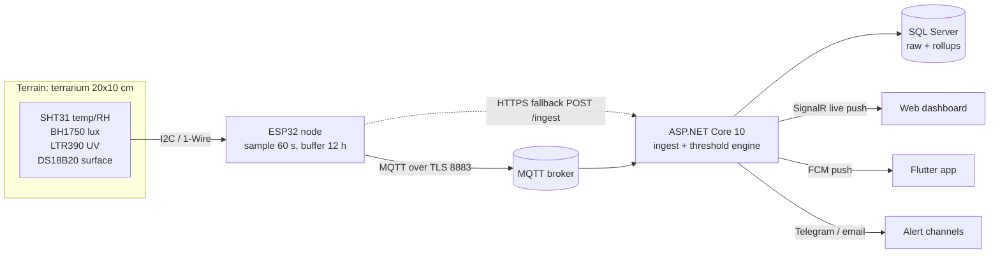

# SmartReptile — Engineering Documentation Set (v1, no AI)

Single source of truth for **building, testing, and releasing** SmartReptile — an IoT
environment-monitoring and alerting system for reptile terrariums.

- **Source requirement:** [`../../SmartReptile_Mo_ta_du_an_v1_khong_AI.docx`](../../SmartReptile_Mo_ta_du_an_v1_khong_AI.docx) (Vietnamese project description, v1 without AI) — the brief itself stays outside this repository
- **Reference brief for mentor-facing structure:** [`../../KhiCanh.docx`](../../KhiCanh.docx) — a different domain (aeroponic farm), used only as a style precedent
- **Course context:** PRM393 — technical report + source archive + release build + demo required
- **Scope of v1:** measure, store, display, alert. **No AI, no automatic actuation.**

---

## 1. Product in one paragraph

SmartReptile measures temperature, humidity, light and UV index inside a terrarium with an
ESP32-based sensor node, streams the readings over MQTT to a backend, and compares every
reading against the environmental envelope published for the kept species. Keepers get a
live dashboard, historical charts, and alerts the moment conditions drift out of range or
the device goes silent. The accumulated time-series is the training asset for the v2
disease-risk AI.

---

## 2. How to use this doc set

| If you are… | Read in this order |
|---|---|
| Building the firmware | `07-appendices/04-hardware-bom-and-wiring.md` → `03-implementation/04-firmware-sensor-sampling-and-transport.md` → `07-appendices/03-mqtt-and-rest-api-spec.md` |
| Building the backend | `01-product/03-functional-requirements.md` → `02-design/01-architecture.md` → `02-design/03-telemetry-ingest-and-threshold-engine.md` → `03-implementation/03-backend-api-and-data-layer.md` |
| Building the app / dashboard | `02-design/04-ui-ux-and-navigation.md` → `03-implementation/05-app-state-management-and-realtime.md` |
| Writing the report | `06-report/01-report-outline.md` → `01-product/*` → `02-design/*` → `04-quality/04-requirements-traceability-matrix.md` |
| Testing / QA | `04-quality/01-test-strategy-and-plan.md` → `04-quality/02-test-cases.md` → `04-quality/03-manual-qa-checklist.md` |
| Releasing / demoing | `05-release/01-build-and-release.md` → `05-release/02-performance-and-reliability.md` |
| Reviewing scope or defending a decision | `01-product/01-vision-and-scope.md` → `07-appendices/01-adr-log.md` → `05-release/03-risks-assumptions-decisions.md` |

**Conventions**

- Every requirement has a stable id: `FR-01…FR-18`, `NFR-01…NFR-12`, `US-01…US-20`, `UC-01…UC-07`,
  `ADR-001…ADR-016`, `TC-U-FW-*` / `TC-U-*` / `TC-I-*` / `TC-W-*` / `TC-E2E-*` (101 test cases).
- Paths are relative to this folder unless written with `../`.
- `MUST` / `SHOULD` / `MAY` follow RFC 2119.
- Anything marked **`[TBC]`** is an open decision the team must close before the demo — they are
  collected in `05-release/03-risks-assumptions-decisions.md` §6.

---

## 3. Document map

### 01 — Product
| File | Purpose |
|---|---|
| `01-product/01-vision-and-scope.md` | Problem, vision, personas, in/out of scope, objectives → requirement mapping, success metrics |
| `01-product/02-glossary.md` | Domain vocabulary (terrarium, species threshold, dwell, exposure index, claim code…) |
| `01-product/03-functional-requirements.md` | FR-01…FR-18 with rules and Given/When/Then acceptance criteria |
| `01-product/04-non-functional-requirements.md` | NFR-01…NFR-12 as measurable budgets + verification method |
| `01-product/05-user-stories-and-use-cases.md` | US-01…US-20 and UC-01…UC-07 with alternative/exception flows |

### 02 — Design
| File | Purpose |
|---|---|
| `02-design/01-architecture.md` | Four-layer architecture, component responsibilities, deployment view, dependency rules |
| `02-design/02-domain-and-data-model.md` | Entities, ERD, relationships, lifecycle/state machines, retention model |
| `02-design/03-telemetry-ingest-and-threshold-engine.md` | Ingest pipeline, validation, dedupe, dwell/hysteresis algorithm, alert state machine |
| `02-design/04-ui-ux-and-navigation.md` | Screen inventory, navigation graph, wireframes, design tokens, responsive rules |
| `02-design/05-alerts-and-notifications.md` | Alert severity matrix, channel selection, quiet hours, rate limiting, escalation |
| `02-design/06-security-device-auth-and-provisioning.md` | Claim flow, device credentials, RBAC, token handling, threat model |

### 03 — Implementation
| File | Purpose |
|---|---|
| `03-implementation/01-tech-stack-and-setup.md` | Prerequisites, pinned versions, package lists, bootstrap commands per component |
| `03-implementation/02-project-structure-and-conventions.md` | Folder trees for 3 components, naming, style, error handling, "how to add a metric" |
| `03-implementation/03-backend-api-and-data-layer.md` | EF Core model, migrations, repositories, background workers, SignalR hub |
| `03-implementation/04-firmware-sensor-sampling-and-transport.md` | ESP32 tasks, sensor drivers, filtering, ring buffer, MQTT/HTTPS transport, provisioning UX |
| `03-implementation/05-app-state-management-and-realtime.md` | Flutter provider graph, REST + SignalR clients, offline cache, web dashboard JS structure |
| `03-implementation/06-threshold-and-species-profile-logic.md` | Threshold resolution, phase/day-night logic, exposure index, summary rollups, worked examples |
| `03-implementation/07-implementation-roadmap.md` | 6 milestones, task breakdown, definition of done, FR coverage order |

### 04 — Quality
| File | Purpose |
|---|---|
| `04-quality/01-test-strategy-and-plan.md` | Test pyramid, tooling, coverage targets, FR → test-type mapping, test data strategy |
| `04-quality/02-test-cases.md` | TC-U-FW-01…12, TC-U-01…50, TC-I-01…15, TC-W-01…18, TC-E2E-01…06 with reference skeletons (101 cases) |
| `04-quality/03-manual-qa-checklist.md` | Hardware bring-up, soak test, device matrix, bug report template |
| `04-quality/04-requirements-traceability-matrix.md` | FR/NFR → design doc → code module → test → report section |

### 05 — Release
| File | Purpose |
|---|---|
| `05-release/01-build-and-release.md` | Firmware release, backend Docker Compose deploy, APK/AppBundle signing, versioning, demo runbook |
| `05-release/02-performance-and-reliability.md` | Performance budgets, load profile, profiling workflow, soak/chaos checks, logging |
| `05-release/03-risks-assumptions-decisions.md` | Risk register, assumptions, open questions, decision log index |

### 06 — Report (course deliverable)
| File | Purpose |
|---|---|
| `06-report/01-report-outline.md` | Technical report structure mapped to the PRM393 rubric, with evidence checklist |
| `06-report/02-contribution-table.md` | Team contribution table template + evidence rules |

### 07 — Appendices
| File | Purpose |
|---|---|
| `07-appendices/01-adr-log.md` | ADR-001…ADR-016 (context / decision / consequences / rejected options) |
| `07-appendices/02-sql-schema-reference.md` | Full table reference: columns, types, keys, indexes, DDL excerpts, seed data |
| `07-appendices/03-mqtt-and-rest-api-spec.md` | MQTT topics/payloads/QoS + REST endpoint reference with status/error codes |
| `07-appendices/04-hardware-bom-and-wiring.md` | Bill of materials, pin map, power budget, enclosure notes, bring-up sequence |
| `07-appendices/05-species-threshold-reference.md` | Threshold tables per species/climate zone, phase rules, **literature list to verify** |
| `07-appendices/06-v2-ai-roadmap.md` | Dataset/feature schema, label sources, model candidates, ethics, v2 milestones |

---

## 4. Glossary quick access

See `01-product/02-glossary.md`. Most-used terms: **terrarium**, **species profile**,
**threshold band**, **dwell time**, **hysteresis**, **exposure index (degree-hours)**,
**claim code**, **stale reading**.

## 5. Status

**Created 2026-09-21 — pre-implementation design freeze (v1.0 of the doc set).**

| Doc | Status |
|---|---|
| 01-product | ✅ drafted |
| 02-design | ✅ drafted |
| 03-implementation | ✅ drafted |
| 04-quality | ✅ drafted |
| 05-release | ✅ drafted |
| 06-report | ✅ drafted (fills with real evidence during the build) |
| 07-appendices | ✅ drafted (threshold numbers require literature verification — see `[TBC]` markers) |

> **Honesty note.** All species thresholds in `07-appendices/05` are *typical published
> husbandry ranges* for the cited species. The project brief requires them to be derived from
> papers/books for the chosen species; treat the tables as a starting draft and close the
> verification checklist in §5 of that appendix before the demo.
