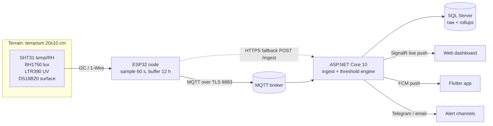

# SmartReptile — Engineering Documentation Set (v1, no AI)

Single source of truth for **building, testing, and releasing** SmartReptile — an IoT
environment-monitoring and alerting system for reptile terrariums.

- **Source requirement:** [`../../SmartReptile_Mo_ta_du_an_v1_khong_AI.docx`](../../SmartReptile_Mo_ta_du_an_v1_khong_AI.docx) (Vietnamese project description, v1 without AI) — the brief itself stays outside this repository
- **Reference brief for mentor-facing structure:** [`../../KhiCanh.docx`](../../KhiCanh.docx) — a different domain (aeroponic farm), used only as a style precedent
- **Course context:** PRM393 — technical report + source archive + release build + demo required
- **Scope of v1:** measure, store, display, alert. **No AI, no automatic actuation.**

---

## 1. Product in one paragraph

SmartReptile measures temperature, humidity, light and UV index inside a terrarium with an
ESP32-based sensor node, streams the readings over MQTT to a backend, and compares every
reading against the environmental envelope published for the kept species. Keepers get a
live dashboard, historical charts, and alerts the moment conditions drift out of range or
the device goes silent. The accumulated time-series is the training asset for the v2
disease-risk AI.

```mermaid
flowchart LR
  subgraph T[Terrain: terrarium 20x10 cm]
    S[SHT31 temp/RH<br/>BH1750 lux<br/>LTR390 UV<br/>DS18B20 surface]
  end
  S -->|I2C / 1-Wire| E[ESP32 node<br/>sample 60 s, buffer 12 h]
  E -->|MQTT over TLS 8883| B[(MQTT broker)]
  E -.->|HTTPS fallback POST /ingest| API
  B --> API[ASP.NET Core 10<br/>ingest + threshold engine]
  API --> DB[(SQL Server<br/>raw + rollups)]
  API -->|SignalR live push| W[Web dashboard]
  API -->|FCM push| M[Flutter app]
  API -->|Telegram / email| N[Alert channels]
```

---

## 2. How to use this doc set

| If you are… | Read in this order |
|---|---|
| Building the firmware | `07-appendices/04-hardware-bom-and-wiring.md` → `03-implementation/04-firmware-sensor-sampling-and-transport.md` → `07-appendices/03-mqtt-and-rest-api-spec.md` |
| Building the backend | `01-product/03-functional-requirements.md` → `02-design/01-architecture.md` → `02-design/03-telemetry-ingest-and-threshold-engine.md` → `03-implementation/03-backend-api-and-data-layer.md` |
| Building the app / dashboard | `02-design/04-ui-ux-and-navigation.md` → `03-implementation/05-app-state-management-and-realtime.md` |
| Writing the report | `06-report/01-report-outline.md` → `01-product/*` → `02-design/*` → `04-quality/04-requirements-traceability-matrix.md` |
| Testing / QA | `04-quality/01-test-strategy-and-plan.md` → `04-quality/02-test-cases.md` → `04-quality/03-manual-qa-checklist.md` |
| Releasing / demoing | `05-release/01-build-and-release.md` → `05-release/02-performance-and-reliability.md` |
| Reviewing scope or defending a decision | `01-product/01-vision-and-scope.md` → `07-appendices/01-adr-log.md` → `05-release/03-risks-assumptions-decisions.md` |

**Conventions**

- Every requirement has a stable id: `FR-01…FR-18`, `NFR-01…NFR-12`, `US-01…US-20`, `UC-01…UC-07`,
  `ADR-001…ADR-018`, `TC-U-FW-*` / `TC-U-*` / `TC-I-*` / `TC-W-*` / `TC-E2E-*` (101 test cases).
- Paths are relative to this folder unless written with `../`.
- `MUST` / `SHOULD` / `MAY` follow RFC 2119.
- Anything marked **`[TBC]`** is an open decision the team must close before the demo — they are
  collected in `05-release/03-risks-assumptions-decisions.md` §6.

---

## 3. Document map

### 01 — Product
| File | Purpose |
|---|---|
| `01-product/01-vision-and-scope.md` | Problem, vision, personas, in/out of scope, objectives → requirement mapping, success metrics |
| `01-product/02-glossary.md` | Domain vocabulary (terrarium, species threshold, dwell, exposure index, claim code…) |
| `01-product/03-functional-requirements.md` | FR-01…FR-18 with rules and Given/When/Then acceptance criteria |
| `01-product/04-non-functional-requirements.md` | NFR-01…NFR-12 as measurable budgets + verification method |
| `01-product/05-user-stories-and-use-cases.md` | US-01…US-20 and UC-01…UC-07 with alternative/exception flows |

### 02 — Design
| File | Purpose |
|---|---|
| `02-design/01-architecture.md` | Four-layer architecture, component responsibilities, deployment view, dependency rules |
| `02-design/02-domain-and-data-model.md` | Entities, ERD, relationships, lifecycle/state machines, retention model |
| `02-design/03-telemetry-ingest-and-threshold-engine.md` | Ingest pipeline, validation, dedupe, dwell/hysteresis algorithm, alert state machine |
| `02-design/04-ui-ux-and-navigation.md` | Screen inventory, navigation graph, wireframes, design tokens, responsive rules |
| `02-design/05-alerts-and-notifications.md` | Alert severity matrix, channel selection, quiet hours, rate limiting, escalation |
| `02-design/06-security-device-auth-and-provisioning.md` | Claim flow, device credentials, RBAC, token handling, threat model |

### 03 — Implementation
| File | Purpose |
|---|---|
| `03-implementation/01-tech-stack-and-setup.md` | Prerequisites, pinned versions, package lists, bootstrap commands per component |
| `03-implementation/02-project-structure-and-conventions.md` | Folder trees for 3 components, naming, style, error handling, "how to add a metric" |
| `03-implementation/03-backend-api-and-data-layer.md` | EF Core model, migrations, repositories, background workers, SignalR hub |
| `03-implementation/04-firmware-sensor-sampling-and-transport.md` | ESP32 tasks, sensor drivers, filtering, ring buffer, MQTT/HTTPS transport, provisioning UX |
| `03-implementation/05-app-state-management-and-realtime.md` | Flutter provider graph, REST + SignalR clients, offline cache, the two web surfaces (static dashboard + mock-data prototype) |
| `03-implementation/06-threshold-and-species-profile-logic.md` | Threshold resolution, phase/day-night logic, exposure index, summary rollups, worked examples |
| `03-implementation/07-implementation-roadmap.md` | 6 milestones, task breakdown, definition of done, FR coverage order, team allocation |
| `03-implementation/08-work-distribution-w5-w10.md` | Who does what in weeks 5–10: app-first schedule with an end-of-W8 app freeze, Friday gates, workload, cut list |

### 04 — Quality
| File | Purpose |
|---|---|
| `04-quality/01-test-strategy-and-plan.md` | Test pyramid, tooling, coverage targets, FR → test-type mapping, test data strategy |
| `04-quality/02-test-cases.md` | TC-U-FW-01…12, TC-U-01…50, TC-I-01…15, TC-W-01…18, TC-E2E-01…06 with reference skeletons (101 cases) |
| `04-quality/03-manual-qa-checklist.md` | Hardware bring-up, soak test, device matrix, bug report template |
| `04-quality/04-requirements-traceability-matrix.md` | FR/NFR → design doc → code module → test → report section |

### 05 — Release
| File | Purpose |
|---|---|
| `05-release/01-build-and-release.md` | Firmware release, backend Docker Compose deploy, APK/AppBundle signing, versioning, demo runbook |
| `05-release/02-performance-and-reliability.md` | Performance budgets, load profile, profiling workflow, soak/chaos checks, logging |
| `05-release/03-risks-assumptions-decisions.md` | Risk register, assumptions, open questions, decision log index |

### 06 — Report (course deliverable)
| File | Purpose |
|---|---|
| `06-report/01-report-outline.md` | Technical report structure mapped to the PRM393 rubric, with evidence checklist |
| `06-report/02-contribution-table.md` | Team contribution table template + evidence rules |

### 07 — Appendices
| File | Purpose |
|---|---|
| `07-appendices/01-adr-log.md` | ADR-001…ADR-018 (context / decision / consequences / rejected options) |
| `07-appendices/02-sql-schema-reference.md` | Full table reference: columns, types, keys, indexes, DDL excerpts, seed data |
| `07-appendices/03-mqtt-and-rest-api-spec.md` | MQTT topics/payloads/QoS + REST endpoint reference with status/error codes |
| `07-appendices/04-hardware-bom-and-wiring.md` | Bill of materials, pin map, power budget, enclosure notes, bring-up sequence |
| `07-appendices/05-species-threshold-reference.md` | Threshold tables per species/climate zone, phase rules, **literature list to verify** |
| `07-appendices/06-v2-ai-roadmap.md` | Dataset/feature schema, label sources, model candidates, ethics, v2 milestones |

---

## 4. Glossary quick access

See `01-product/02-glossary.md`. Most-used terms: **terrarium**, **species profile**,
**threshold band**, **dwell time**, **hysteresis**, **exposure index (degree-hours)**,
**claim code**, **stale reading**.

## 5. Status

**Created 2026-09-21 — pre-implementation design freeze (v1.0 of the doc set).**

| Doc | Status |
|---|---|
| 01-product | ✅ drafted |
| 02-design | ✅ drafted |
| 03-implementation | ✅ drafted |
| 04-quality | ✅ drafted |
| 05-release | ✅ drafted |
| 06-report | ✅ drafted (fills with real evidence during the build) |
| 07-appendices | ✅ drafted (threshold numbers require literature verification — see `[TBC]` markers) |

> **Honesty note.** All species thresholds in `07-appendices/05` are *typical published
> husbandry ranges* for the cited species. The project brief requires them to be derived from
> papers/books for the chosen species; treat the tables as a starting draft and close the
> verification checklist in §5 of that appendix before the demo.

**Revised 2026-10-03 — the web section is re-based on the TERRAGUARD prototype.** A React UI prototype landed at
the root of `web/` and moved the M1 dashboard pages to `web/legacy/`; the doc set described only the vanilla-JS
dashboard, and the compose `web` service still mounted `web/` (BUG-03 — **fixed in the second pass below**). The decision is `ADR-017`, the defect it caused is
BUG-03, and the touched files are `03-implementation/01` §1/§2/§4.4, `03-implementation/02` §4,
`03-implementation/05` §6, `02-design/01` §2, `02-design/04` §1.2, `05-release/01` §5, `05-release/03` §3–§5,
`06-report/01` R6.7, `06-report/snapshots/README.md`, `04-quality/04`, and the roadmap (`03-implementation/07` M4
and `03-implementation/08`). The prototype is described as what it is — mock data, Vietnamese-only, outside CI —
and the three follow-ups are roadmap tasks 4.12–4.14. Its own Vietnamese summary sits beside this set as
`TERRAGUARD_SUMMARY.md`, which brings the doc set to 36 files (35 documents + this index).

**Revised 2026-10-03 (second pass) — the three follow-ups the re-base created are closed.** Roadmap **4.12** fixed
**BUG-03** (`web/nginx.conf` plus sibling compose mounts; the regression `curl` pair lives in `05-release/01` §5);
**4.13** is decided as **`ADR-018`** — the TERRAGUARD prototype stays a mock-data UI reference and `web/legacy/`
remains the M4 web surface; **4.14** labels the prototype as mock data in the UI
(`web/src/components/MockDataNotice.tsx`), documents its prototype-only palette with measured contrast ratios and
settles the Vietnamese-only copy. Touched `07-appendices/01`, `02-design/04` §1.2, `03-implementation/01` §4.4,
`03-implementation/02` §4, `03-implementation/07` (M4 status), `04-quality/01` §6, `05-release/01` §5,
`05-release/03` §3–§5, `06-report/snapshots/README.md`, the repository `README` and this index. No document was
added or removed, so the doc set is still **36 files** (35 documents + this index).

**Revised 2026-10-03 (third pass) — M2 has started, and its prerequisite is done.** User authentication (FR-01) is
implemented so that task 2.2's `Owner`-gated `claim` endpoint has something to authorise against:
`/api/v1/auth` register/login/refresh/logout/me/change-password, PBKDF2 with per-user iterations and
rehash-on-login, HS256 access tokens, single-use refresh rotation with family revocation on reuse, login
throttling and a per-address rate limit. Touched `03-implementation/01` §1 and `03-implementation/07` (a new M2
progress section), `05-release/03` §5 and the repository `README`. No document was added or removed, so the doc set
is still **36 files** (35 documents + this index).

**Revised 2026-10-03 (fourth pass) — task 2.2 is done, and one spec number was corrected.** Device provisioning is
implemented and verified end to end (`/api/v1/devices/{self-register,claim,{id}/rotate-secret,{id}/revoke}`,
credential hashing, rotation grace, `Owner` gating), so a board can now be registered and bound to a terrarium over
HTTP. The pass also fixed an arithmetic error in the claim-code spec: `07-appendices/03` §2.1 described a
"32-symbol" alphabet while listing the 31 symbols that survive removing `0 O 1 I L` from the 36 alphanumerics. The
list is normative (firmware and backend must agree on it byte for byte), so the counts and entropy figures in
`07-appendices/03` §2.1, `02-design/02` §3 and `02-design/06` §5 now read 31 symbols and ≈ 8.5 × 10¹¹. Touched
`07-appendices/03` §2.1–§2.3, `02-design/02`, `02-design/06`, `03-implementation/07` (M2 progress), `05-release/03`
§5 and the repository `README`. No document was added or removed, so the doc set is still **36 files**
(35 documents + this index).

**Revised 2026-10-03 (fifth pass) — task 2.3 closes the MQTT hole.** The broker now verifies the device credential
(`username = deviceId`, `password = secret`, grace window included), serves TLS `8883` and a loopback-only
plaintext `1883` as separate listeners, enforces the per-device topic ACL of `07-appendices/03` §3.1 on both
publish and subscribe, and drops a device's live session when it is revoked (BR-05.4). Config gained
`Mqtt:PlaintextHost` (`.env.example`, `docker-compose.yml`), `Mqtt:RequireClientAuthentication` stays on in
`appsettings.Development.json`, `1883` is published on the host loopback only, and the runbook has the TLS-only
check as step 3a of `05-release/01` §6. Touched `03-implementation/07` (M2 progress), `05-release/01` §6,
`05-release/03` §5 and the repository `README`. No document was added or removed, so the doc set is still
**36 files** (35 documents + this index). The session's own implementation record sits beside the set as
`IMPLEMENTATION_SUMMARY_2026-10-03.md` — like `DOC_CHANGES_2026-10-03.md` and `TERRAGUARD_SUMMARY.md`, it is not
counted in the 36.

**Revised 2026-10-04 (sixth pass) — task 2.4 walks a real sample into SQL Server.** `IngestWorker` and the
pipeline stages of `03-implementation/03` §3 now exist: bytes → schema/shape/timing (rules V-01…V-03, V-07…V-09,
V-10) → device authentication → plausibility (V-06, stored and flagged, never refused) → calibration on `Value`
with `RawValue` preserved → dedupe and persist in one transaction (DI-02/DI-03) → device state and health
denorms. New code in `Application/Ingest`, `Domain/Readings/TelemetryIngestRules.cs`,
`Infrastructure/Ingest` and `Infrastructure/Persistence/EfTelemetryStore.cs`; `MetricDictionary` gained each
metric's firmware `payloadKey`; the broker's publish interceptor now feeds the in-process bus. Touched
`03-implementation/03` §3 (an "as built" note on the two places the sketch and the code differ),
`03-implementation/07` (M2 progress, the 2.4 block and what is still open), `04-quality/02` (`TC-I-01`'s counter
unit, `TC-I-04` split against 3.3, `TC-U-05`'s constant-time assertion), `01-product/05` (the calibration quality
bit was written as 16; it is 32), `05-release/03` §5 and the repository `README`. No document was added or
removed, so the doc set is still **36 files** (35 documents + this index). The branch's implementation record
beside the set, `IMPLEMENTATION_SUMMARY_2026-10-03.md`, now carries this session as well: it covers 2026-10-03 and
2026-10-04 in one file, because the second continues the first.

