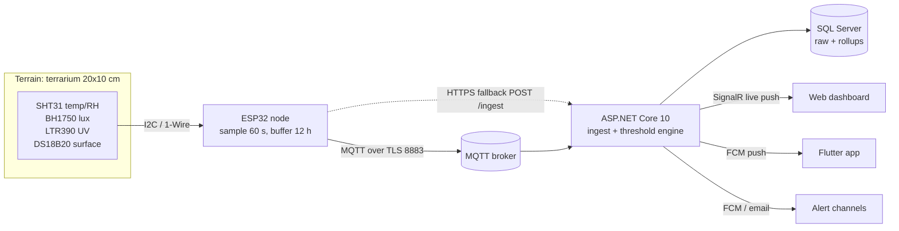

# SmartReptile — Engineering Documentation Set (v1, no AI)

Single source of truth for **building, testing, and releasing** SmartReptile — an IoT
environment-monitoring and alerting system for reptile terrariums.

- **Source requirement:** [`../../SmartReptile_Mo_ta_du_an_v1_khong_AI.docx`](../../SmartReptile_Mo_ta_du_an_v1_khong_AI.docx) (Vietnamese project description, v1 without AI) — the brief itself stays outside this repository
- **Reference brief for mentor-facing structure:** [`../../KhiCanh.docx`](../../KhiCanh.docx) — a different domain (aeroponic farm), used only as a style precedent
- **Course context:** PRM393 — technical report + source archive + release build + demo required
- **Scope of v1:** measure, store, display, alert. **No AI, no automatic actuation.**

---

## 1. Product in one paragraph

SmartReptile measures temperature, humidity, light and UV index inside a terrarium with an
ESP32-based sensor node, streams the readings over MQTT to a backend, and compares every
reading against the environmental envelope published for the kept species. Keepers get a
live dashboard, historical charts, and alerts the moment conditions drift out of range or
the device goes silent. The accumulated time-series is the training asset for the v2
disease-risk AI.

```mermaid
flowchart LR
  subgraph T[Terrain: terrarium 20x10 cm]
    S[SHT31 temp/RH<br/>BH1750 lux<br/>LTR390 UV<br/>DS18B20 surface]
  end
  S -->|I2C / 1-Wire| E[ESP32 node<br/>sample 60 s, buffer 12 h]
  E -->|MQTT over TLS 8883| B[(MQTT broker)]
  E -.->|HTTPS fallback POST /ingest| API
  B --> API[ASP.NET Core 10<br/>ingest + threshold engine]
  API --> DB[(SQL Server<br/>raw + rollups)]
  API -->|SignalR live push| W[Web dashboard]
  API -->|FCM push| M[Flutter app]
  API -->|FCM / email| N[Alert channels]
```

---

## 2. How to use this doc set

| If you are… | Read in this order |
|---|---|
| Building the firmware | `07-appendices/04-hardware-bom-and-wiring.md` → `03-implementation/04-firmware-sensor-sampling-and-transport.md` → `07-appendices/03-mqtt-and-rest-api-spec.md` |
| Building the backend | `01-product/03-functional-requirements.md` → `02-design/01-architecture.md` → `02-design/03-telemetry-ingest-and-threshold-engine.md` → `03-implementation/03-backend-api-and-data-layer.md` |
| Building the app / dashboard | `02-design/04-ui-ux-and-navigation.md` → `03-implementation/05-app-state-management-and-realtime.md` |
| Writing the report | `06-report/01-report-outline.md` → `01-product/*` → `02-design/*` → `04-quality/04-requirements-traceability-matrix.md` |
| Testing / QA | `04-quality/01-test-strategy-and-plan.md` → `04-quality/02-test-cases.md` → `04-quality/03-manual-qa-checklist.md` |
| Releasing / demoing | `05-release/01-build-and-release.md` → `05-release/02-performance-and-reliability.md` |
| Reviewing scope or defending a decision | `01-product/01-vision-and-scope.md` → `07-appendices/01-adr-log.md` → `05-release/03-risks-assumptions-decisions.md` |

**Conventions**

- Every requirement has a stable id: `FR-01…FR-18`, `NFR-01…NFR-12`, `US-01…US-20`, `UC-01…UC-07`,
  `ADR-001…ADR-019`, `TC-U-FW-*` / `TC-U-*` / `TC-I-*` / `TC-W-*` / `TC-E2E-*` (107 test cases).
- Paths are relative to this folder unless written with `../`.
- `MUST` / `SHOULD` / `MAY` follow RFC 2119.
- Anything marked **`[TBC]`** is an open decision the team must close before the demo — they are
  collected in `05-release/03-risks-assumptions-decisions.md` §6.

---

## 3. Document map

### 01 — Product
| File | Purpose |
|---|---|
| `01-product/01-vision-and-scope.md` | Problem, vision, personas, in/out of scope, objectives → requirement mapping, success metrics |
| `01-product/02-glossary.md` | Domain vocabulary (terrarium, species threshold, dwell, exposure index, claim code…) |
| `01-product/03-functional-requirements.md` | FR-01…FR-18 with rules and Given/When/Then acceptance criteria |
| `01-product/04-non-functional-requirements.md` | NFR-01…NFR-12 as measurable budgets + verification method |
| `01-product/05-user-stories-and-use-cases.md` | US-01…US-20 and UC-01…UC-07 with alternative/exception flows |

### 02 — Design
| File | Purpose |
|---|---|
| `02-design/01-architecture.md` | Four-layer architecture, component responsibilities, deployment view, dependency rules |
| `02-design/02-domain-and-data-model.md` | Entities, ERD, relationships, lifecycle/state machines, retention model |
| `02-design/03-telemetry-ingest-and-threshold-engine.md` | Ingest pipeline, validation, dedupe, dwell/hysteresis algorithm, alert state machine |
| `02-design/04-ui-ux-and-navigation.md` | Screen inventory, navigation graph, wireframes, design tokens, responsive rules |
| `02-design/05-alerts-and-notifications.md` | Alert severity matrix, channel selection, quiet hours, rate limiting, escalation |
| `02-design/06-security-device-auth-and-provisioning.md` | Claim flow, device credentials, RBAC, token handling, threat model |

### 03 — Implementation
| File | Purpose |
|---|---|
| `03-implementation/01-tech-stack-and-setup.md` | Prerequisites, pinned versions, package lists, bootstrap commands per component |
| `03-implementation/02-project-structure-and-conventions.md` | Folder trees for 3 components, naming, style, error handling, "how to add a metric" |
| `03-implementation/03-backend-api-and-data-layer.md` | EF Core model, migrations, repositories, background workers, SignalR hub |
| `03-implementation/04-firmware-sensor-sampling-and-transport.md` | ESP32 tasks, sensor drivers, filtering, ring buffer, MQTT/HTTPS transport, provisioning UX |
| `03-implementation/05-app-state-management-and-realtime.md` | Flutter provider graph, REST + SignalR clients, offline cache, the two web surfaces (static dashboard + mock-data prototype) |
| `03-implementation/06-threshold-and-species-profile-logic.md` | Threshold resolution, phase/day-night logic, exposure index, summary rollups, worked examples |
| `03-implementation/07-implementation-roadmap.md` | 6 milestones, task breakdown, definition of done, FR coverage order, team allocation |
| `03-implementation/08-work-distribution-w5-w10.md` | Who does what in weeks 5–10: app-first schedule with an end-of-W8 app freeze, Friday gates, workload, cut list |

### 04 — Quality
| File | Purpose |
|---|---|
| `04-quality/01-test-strategy-and-plan.md` | Test pyramid, tooling, coverage targets, FR → test-type mapping, test data strategy |
| `04-quality/02-test-cases.md` | TC-U-FW-01…12, TC-U-01…50, TC-I-01…15, TC-W-01…18, TC-E2E-01…06 with reference skeletons (101 cases) |
| `04-quality/03-manual-qa-checklist.md` | Hardware bring-up, soak test, device matrix, bug report template |
| `04-quality/04-requirements-traceability-matrix.md` | FR/NFR → design doc → code module → test → report section |

### 05 — Release
| File | Purpose |
|---|---|
| `05-release/01-build-and-release.md` | Firmware release, backend Docker Compose deploy, APK/AppBundle signing, versioning, demo runbook |
| `05-release/02-performance-and-reliability.md` | Performance budgets, load profile, profiling workflow, soak/chaos checks, logging |
| `05-release/03-risks-assumptions-decisions.md` | Risk register, assumptions, open questions, decision log index |

### 06 — Report (course deliverable)
| File | Purpose |
|---|---|
| `06-report/01-report-outline.md` | Technical report structure mapped to the PRM393 rubric, with evidence checklist |
| `06-report/02-contribution-table.md` | Team contribution table template + evidence rules |

### 07 — Appendices
| File | Purpose |
|---|---|
| `07-appendices/01-adr-log.md` | ADR-001…ADR-019 (context / decision / consequences / rejected options) |
| `07-appendices/02-sql-schema-reference.md` | Full table reference: columns, types, keys, indexes, DDL excerpts, seed data |
| `07-appendices/03-mqtt-and-rest-api-spec.md` | MQTT topics/payloads/QoS + REST endpoint reference with status/error codes |
| `07-appendices/04-hardware-bom-and-wiring.md` | Bill of materials, pin map, power budget, enclosure notes, bring-up sequence |
| `07-appendices/05-species-threshold-reference.md` | Threshold tables per species/climate zone, phase rules, **literature list to verify** |
| `07-appendices/06-v2-ai-roadmap.md` | Dataset/feature schema, label sources, model candidates, ethics, v2 milestones |
| `07-appendices/07-database-snapshot-2026-10-07.md` | Point-in-time dump of the development database — all 15 tables, their columns and their rows, secrets redacted to their byte length. Regenerate with `scripts/dump-database.ps1`; it is evidence of what the demo was standing on, not the schema's source of truth (that is `07-appendices/02`) |

---

## 4. Glossary quick access

See `01-product/02-glossary.md`. Most-used terms: **terrarium**, **species profile**,
**threshold band**, **dwell time**, **hysteresis**, **exposure index (degree-hours)**,
**claim code**, **stale reading**.

## 5. Status

**Created 2026-09-21 — pre-implementation design freeze (v1.0 of the doc set).**

| Doc | Status |
|---|---|
| 01-product | ✅ drafted |
| 02-design | ✅ drafted |
| 03-implementation | ✅ drafted |
| 04-quality | ✅ drafted |
| 05-release | ✅ drafted |
| 06-report | ✅ drafted (fills with real evidence during the build) |
| 07-appendices | ✅ drafted (threshold numbers require literature verification — see `[TBC]` markers) |

> **Honesty note.** All species thresholds in `07-appendices/05` are *typical published
> husbandry ranges* for the cited species. The project brief requires them to be derived from
> papers/books for the chosen species; treat the tables as a starting draft and close the
> verification checklist in §5 of that appendix before the demo.

**Revised 2026-10-03 — the web section is re-based on the TERRAGUARD prototype.** A React UI prototype landed at
the root of `web/` and moved the M1 dashboard pages to `web/legacy/`; the doc set described only the vanilla-JS
dashboard, and the compose `web` service still mounted `web/` (BUG-03 — **fixed in the second pass below**). The decision is `ADR-017`, the defect it caused is
BUG-03, and the touched files are `03-implementation/01` §1/§2/§4.4, `03-implementation/02` §4,
`03-implementation/05` §6, `02-design/01` §2, `02-design/04` §1.2, `05-release/01` §5, `05-release/03` §3–§5,
`06-report/01` R6.7, `06-report/snapshots/README.md`, `04-quality/04`, and the roadmap (`03-implementation/07` M4
and `03-implementation/08`). The prototype is described as what it is — mock data, Vietnamese-only, outside CI —
and the three follow-ups are roadmap tasks 4.12–4.14. Its own Vietnamese summary sits beside this set as
`TERRAGUARD_SUMMARY.md`, which brings the doc set to 36 files (35 documents + this index).

**Revised 2026-10-03 (second pass) — the three follow-ups the re-base created are closed.** Roadmap **4.12** fixed
**BUG-03** (`web/nginx.conf` plus sibling compose mounts; the regression `curl` pair lives in `05-release/01` §5);
**4.13** is decided as **`ADR-018`** — the TERRAGUARD prototype stays a mock-data UI reference and `web/legacy/`
remains the M4 web surface (**`ADR-018` revoked in full on 2026-10-06 by `ADR-019`**, in the eighth pass below); **4.14** labels
the prototype as mock data in the UI
(`web/src/components/MockDataNotice.tsx`), documents its prototype-only palette with measured contrast ratios and
settles the Vietnamese-only copy. Touched `07-appendices/01`, `02-design/04` §1.2, `03-implementation/01` §4.4,
`03-implementation/02` §4, `03-implementation/07` (M4 status), `04-quality/01` §6, `05-release/01` §5,
`05-release/03` §3–§5, `06-report/snapshots/README.md`, the repository `README` and this index. No document was
added or removed, so the doc set is still **36 files** (35 documents + this index).

**Revised 2026-10-03 (third pass) — M2 has started, and its prerequisite is done.** User authentication (FR-01) is
implemented so that task 2.2's `Owner`-gated `claim` endpoint has something to authorise against:
`/api/v1/auth` register/login/refresh/logout/me/change-password, PBKDF2 with per-user iterations and
rehash-on-login, HS256 access tokens, single-use refresh rotation with family revocation on reuse, login
throttling and a per-address rate limit. Touched `03-implementation/01` §1 and `03-implementation/07` (a new M2
progress section), `05-release/03` §5 and the repository `README`. No document was added or removed, so the doc set
is still **36 files** (35 documents + this index).

**Revised 2026-10-03 (fourth pass) — task 2.2 is done, and one spec number was corrected.** Device provisioning is
implemented and verified end to end (`/api/v1/devices/{self-register,claim,{id}/rotate-secret,{id}/revoke}`,
credential hashing, rotation grace, `Owner` gating), so a board can now be registered and bound to a terrarium over
HTTP. The pass also fixed an arithmetic error in the claim-code spec: `07-appendices/03` §2.1 described a
"32-symbol" alphabet while listing the 31 symbols that survive removing `0 O 1 I L` from the 36 alphanumerics. The
list is normative (firmware and backend must agree on it byte for byte), so the counts and entropy figures in
`07-appendices/03` §2.1, `02-design/02` §3 and `02-design/06` §5 now read 31 symbols and ≈ 8.5 × 10¹¹. Touched
`07-appendices/03` §2.1–§2.3, `02-design/02`, `02-design/06`, `03-implementation/07` (M2 progress), `05-release/03`
§5 and the repository `README`. No document was added or removed, so the doc set is still **36 files**
(35 documents + this index).

**Revised 2026-10-03 (fifth pass) — task 2.3 closes the MQTT hole.** The broker now verifies the device credential
(`username = deviceId`, `password = secret`, grace window included), serves TLS `8883` and a loopback-only
plaintext `1883` as separate listeners, enforces the per-device topic ACL of `07-appendices/03` §3.1 on both
publish and subscribe, and drops a device's live session when it is revoked (BR-05.4). Config gained
`Mqtt:PlaintextHost` (`.env.example`, `docker-compose.yml`), `Mqtt:RequireClientAuthentication` stays on in
`appsettings.Development.json`, `1883` is published on the host loopback only, and the runbook has the TLS-only
check as step 3a of `05-release/01` §6. Touched `03-implementation/07` (M2 progress), `05-release/01` §6,
`05-release/03` §5 and the repository `README`. No document was added or removed, so the doc set is still
**36 files** (35 documents + this index). The session's own implementation record sits beside the set as
`IMPLEMENTATION_SUMMARY_2026-10-03.md` — like `DOC_CHANGES_2026-10-03.md` and `TERRAGUARD_SUMMARY.md`, it is not
counted in the 36.

**Revised 2026-10-04 (sixth pass) — task 2.4 walks a real sample into SQL Server.** `IngestWorker` and the
pipeline stages of `03-implementation/03` §3 now exist: bytes → schema/shape/timing (rules V-01…V-03, V-07…V-09,
V-10) → device authentication → plausibility (V-06, stored and flagged, never refused) → calibration on `Value`
with `RawValue` preserved → dedupe and persist in one transaction (DI-02/DI-03) → device state and health
denorms. New code in `Application/Ingest`, `Domain/Readings/TelemetryIngestRules.cs`,
`Infrastructure/Ingest` and `Infrastructure/Persistence/EfTelemetryStore.cs`; `MetricDictionary` gained each
metric's firmware `payloadKey`; the broker's publish interceptor now feeds the in-process bus. Touched
`03-implementation/03` §3 (an "as built" note on the two places the sketch and the code differ),
`03-implementation/07` (M2 progress, the 2.4 block and what is still open), `04-quality/02` (`TC-I-01`'s counter
unit, `TC-I-04` split against 3.3, `TC-U-05`'s constant-time assertion), `01-product/05` (the calibration quality
bit was written as 16; it is 32), `05-release/03` §5 and the repository `README`. No document was added or
removed, so the doc set is still **36 files** (35 documents + this index). The branch's implementation record
beside the set, `IMPLEMENTATION_SUMMARY_2026-10-03.md`, now carries this session as well: it covers 2026-10-03 and
2026-10-04 in one file, because the second continues the first.

**Revised 2026-10-06 (seventh pass) — the read surface, then password recovery.** Two pieces of work landed
together. First, M2 task 2.8's terrarium read surface: six routes (`GET`/`POST /terrariums`, `GET /{id}`, `GET
/{id}/readings/latest`, `GET /{id}/readings`, `GET /{id}/coverage`) and the `web/legacy` sign-in that calls them, so
the dashboard renders measured values instead of an empty state; documented in `07-appendices/03` §4.2, 
`03-implementation/03` §6/§9, `03-implementation/07` and `04-quality/02`/`04`. Second, password recovery for
**FR-01**: a backup recovery code issued at registration (`POST /auth/recover` spends it), a server-issued
single-use code (`POST /auth/forgot-password` + `/auth/reset-password`), and delivery as an
`IPasswordResetNotifier` port whose demo implementation writes the code to the log behind `PasswordReset:LogCode`;
documented in `02-design/06` §2, `07-appendices/03` §4.1/§5, `07-appendices/02` §3.1/§3.13/§4,
`03-implementation/03` §6/§9, `03-implementation/07` (a new progress block), `04-quality/02` (`TC-U-51…56`),
`04-quality/04` and `05-release/03` §7, where **L-02** is rewritten from "no password reset" to "reset-code
delivery is a log line, not email". No document was added or removed, so the doc set is still **36 files**
(35 documents + this index).

**Revised 2026-10-06 (eighth pass) — `ADR-019` promotes TERRAGUARD, revokes `ADR-018` and retires the static dashboard.** The
prototype that `ADR-018` kept as a mock-data reference becomes the M4 web surface, and `web/legacy/` — the vanilla-JS
dashboard that has carried the milestone since M1 — is retired by new task 4.19. The promotion is recorded with the
obligations that come with it rather than as a relabel: real API data (4.15–4.16), verdicts from the server instead
of `value > max` in a screen (4.17), vi+en with a key set shared with the app (4.18), `02-design/04` §3 tokens at
≥ 4.5:1 (4.18), the wallboard rebuilt in React (4.19), and the remaining screens wired as their endpoints land
(4.20). Touched `07-appendices/01` (ADR-019 appended; the ADR-003/017/018 status lines), `03-implementation/07`
(M4 intro, 4.10, 4.15–4.20, DoD and a per-screen staging table), `02-design/04` §1.2, `05-release/01` §5,
`04-quality/01` §6, `04-quality/02` (the `TC-I-15` caveat), `04-quality/03` §5.12, `03-implementation/01`/`02` and
`05-release/03` §3/§5. No document was added or removed, so the doc set is still **36 files** (35 documents + this
index).

**Revised 2026-10-09 (twelfth pass) — M3 task 3.2: the threshold engine, and the first alert this system ever
raised.** The decision procedure of `02-design/03` §4.2 is now `ThresholdDecision.Decide` — a static,
dependency-free function over a band, a reading and an `EvaluationState` that mutates that state and returns what to
do — and `SampleEvaluator` became the thing that acts on it: it resolves the band through the *same*
`ThresholdResolver` the read surface labels a card with, and writes the new alert, the touch, the escalation or the
resolution. `ThresholdAlertWriter` owns those four field-level writes so they are testable without a store, and
`alerts_opened_total` is counted by severity from the evaluation outcome. Five readings of the design were settled
while writing it, and all five are now stated in the documents rather than only in the code: the **dwell is
measured against the evaluation instant** while every instant recorded is the sample's own, so a back-filled
excursion opens for the record and back-dated (the burst the design worries about is the dispatcher's rule,
BR-06.6/11.8); **a reading back inside the target band ends the excursion even without clearing the recovery
margin**, because the margin gates closing an alert rather than re-arming the dwell; **escalation needs the severity
the alert already carries**, passed in because `EvaluationState` has no severity column and should not grow one;
**the critical window is consecutive**; and the alert's **triggering value and peak are read back from the stored
readings of the dwell window** rather than from two more columns rewritten on every sample. Two examples in the doc
set were found to be self-inconsistent and are corrected where they stand — `TC-U-15`'s 32.2 °C is *outside* a
26–32 °C band, and `03-implementation/06` §3's Example B listed 31.6 °C as a recovery tick when a 0.5 °C margin asks
for ≤ 31.5 — and the `07-appendices/03` `seq` rule gained the sentence that cost this pass twenty minutes: `seq` is
the batch's **first** sample, and the samples that follow continue from there, so a device publishing batches of
three advances the counter by three. **Two pieces of the design are deliberately absent and named rather than implied:**
delivery (evaluation writes alerts and the dispatcher sends them, 3.5; `alertChanged` arrives with the lifecycle API
in 3.4, because an event no client can act on is noise with a schema) and the **per-device reorder window** of
`02-design/03` §7 — samples are evaluated in ingest order, which for one node *is* `RecordedAt` order, but a second
publisher or a broker redelivery could arrive out of order and the `EvaluationState` watermark cannot see it because
it is an *id* watermark. Evidence: 545 unit tests (19 `ThresholdDecisionTests` + 26 evaluator cases), 19 integration
cases, `dotnet format --verify-no-changes --severity error` clean, and a live 48-check run in which a **scripted
node** drove one excursion through a real broker, ingest, evaluator and SQL Server — a faulted reading ignored, a
sub-dwell excursion silent, exactly one back-dated Warning whose peak came from its dwell window rather than from
the reading that opened it, a critical reading short of its dwell touching without escalating, that same row
escalating exactly once, `Recovered` after three ticks with the pointer and the excursion cleared, a second episode
as a separate row, and counters that moved by exactly the two openings and ten stored samples with no duplicate.
Touched `02-design/03` (§4.1/§4.2), `03-implementation/03` (§4's as-built table and §5's open note),
`03-implementation/06` §3, `03-implementation/07` (the 3.2 block, its row, the scaffolding pointer),
`04-quality/02` (B2), `07-appendices/02` (§3.8/§3.9), `07-appendices/03` §3.2, `05-release/03` §5 and the repository
`README`. No document was added or removed, so the doc set is still **36 files** (35 documents + this index).

**Revised 2026-10-09 (eleventh pass) — M3 has started, with the one task in it that is a prerequisite rather than
a feature.** The threshold resolution order (`03-implementation/06` §1) was a private method inside
`TerrariumService` that returned the band and discarded the reason; 3.1 needed an endpoint that reports `source`,
which would have meant a second copy of the rule and 3.2's evaluator a third. It is now
`ThresholdResolver.Resolve` — one pure function in the domain returning `EffectiveThreshold(metric, phase, source,
band)` — and `GET /api/v1/terrariums/{id}/thresholds` reads the metric dictionary through it at `clock.UtcNow` in
the terrarium's own zone. The response carries `terrariumId`, `capturedAtUtc`, `timeZoneId` and
`effectiveThresholds[]`; a metric with no band for the phase in force is **absent** rather than null-bounded, and
entries are ordered by metric key so the editor's rows keep their places. `readings/latest`'s band and this
endpoint's band now come from the same call, and a test asserts they agree instead of assuming it. Writing the rule
down once also forced two ambiguities in §1 into the open, and both are now settled in the document: precedence is
applied **per instant** (an override decides whenever it holds a row for the phase in force, but a layer holding
only the other phase's row is silent rather than decisive — the behaviour `readings/latest` already had), and
**`Any` wins inside a layer**. Three things are deliberately *not* built and are recorded as open rather than
implied: the override write path (`PUT`/`DELETE`, which is why the live check inserted its rows with `sqlcmd`),
`ThresholdSnapshot` (its natural writer is 3.2/3.4), and the resolution order's third tier `SystemDefault` — which
§1 names and then never gives a value anywhere in the doc set, so an unresolvable metric is reported absent instead
of filled from a default nobody wrote down. Evidence: 513 unit tests (10 `ThresholdResolverTests` + 6 service cases
new), 19 integration cases against SQL Server Express, `dotnet format --verify-no-changes --severity error` clean,
and a live run of 34 checks through the real API and database on the seeded Tropical profile — **both phases
observed**, by creating one terrarium whose local clock is inside the photoperiod and one outside it. Touched
`03-implementation/06` §1, `07-appendices/03` §4.2 (the built route, its response shape and the three shape rules a
client needs), `03-implementation/07` (a new 3.1 block, the 3.1 row and 4.20's threshold-editor note),
`04-quality/02` (B3's `TC-U-21…26` status) and `05-release/03` §5. No document was added or removed, so the doc set
is still **36 files** (35 documents + this index).

**Revised 2026-10-09 (tenth pass) — the client is renamed VIVARIUMGUARD.** The wordmark in the shell and on the
sign-in hero, the browser title (`web/index.html`), the Flutter `MaterialApp` title and the app's own split-span
wordmark (`app/lib/app.dart`) now read **VIVARIUMGUARD**, the two-tone `VIVARIUM` + `GUARD` structure unchanged; the
settings placeholders in both clients carry `admin@vivariumguard.vn`. The committed `web/dist/` is rebuilt to match,
so it is now `index-DX1qiJCO.js` — Vite empties `outDir`, so the old hash is gone. Three internal identifiers keep
the old word deliberately, because no user ever sees them and renaming two of them would sign every existing
session out and forget the language choice: the `localStorage` keys `terraguard.session` / `terraguard.language`,
and the npm package name `terraguard-web`. **Revision notes and ADR titles above are not rewritten** — the
project's existing rule for past records — so `ADR-017`/`ADR-018`/`ADR-019`, the M4 sections that describe the
promotion, and the earlier passes of this index still say TERRAGUARD where they are recording what was decided at
the time. Touched `05-release/01` §5 (the rebuild, the new hash and what is deliberately *not* renamed),
`05-release/03` §5, `02-design/04` §1.2, the roadmap's M4 heading and the repository `README`. No document was
added or removed, so the doc set is still **36 files** (35 documents + this index).

**Revised 2026-10-09 (ninth pass) — M2's closable backlog is closed, without hardware, and M3 is scaffolded.**
Everything M2 still owed that did not need a board is now built and verified: FR-03's update and delete halves
(`PATCH`/`DELETE /terrariums/{id}` with a `Terrarium.RowVersion` concurrency token, `ETag`/`If-Match`,
`412`/`428`/`409`), the claim `500`→`409 terrarium_already_bound` translation, the three unforwarded device channels
(`health`, `status`, `events`) and the `statusChanged` push they made possible. The M3 boundary pieces that M2 left
as placeholders are real: a bounded `IEvaluationQueue` replacing `PendingEvaluationQueue`, an `EvaluatorWorker`
whose `SampleEvaluator` applies §02-design/03 §4.2's documented guard and advances an `EvaluationState` watermark,
and `DeviceEvent` storage for 3.3 — both tables created by one migration. Touched `07-appendices/02` (the summary
table, §3.9, a new §3.14, and the migration's DDL), `07-appendices/03` (§3.1's health payload and the per-channel
`deviceId` rule, §4.2's `PATCH`/`DELETE` contract, §6's emitted events), `03-implementation/07` (2.2/2.4/2.8/2.9
closures and a new M3-scaffolding block), `04-quality/02` (`TC-I-03`'s evaluator note), `05-release/03` §5 and the
repository `README`. No document was added or removed, so the doc set is still **36 files** (35 documents + this
index).

